# Docker Fundamentals

**Assignment requirements** (verbatim from `DevOps Homework.docx`):

> ## Task: Hello World Applications
> Create simple Hello World web applications using Docker for:
> - Node.js application (preferably React)
> - Python application
> - Java application
> - Apache web server
> - React application
> - Nginx application
>
> ## Requirements
> For each application:
> - Create a separate folder: `nodejs-app`, `python-app`, `java-app`, `Apache-app`, `React-app`, `nginx-app`
> - Add the application code.
> - Create a Dockerfile.
> - Build the Docker image.
> - Run the application using Docker.
> - Verify that Hello World is displayed on a webpage.
>
> ## Submission
> - Push all applications and Dockerfiles to your GitHub repository.
> - Maintain the folder structure mentioned above.

*Built and run on macOS with Docker Desktop (Docker 29.5.2). GitHub push is left to
the user — see the note at the bottom.*

---

## The six apps

| Folder | Base image | Host port → container port | Image size (disk / content) | What it serves |
|---|---|---|---|---|
| [`nodejs-app`](nodejs-app/) | `node:22-alpine` | 18081 → 3000 | 228MB / 58.1MB | Plain Node.js `http` server, stdlib only, no `npm install` |
| [`python-app`](python-app/) | `python:3.12-alpine` | 18082 → 5000 | 87.8MB / 21.4MB | Plain Python `http.server`, stdlib only, no `pip install` |
| [`java-app`](java-app/) | `eclipse-temurin:21-jdk-alpine` → `21-jre-alpine` (multi-stage) | 18083 → 8080 | 286MB / 73.4MB | Plain Java `com.sun.net.httpserver.HttpServer`, compiled with `javac`, no Maven/Gradle |
| [`Apache-app`](Apache-app/) | `httpd:2.4-alpine` | 18084 → 80 | 105MB / 21.1MB | Static HTML served by real Apache HTTP Server |
| [`React-app`](React-app/) | `node:22-alpine` → `nginx:alpine` (multi-stage) | 18085 → 80 | 92.9MB / 26.2MB | Real React app (`react`+`react-dom`), bundled with esbuild, served statically |
| [`nginx-app`](nginx-app/) | `nginx:alpine` | 18086 → 80 | 92.8MB / 26.2MB | Static HTML served by Nginx with a custom server block (`/health` route, custom header) |

Image sizes are from `docker images` on this host, which reports two columns —
**DISK USAGE** (uncompressed size on disk, equivalent to the classic `docker images`
`SIZE` column) and **CONTENT SIZE** (compressed layer size) — both cited above as
disk/content. Container names are `df-nodejs`, `df-python`, `df-java`, `df-apache`,
`df-react`, `df-nginx`; image tags are `df-<name>:1.0`.

## Verified Hello World output (real `curl`, not simulated)

```
$ curl -s http://localhost:18081 | grep -i 'hello world'      # nodejs-app
  <title>Node.js Hello World</title>
  <h1>Hello World</h1>

$ curl -s http://localhost:18082 | grep -i 'hello world'      # python-app
  <title>Python Hello World</title>
  <h1>Hello World</h1>

$ curl -s http://localhost:18083 | grep -i 'hello world'      # java-app
<head><meta charset="UTF-8"><title>Java Hello World</title>
<h1>Hello World</h1>

$ curl -s http://localhost:18084 | grep -i 'hello world'      # Apache-app
  <title>Apache Hello World</title>
  <h1>Hello World</h1>

$ curl -s http://localhost:18085 | grep -i 'hello world'      # React-app
  <title>React Hello World</title>
  <h1>Hello World</h1>

$ curl -s http://localhost:18086 | grep -i 'hello world'      # nginx-app
  <title>Nginx Hello World</title>
  <h1>Hello World</h1>
```

All six returned `HTTP/1.1 200 OK` on `curl -I` (Node.js, Java, Apache, React,
Nginx) — except Python, which returned `HTTP/1.0 501 Unsupported method ('HEAD')`
because the minimal stdlib handler only implements `do_GET`, not `do_HEAD`; the
actual page (`GET`) works fine, as shown above. Full transcripts, including every
response header, are in `transcripts/docker-b.txt`.

`docker ps` while all six were running, and `docker images` afterward, are also in
that transcript.

## What each Dockerfile instruction does

| Instruction | Purpose |
|---|---|
| `FROM <image>` | Sets the base image the build starts from. Using an `-alpine` (or, for Java, `eclipse-temurin:*-jre-alpine`) variant instead of a full Debian-based image is the single biggest lever on final image size. |
| `AS <name>` (on `FROM`) | Names a build stage so a later stage can copy files out of it with `COPY --from=<name>` — the mechanism behind multi-stage builds. |
| `WORKDIR <path>` | Sets/creates the working directory for all following instructions in that stage (`COPY`, `RUN`, `CMD`). Avoids hardcoding paths everywhere. |
| `COPY <src> <dest>` | Copies files from the build context (or, with `--from=<stage>`, from an earlier stage) into the image filesystem. |
| `RUN <cmd>` | Executes a command **at build time**, producing a new image layer (used here for `npm install`, `javac`, `esbuild`). |
| `EXPOSE <port>` | Documents which port the container listens on. Purely metadata — it does **not** publish the port to the host; `-p host:container` on `docker run` does that. |
| `ENV <key>=<value>` | Sets an environment variable available at build time (to later `RUN`s) and at container runtime. Used in `python-app` to fix stdout buffering (`PYTHONUNBUFFERED=1`). |
| `CMD ["executable", "arg", ...]` | The default command run when the container starts (unless overridden by `docker run ... <cmd>`). Exec form (JSON array) is used throughout so the process runs as PID 1 directly, without an extra shell wrapping it. |

## Image size: what the real numbers show

Sorted by disk size, smallest to largest:

| App | Disk size | Notes |
|---|---|---|
| python-app | 87.8MB | Alpine + Python interpreter only, stdlib app |
| nginx-app | 92.8MB | Alpine + Nginx binary + two static files |
| React-app | 92.9MB | **Same nginx base as nginx-app** — the entire Node/npm/React/esbuild toolchain from the build stage is discarded; only `index.html` + one `bundle.js` remain |
| Apache-app | 105MB | Alpine + Apache (a bit heavier than Nginx) + one static file |
| nodejs-app | 228MB | Alpine + full Node.js runtime (V8 + npm tooling baked into the base image) even though this app makes no use of npm |
| java-app | 286MB | Alpine + JRE (JVM + core class libraries) — the biggest even after a multi-stage build |

**Why Java is the biggest, even with a multi-stage build:** a multi-stage build
only removes the *build-time-only* layers (here, the JDK's compiler, `javac`,
javadoc tools, etc. — stage 1 is fully discarded). What's left in the final image
is still a complete JRE: the JVM itself plus its core class library, which is
inherently a larger runtime than a single static Nginx/Apache binary or a Python
interpreter. Multi-stage build already did its job here — it's the difference
between shipping the ~450MB+ JDK image and the ~286MB JRE-only image — but the JRE
floor is still higher than the other runtimes' floors.

**Why multi-stage builds matter (React-app is the clearest example):** `React-app`
needs `npm install` (which pulls `node_modules`) and `esbuild` to produce
`bundle.js`, but *none of that* needs to exist in the image that actually serves
traffic. By building in a throwaway `node:22-alpine` stage and copying only
`public/index.html` + `public/bundle.js` into a fresh `nginx:alpine` stage, the
final image is 92.9MB — indistinguishable in size from `nginx-app`, which never
touched Node.js at all. Without multi-stage, the final image would have carried
the entire `node_modules` tree and the Node runtime alongside nginx, likely pushing
past 300-400MB for no runtime benefit (Node isn't even needed once `bundle.js`
exists as a static file). The same logic applies to `java-app`: the JDK compiler is
gone from the final image, leaving only the JRE and two `.class` files.

**Why Alpine bases matter:** every image here uses an `-alpine` (or
`eclipse-temurin:*-alpine`) tag. Alpine Linux uses `musl libc` and BusyBox instead
of glibc/coreutils, and ships a minimal set of packages by default, so the base
layer itself is tens of MB instead of 100MB+ for Debian-based equivalents. That
reduction stacks with the multi-stage savings above rather than replacing it.

## Honest notes / what had to be substituted

- **`python-app` uses the stdlib `http.server`, not Flask.** The assignment
  allowed either; Flask would have needed a `pip install` (network-dependent,
  slower, and adds a dependency tree for a homework-sized app), so the plain
  `BaseHTTPRequestHandler` approach was used instead. It genuinely serves HTML
  over HTTP — verified by `curl` — it's just not a "framework" in the Flask
  sense.
- **`React-app` used the real npm/esbuild toolchain, not the CDN fallback.** The
  assignment offered a CDN/UMD fallback in case `npm install` proved too slow or
  network-blocked. In this environment `npm install` (7 packages) plus the esbuild
  bundle step completed in well under 10 seconds total, so the real toolchain path
  was used throughout — see `React-app/README.md` for the full explanation and the
  measured timing.
- **Two real bugs were hit and fixed during this work, not just anticipated:**
  1. `java-app`'s first Dockerfile only copied `HelloWorld.class` out of the build
     stage, but `javac` also produces `HelloWorld$HelloHandler.class` for the
     nested handler class — the container crashed with `NoClassDefFoundError`
     until the `COPY` was changed to a glob (`*.class`). See `java-app/README.md`
     and `transcripts/docker-a.txt` / `docker-c.txt`.
  2. `python-app`'s `docker logs` was completely empty even though the app was
     serving requests correctly, because Python buffers stdout when it isn't
     attached to a TTY. Fixed with `ENV PYTHONUNBUFFERED=1`. See
     `python-app/README.md` and `transcripts/docker-c.txt`.
- **Folder capitalization matches the assignment text exactly** (`Apache-app`,
  `React-app` capitalized; the other four lowercase), even though this is
  inconsistent — per the assignment's own wording.

## Cleanup

All six containers were stopped and removed after verification
(`docker stop` / `docker rm`); the six images were kept (`df-nodejs:1.0`,
`df-python:1.0`, `df-java:1.0`, `df-apache:1.0`, `df-react:1.0`, `df-nginx:1.0`) as
evidence and so they don't need to be rebuilt. See `transcripts/docker-c.txt` for
the full inspection-and-cleanup sequence.

## GitHub submission

The assignment asks for these folders and Dockerfiles to be pushed to a GitHub
repository. That push was intentionally **not** performed by this automation — it's
outward-facing and left for the user to run once they've reviewed everything here.
All six folders (`nodejs-app/`, `python-app/`, `java-app/`, `Apache-app/`,
`React-app/`, `nginx-app/`) are ready to commit and push as-is.

<!-- AUTO-ATTACHED: screenshots & transcripts -->

## Screenshots — practice session

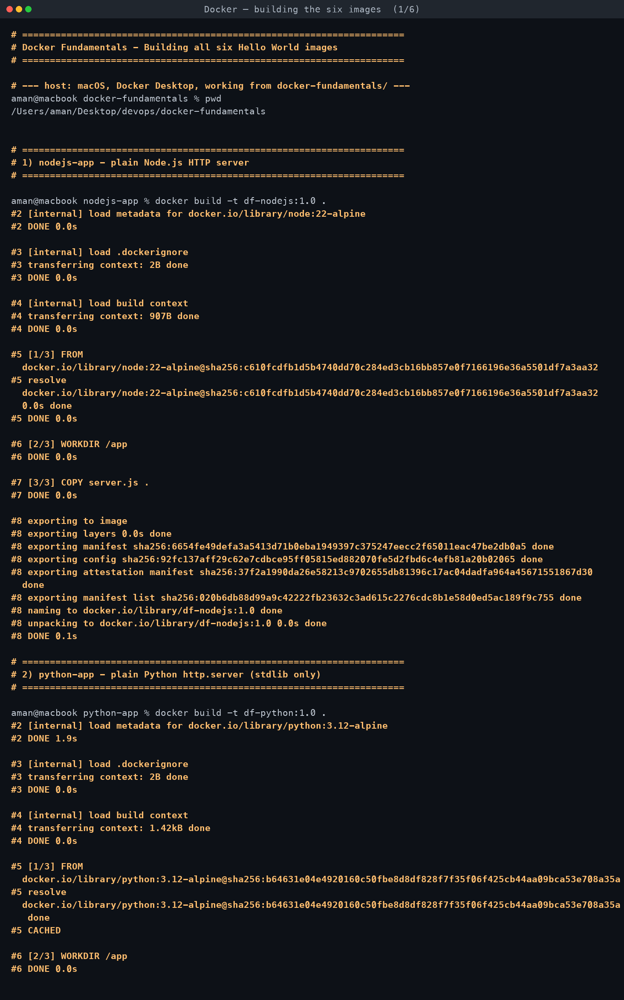
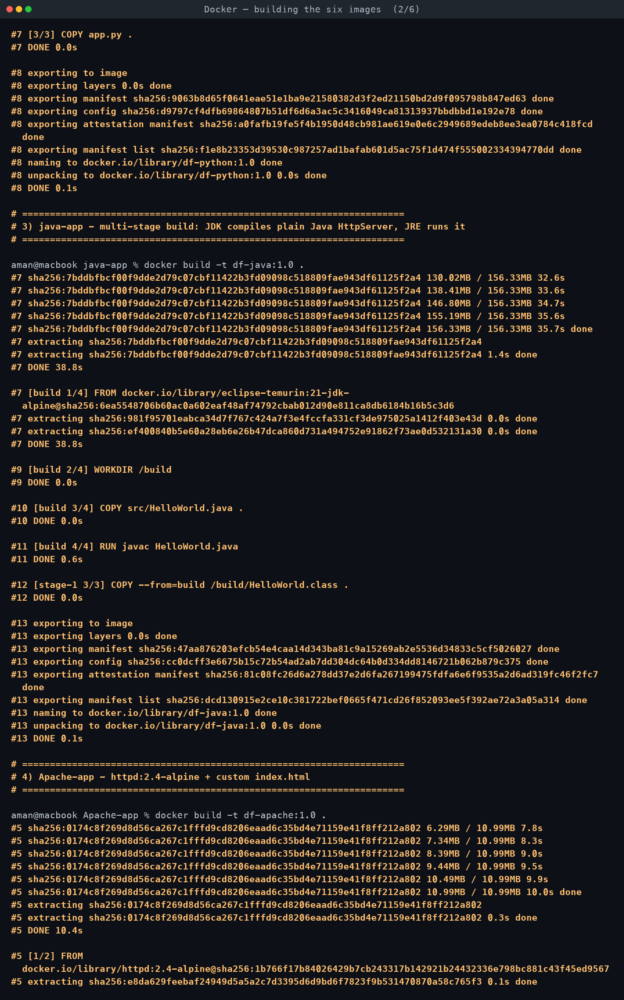
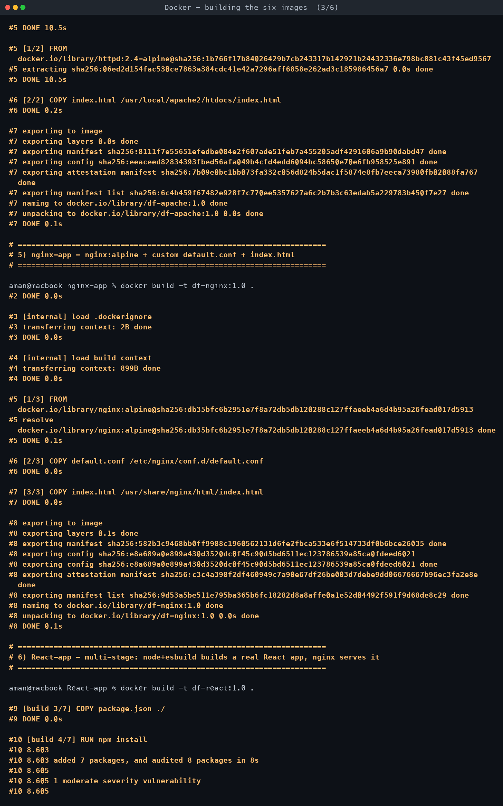
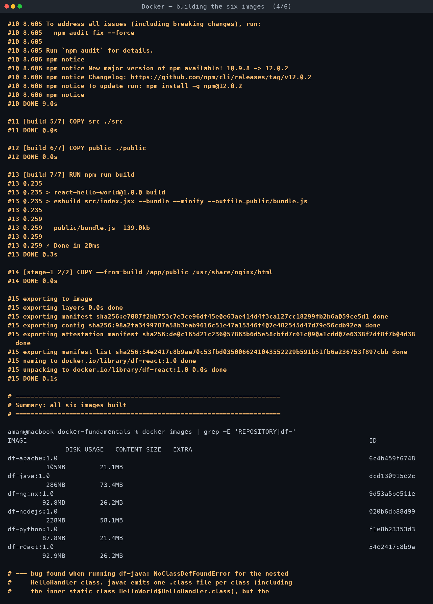
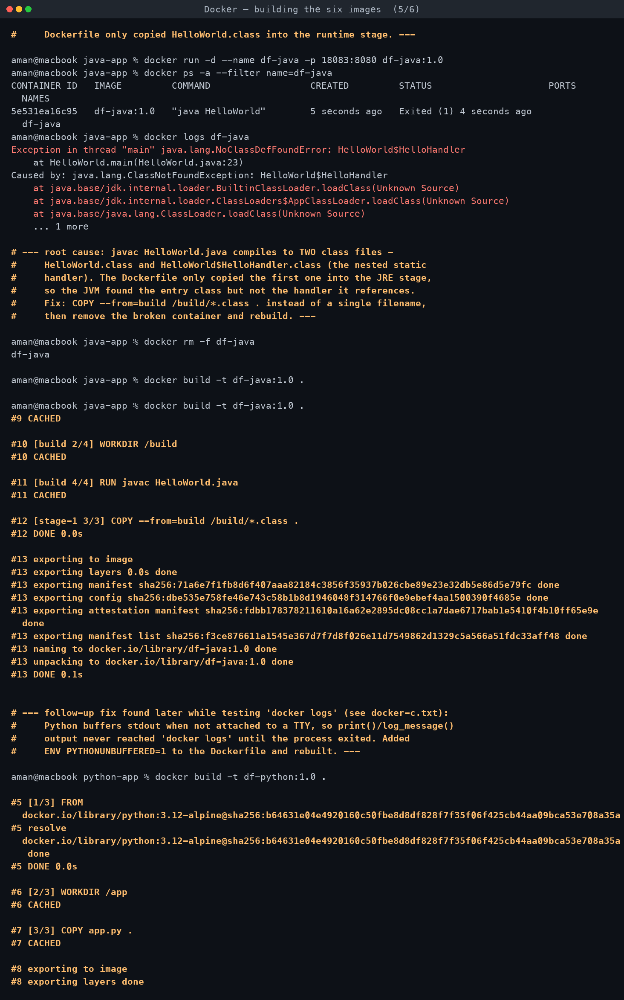
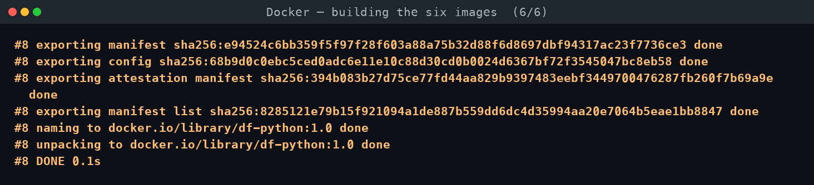

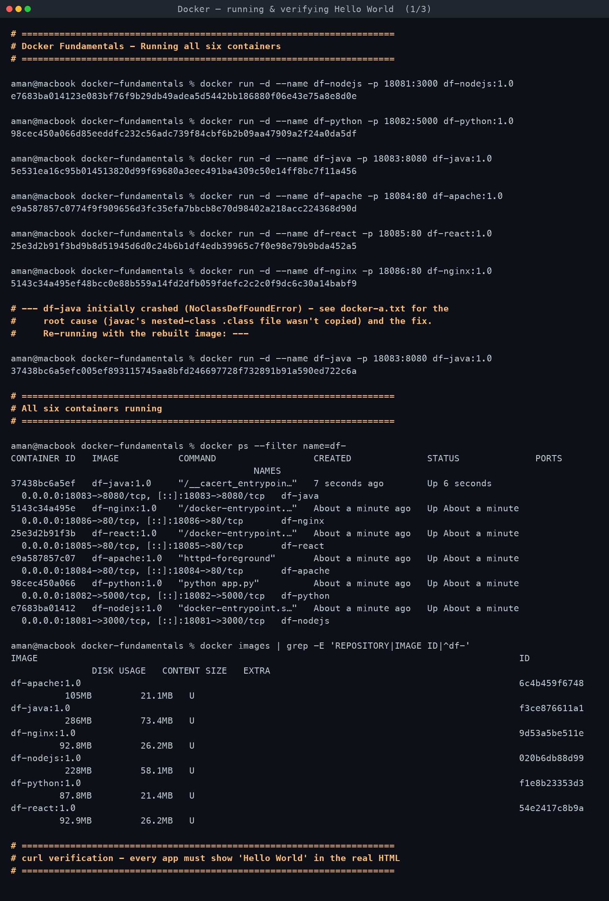
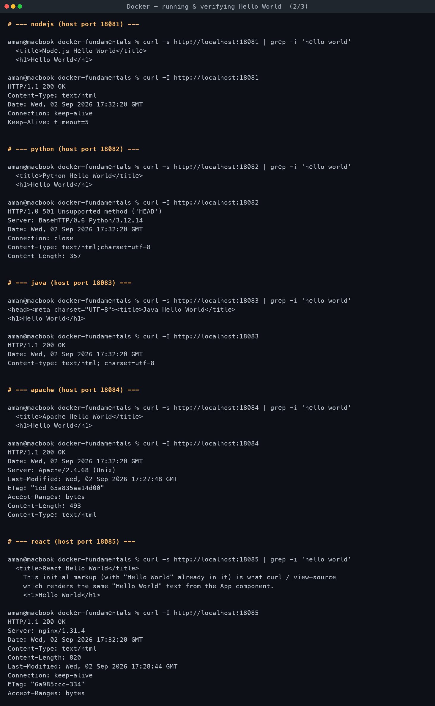
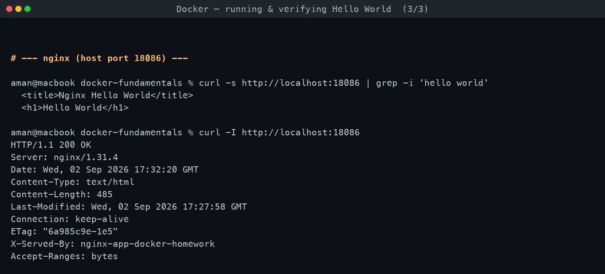

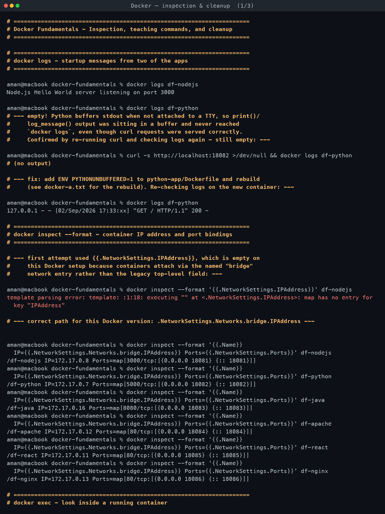
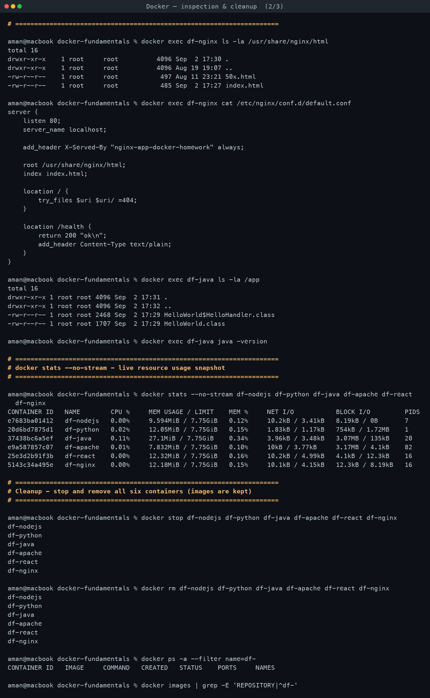
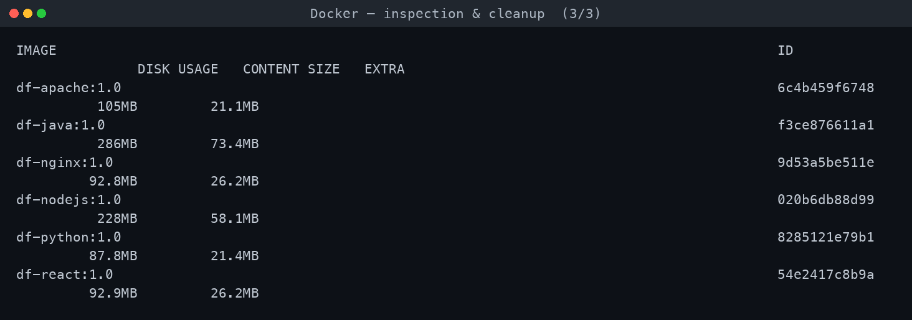

## Full terminal transcript

- [Docker — building the six images](transcript-a-building-images.md)
- [Docker — running & verifying Hello World](transcript-b-running-and-verifying.md)
- [Docker — inspection & cleanup](transcript-c-inspection-cleanup.md)
