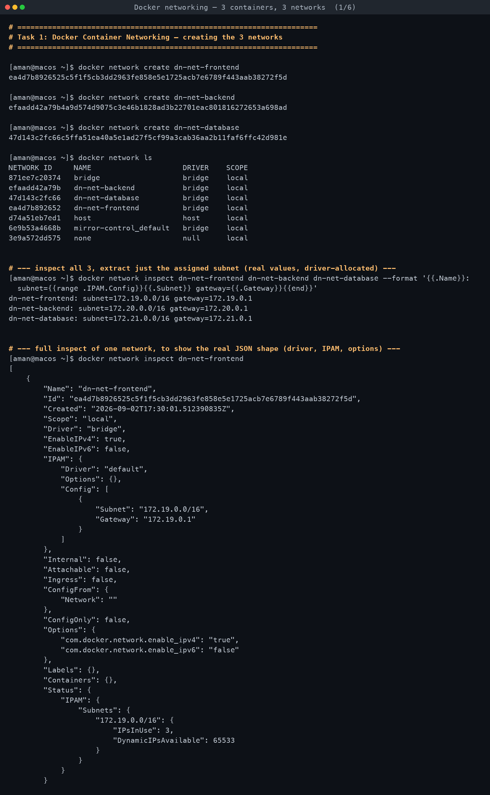
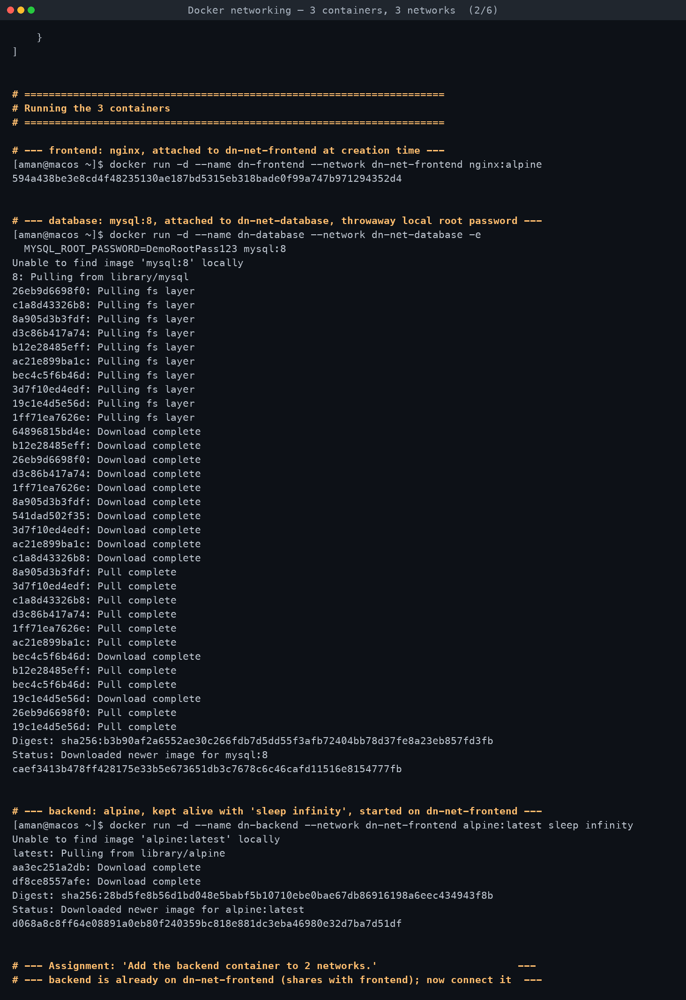
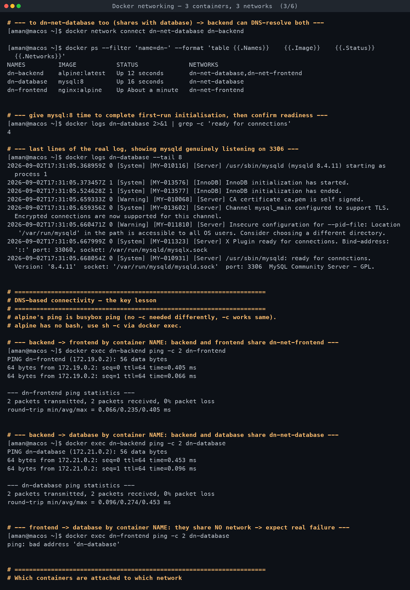
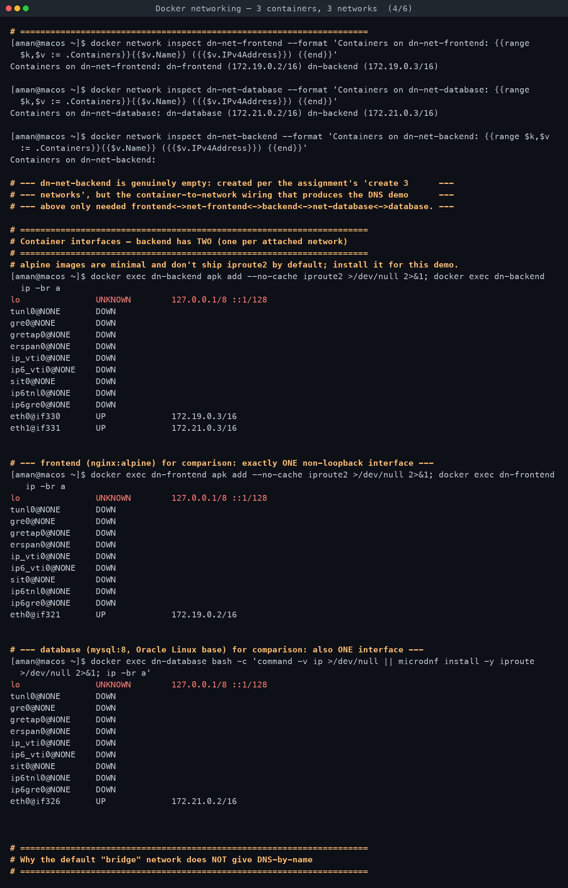
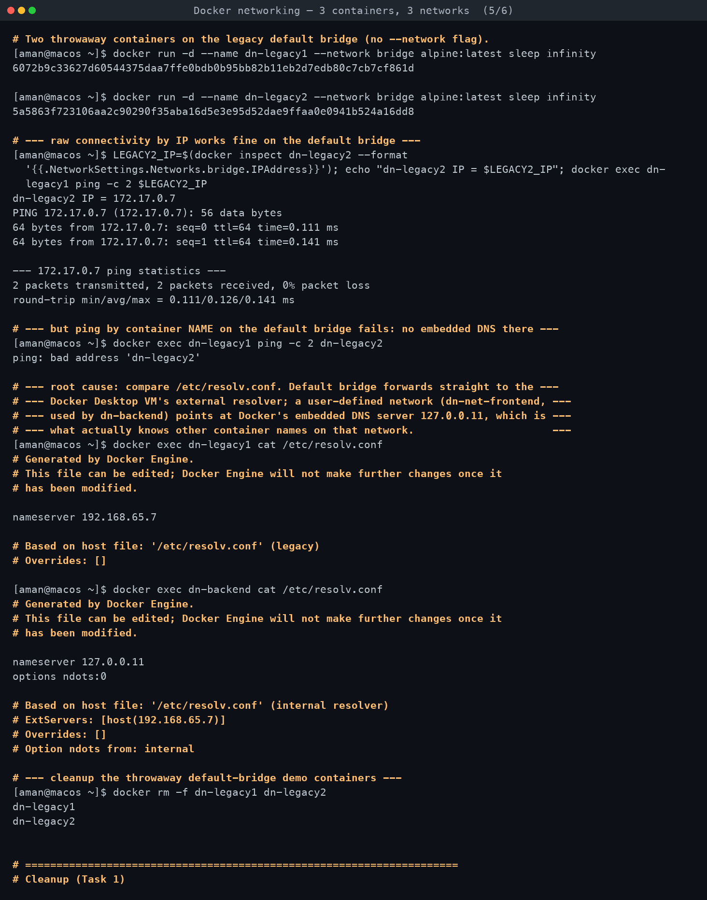
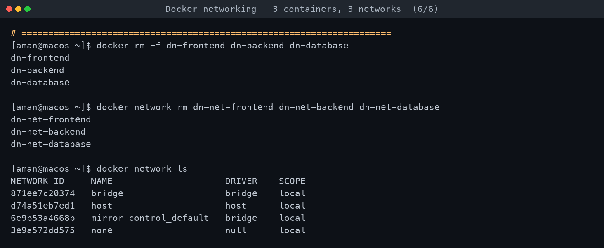

# Task 1 — Docker Container Networking

**Assignment requirements** (verbatim from `DevOps Homework.docx`):

> - Create 3 containers: Frontend, Backend, Database
> - Use Nginx or Alpine images for the frontend and backend.
> - Use the MySQL image for the database.
> - Create 3 different Docker networks.
> - Add the backend container to 2 networks.
> - Check connectivity between the containers.

*Run for real on macOS with Docker Desktop (Docker Engine 29.5.2, server `linux/arm64`).
Every command below was executed; all output is verbatim.*

[← Back to Docker Networking](../README.md)

---

## Topology

| Container | Image | Role | Networks |
|---|---|---|---|
| `dn-frontend` | `nginx:alpine` | Frontend | `dn-net-frontend` |
| `dn-backend` | `alpine:latest` (`sleep infinity`) | Backend | `dn-net-frontend` **and** `dn-net-database` |
| `dn-database` | `mysql:8` | Database | `dn-net-database` |

```
   dn-net-frontend (172.19.0.0/16)          dn-net-database (172.21.0.0/16)
 ┌───────────────────────────────┐        ┌───────────────────────────────┐
 │  dn-frontend   dn-backend  ───┼────────┼──  dn-backend    dn-database  │
 │  172.19.0.2    172.19.0.3     │        │    172.21.0.3    172.21.0.2   │
 └───────────────────────────────┘        └───────────────────────────────┘
                                dn-backend has one leg on each
```

`dn-net-backend` (172.20.0.0/16) is also created, satisfying "create 3 different networks",
but no container is attached to it — the assignment's actual connectivity demo (backend
reaching *both* the other containers by name) only requires backend to sit on
`dn-net-frontend` **and** `dn-net-database`, since those are the networks frontend and
database each live on. A network with zero members is still a perfectly valid Docker object,
which the inspect output below confirms (real subnet allocated, `Containers: {}`).

## The 3 networks — real subnets Docker assigned

| Network | Driver | Subnet | Gateway |
|---|---|---|---|
| `dn-net-frontend` | bridge | `172.19.0.0/16` | `172.19.0.1` |
| `dn-net-backend` | bridge | `172.20.0.0/16` | `172.20.0.1` |
| `dn-net-database` | bridge | `172.21.0.0/16` | `172.21.0.1` |

Docker's local IPAM driver picked these sequentially from its default private-range pool —
nothing was hand-specified, this is what `docker network create` actually handed out on this
host at this moment. A different machine/run could get different `/16`s from the same pool.

## Why the default `bridge` network does NOT give DNS-by-name

Docker's **embedded DNS server** (`127.0.0.11`) only answers on **user-defined** networks
(anything made with `docker network create`). The legacy default `bridge` network predates
that feature and was never wired up to it — containers placed there with no `--network` flag
get the host's/VM's real external resolver in `/etc/resolv.conf` instead, which obviously has
never heard of another container's name.

This was demonstrated directly (two disposable containers, `dn-legacy1`/`dn-legacy2`, both on
`--network bridge`):

- `ping <IP>` between them **worked** — raw L3 connectivity on the default bridge is fine.
- `ping dn-legacy2` (by name) **failed**: `ping: bad address 'dn-legacy2'`.
- `cat /etc/resolv.conf` inside `dn-legacy1` showed `nameserver 192.168.65.7` (the Docker
  Desktop VM's external resolver) — compare that to `dn-backend` (on the user-defined
  `dn-net-frontend`), whose `/etc/resolv.conf` showed `nameserver 127.0.0.11`, Docker's
  embedded DNS. That one line is the entire mechanism.

## What actually happened

All three containers started cleanly. `dn-database` (`mysql:8`) needed a few seconds of
first-run initialisation (temp server → schema init → shutdown → real server start) before
its log printed `mysqld: ready for connections... port: 3306` — confirmed with
`docker logs dn-database` before trusting the container was actually usable, not just
"Up" per `docker ps`.

`docker network connect dn-net-database dn-backend` put `dn-backend` on its second network.
`docker ps --format '{{.Networks}}'` confirmed it: `dn-net-database,dn-net-frontend`. Inside
the container, `ip -br a` (after `apk add iproute2`, since alpine ships nothing but a shell by
default) showed **two** real interfaces:

```
eth0@if330       UP             172.19.0.3/16
eth1@if331       UP             172.21.0.3/16
```

`dn-frontend` and `dn-database`, each on a single network, showed exactly one `eth0` each —
confirmed the same way, for contrast.

### The DNS-connectivity contrast (the actual point of this task)

```
dn-backend  -> ping dn-frontend  : SUCCESS  (172.19.0.2, 0% loss)
dn-backend  -> ping dn-database  : SUCCESS  (172.21.0.2, 0% loss)
dn-frontend -> ping dn-database  : FAILED   ("ping: bad address 'dn-database'")
```

Backend can resolve and reach both other containers by their container **name** because
Docker's embedded DNS server only shares name records among containers that share a network —
and backend shares one with each of them individually. Frontend and database share **no**
network with each other, so frontend's embedded-DNS resolver has never heard the name
`dn-database` at all — this isn't a firewall/routing failure, it's a **name resolution**
failure, one layer higher. (If frontend tried the raw database IP directly it would likely
still fail too, since with no shared network there is no route between the two bridges either
— but the interesting, assignment-relevant failure here is specifically the DNS one, since
that's the mechanism this task is testing.)

`docker network inspect` after everything was wired up confirmed membership directly:
- `dn-net-frontend` → `dn-frontend (172.19.0.2/16)`, `dn-backend (172.19.0.3/16)`
- `dn-net-database` → `dn-database (172.21.0.2/16)`, `dn-backend (172.21.0.3/16)`
- `dn-net-backend` → empty, as expected

Everything (`dn-frontend`, `dn-backend`, `dn-database`, all 3 networks, and the two throwaway
`dn-legacy*` containers used for the bridge-vs-user-defined demo) was removed at the end —
`docker rm -f` / `docker network rm` — confirmed with a final `docker network ls`.

<!-- AUTO-ATTACHED: screenshots & transcripts -->

## Screenshots — practice session








## Full terminal transcript

- [Docker networking — three containers, three networks](transcript.md)
