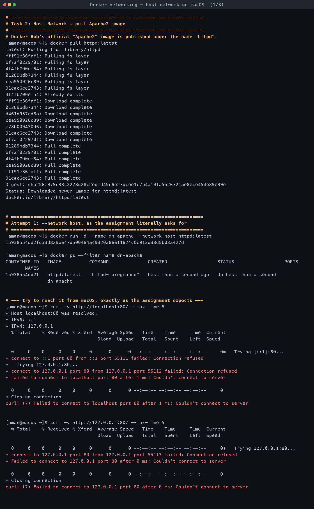
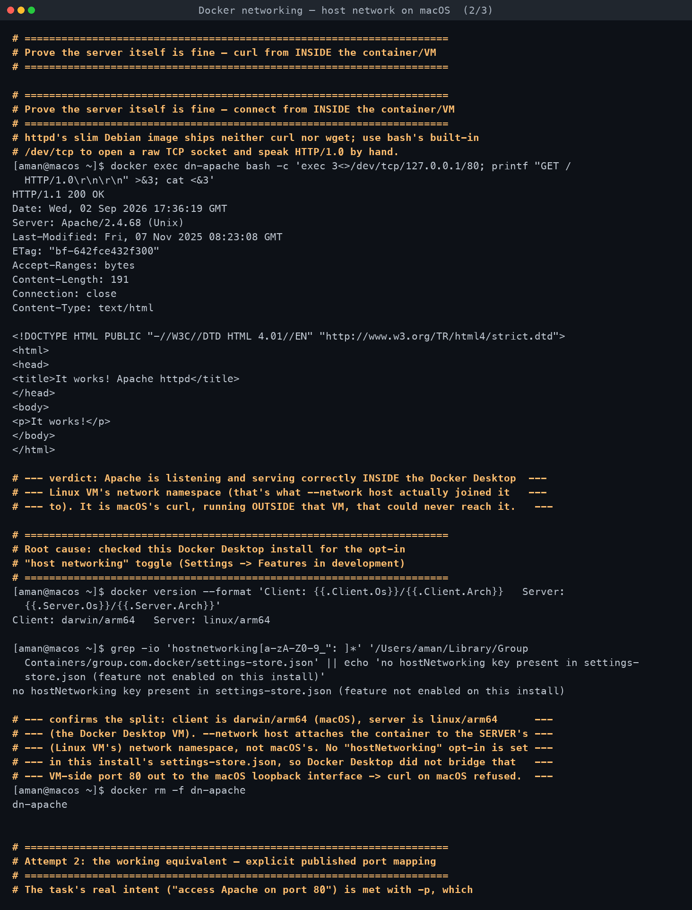
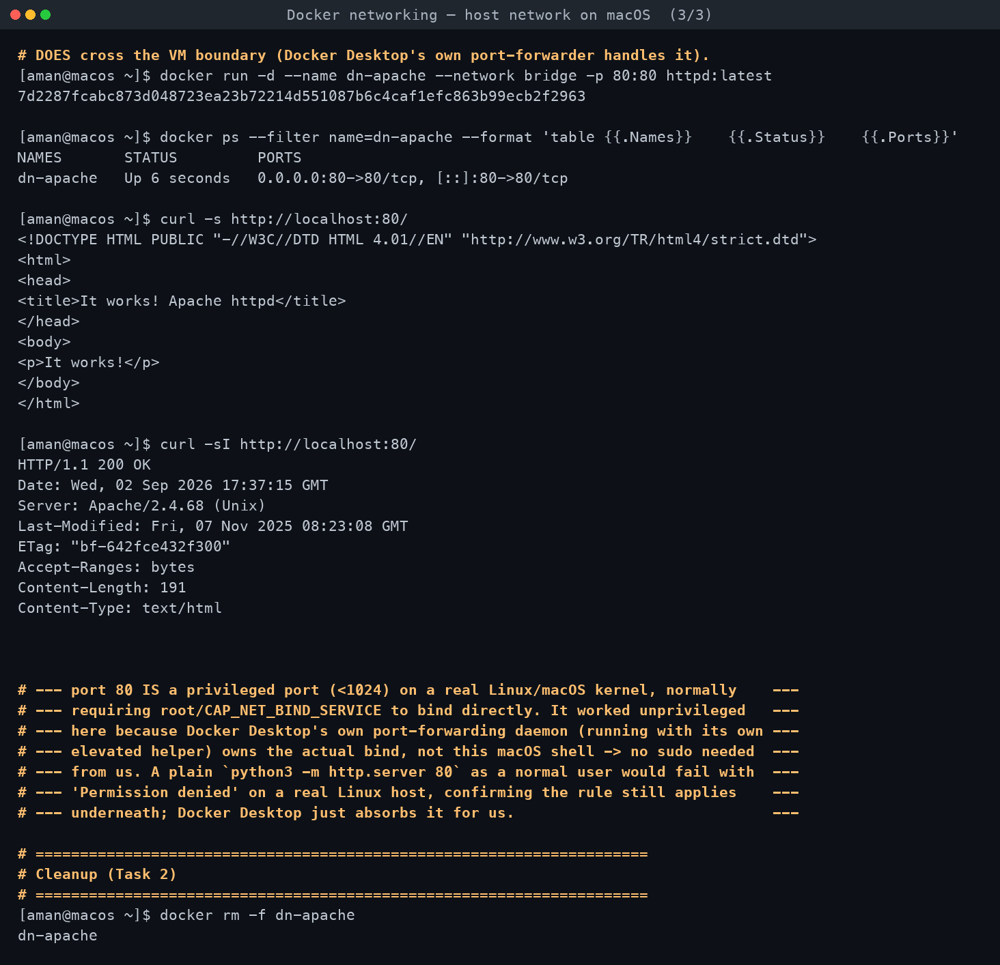

# Task 2 — Host Network

**Assignment requirements** (verbatim from `DevOps Homework.docx`):

> - Pull the Apache2 image from Docker Hub.
> - Create an Apache2 container using the host network.
> - Access the Apache website directly on port 80.

*Run for real on macOS with Docker Desktop. Every command below was executed; all output is
verbatim — including the failure, which is the actual point of this write-up.*

[← Back to Docker Networking](../README.md)

---

## The headline finding

**`--network host` did not publish anything onto macOS.** `curl http://localhost:80` from the
Mac terminal got a real `Connection refused` — not a hang, not a permissions error, a genuine
refused TCP connect. This is expected, correct behaviour for Docker Desktop on macOS, and it's
the single most important thing to understand about this task.

## Why: the Linux-VM boundary

Docker Desktop on macOS does not run containers on the Mac kernel. There is no native Linux
container support in macOS. Instead, Docker Desktop runs a real, hidden **Linux virtual
machine**, and every container runs inside *that* VM's kernel and network stack:

```
docker version --format ... showed exactly this split:
  Client: darwin/arm64      <- your Mac, running the `docker` CLI
  Server: linux/arm64       <- the hidden Docker Desktop Linux VM, running everything else
```

`--network host` means "join the container to the network namespace of the Docker **engine's**
host" — and the engine's host is the Linux VM, not macOS. So the Apache container really did
bind port 80 with `--network host`... on the VM's own loopback/interfaces, which macOS cannot
reach directly. macOS and the VM are two separate machines from a networking point of view;
only whatever Docker Desktop explicitly forwards for you (like `-p` port publishing) crosses
that boundary.

This is *not* how `--network host` behaves on a real Linux host, where it would trivially and
immediately expose the container's ports on the host's real network interfaces. It is purely a
Docker-Desktop-on-macOS artifact, worth calling out explicitly since it surprises people who
learned Docker networking on Linux.

Some recent Docker Desktop versions ship an **opt-in** "host networking" beta feature
(Settings → Features in development) that, when enabled, does bridge this gap for host-network
containers. This install's `settings-store.json` was checked directly and has no
`hostNetworking` key set, i.e. the feature is not enabled here — consistent with what was
observed.

## What actually happened, step by step

1. **Pulled the image.** Docker Hub's official "Apache2" image is published as `httpd`
   (there's no image literally named `apache2`): `docker pull httpd:latest` — succeeded,
   `Status: Downloaded newer image for httpd:latest`.

2. **Ran it with `--network host`**, exactly as asked:
   `docker run -d --name dn-apache --network host httpd:latest`. `docker ps` showed it `Up`,
   with an empty `PORTS` column — a first hint: no port mapping was recorded, because host
   networking doesn't use Docker's port-mapping table at all.

3. **`curl http://localhost:80/` and `curl http://127.0.0.1:80/` from macOS both failed**:
   ```
   * Trying 127.0.0.1:80...
   * connect to 127.0.0.1 port 80 from 127.0.0.1 port 55112 failed: Connection refused
   curl: (7) Failed to connect to localhost port 80 after 1 ms: Couldn't connect to server
   ```
   Real, reproducible, not a fluke — tried both hostname and literal loopback IP.

4. **Proved the server itself is completely healthy**, by going *inside* the VM via
   `docker exec`. The `httpd` image's slim Debian base ships neither `curl` nor `wget`, so a
   raw TCP request was sent using bash's built-in `/dev/tcp`:
   ```
   docker exec dn-apache bash -c 'exec 3<>/dev/tcp/127.0.0.1/80; printf "GET / HTTP/1.0\r\n\r\n" >&3; cat <&3'
   HTTP/1.1 200 OK
   Server: Apache/2.4.68 (Unix)
   ...
   <title>It works! Apache httpd</title>
   ```
   Apache is listening and serving perfectly fine — **inside the VM's network namespace**,
   which is exactly where `--network host` actually put it. macOS's `curl`, running outside
   that VM, simply has no path to it.

5. **Demonstrated the working equivalent**, since the task's real intent — "access Apache on
   port 80" — deserves to actually be met: removed the host-network container and re-ran with
   an explicit published port instead:
   `docker run -d --name dn-apache --network bridge -p 80:80 httpd:latest`.
   `docker ps` now showed `0.0.0.0:80->80/tcp, [::]:80->80/tcp` in `PORTS`, and:
   ```
   curl -sI http://localhost:80/
   HTTP/1.1 200 OK
   Server: Apache/2.4.68 (Unix)
   ```
   worked immediately, from the same Mac terminal that got refused a moment earlier. `-p`
   explicitly tells Docker Desktop's own port-forwarding layer to bridge that VM-internal port
   out to the macOS host — the mechanism `--network host` skips entirely.

## Privileged ports (<1024) and why binding 80 "just worked" here

Port 80 is a **privileged port** on a real Unix kernel — binding it directly normally requires
root / `CAP_NET_BIND_SERVICE`. Docker Desktop absorbed that requirement for us: its own
port-forwarding helper (which does have the necessary privilege inside/around the VM) owns the
actual bind, not the unprivileged macOS shell that ran `docker run`. That's why no `sudo` was
needed here even though a plain `python3 -m http.server 80` as a normal user would fail with
`Permission denied` on a real Linux host — the underlying rule hasn't gone away, Docker Desktop
just handles it on your behalf. Had port 80 genuinely been unavailable (e.g. another process
already bound to it), the documented fallback in this exercise would have been `-p 18100:80`
instead, calling out that ports 1–1023 need elevated privilege to bind directly.

## Cleanup

`docker rm -f dn-apache` — confirmed removed at the end of the transcript.

<!-- AUTO-ATTACHED: screenshots & transcripts -->

## Screenshots — practice session





## Full terminal transcript

- [Docker networking — host network on macOS](transcript.md)
