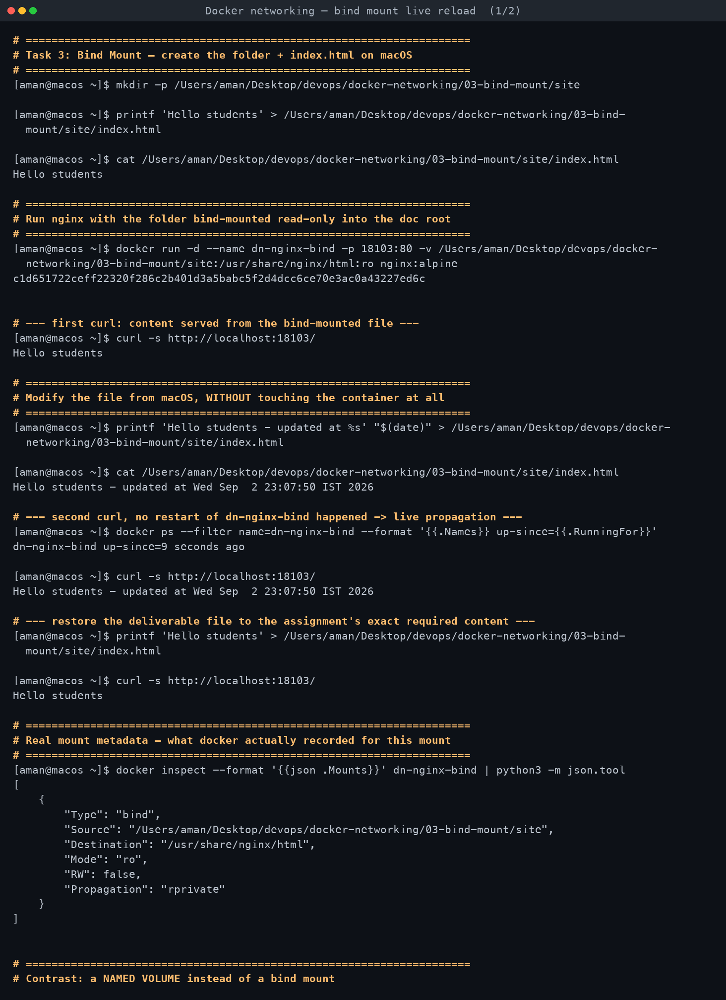
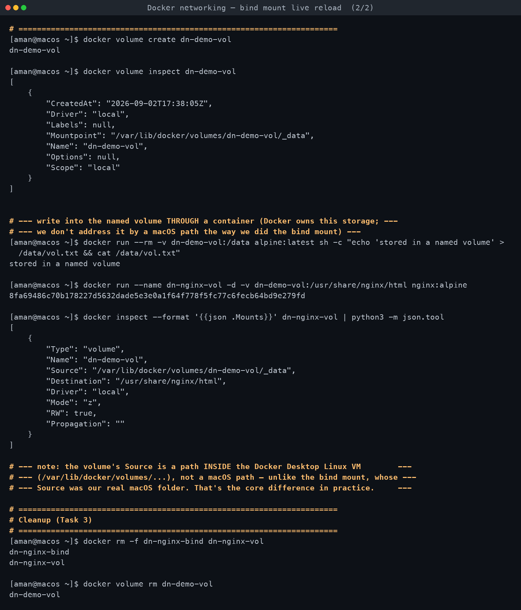

# Task 3 — Bind Mount

**Assignment requirements** (verbatim from `DevOps Homework.docx`):

> - Create a folder on your local machine.
> - Create an index.html file with `Hello students` as the content.
> - Bind mount the folder to an Nginx container.
> - Access the Nginx website and verify the content.
> - Modify the index.html file.
> - Verify that the changes are reflected without restarting the container.

*Run for real on macOS with Docker Desktop. Every command below was executed; all output is
verbatim.*

[← Back to Docker Networking](../README.md)

---

## Deliverable folder

```
03-bind-mount/
└── site/
    └── index.html      "Hello students" — this exact folder was bind-mounted
```

## What actually happened

1. Created `03-bind-mount/site/index.html` on macOS with content `Hello students` (no trailing
   newline, via `printf`).

2. Ran nginx with the folder bind-mounted **read-only** into its document root, published on
   `18103` (per this topic's assigned port range):
   ```
   docker run -d --name dn-nginx-bind -p 18103:80 \
     -v /Users/aman/Desktop/devops/docker-networking/03-bind-mount/site:/usr/share/nginx/html:ro \
     nginx:alpine
   ```

3. **First curl** — `curl -s http://localhost:18103/` → `Hello students`. Confirmed the mount
   is live and nginx is actually serving the mounted file, not its own baked-in default page.

4. **Modified the file from macOS**, container untouched the whole time:
   ```
   printf 'Hello students - updated at %s' "$(date)" > site/index.html
   ```
   `docker ps` right after confirmed `dn-nginx-bind` had **not** restarted (`up-since` kept
   climbing continuously, no reset to `0 seconds`).

5. **Second curl**, no restart in between — `curl -s http://localhost:18103/` immediately
   returned `Hello students - updated at Wed Sep  2 23:07:50 IST 2026`, the exact new content.
   This is the core lesson of a bind mount: the container's filesystem view of that path *is*
   literally the macOS folder (same inode, mounted through), so nginx's next `open()` on that
   file sees the new bytes with zero container-side action needed — no rebuild, no restart, no
   volume-sync daemon, nothing to reload.

6. File was then restored to the assignment's exact required content (`Hello students`) so the
   deliverable in `site/index.html` matches the spec, and re-verified with a third curl.

### Real mount metadata

```
docker inspect --format '{{json .Mounts}}' dn-nginx-bind
[
  {
    "Type": "bind",
    "Source": "/Users/aman/Desktop/devops/docker-networking/03-bind-mount/site",
    "Destination": "/usr/share/nginx/html",
    "Mode": "ro",
    "RW": false,
    "Propagation": "rprivate"
  }
]
```

`Source` is the **real macOS path** — proof this is a genuine bind mount tied to a specific
host location, not Docker-managed storage.

## Bind mount vs named volume — demonstrated directly

A named volume (`dn-demo-vol`) was created and mounted into a second container for direct
comparison:

```
docker volume create dn-demo-vol
docker volume inspect dn-demo-vol
[{ "Mountpoint": "/var/lib/docker/volumes/dn-demo-vol/_data", "Driver": "local", ... }]

docker inspect --format '{{json .Mounts}}' dn-nginx-vol
[{ "Type": "volume", "Name": "dn-demo-vol",
   "Source": "/var/lib/docker/volumes/dn-demo-vol/_data",
   "Destination": "/usr/share/nginx/html", "Mode": "z", "RW": true, "Propagation": "" }]
```

The critical difference is visible in `Source`: the bind mount's source is a path *on macOS*
that you chose and can browse/edit directly in Finder or a text editor. The named volume's
source (`/var/lib/docker/volumes/...`) is a path **inside the Docker Desktop Linux VM** — you
cannot `cd` there from macOS at all; the only supported way to read or write it is through a
container (as done here: `docker run --rm -v dn-demo-vol:/data alpine ...`).

| | Bind mount | Named volume | tmpfs |
|---|---|---|---|
| Backed by | An existing path **you** choose on the host | Storage **Docker manages** (under `/var/lib/docker/volumes/...` inside the engine) | RAM only, on the container's host |
| Visible/editable from the host directly? | Yes — it's just a folder (on macOS: inside the Docker Desktop VM's file-sharing bridge) | No — only reachable through a container mount | No — never touches disk at all |
| Survives `docker rm` of the container? | Yes (it's your folder, untouched) | Yes (volume persists until `docker volume rm`) | **No** — destroyed the moment the container using it stops |
| Survives host reboot? | Yes | Yes | No |
| Created ahead of time? | The folder must already exist (or Docker silently creates an empty dir) | `docker volume create`, or auto-created on first use | Created fresh every container start |
| Portable across machines? | No — tied to a specific host path | Somewhat — can be backed up/restored via `docker run --volumes-from` patterns | No |
| Typical use | Live source-code/config editing, exactly this exercise, injecting host-generated files | App data that should persist and be Docker-managed (databases, uploads) — this is what `mysql:8`'s own image uses internally for `/var/lib/mysql` | Secrets/scratch space that must **never** persist to disk (short-lived tokens, temp caches) |
| Perf on Docker Desktop (macOS) | Slower — crosses the macOS↔VM file-sharing layer (gRPC-FUSE/VirtioFS) for every access | Faster — lives natively inside the Linux VM's own filesystem, no cross-boundary sync | Fastest — pure RAM, no I/O layer at all |

## Cleanup

`dn-nginx-bind`, `dn-nginx-vol` removed with `docker rm -f`; `dn-demo-vol` removed with
`docker volume rm`. The `site/` folder and its `index.html` were left in place as the
deliverable, exactly as required.

<!-- AUTO-ATTACHED: screenshots & transcripts -->

## Screenshots — practice session




## Full terminal transcript

- [Docker networking — bind mount live reload](transcript.md)
