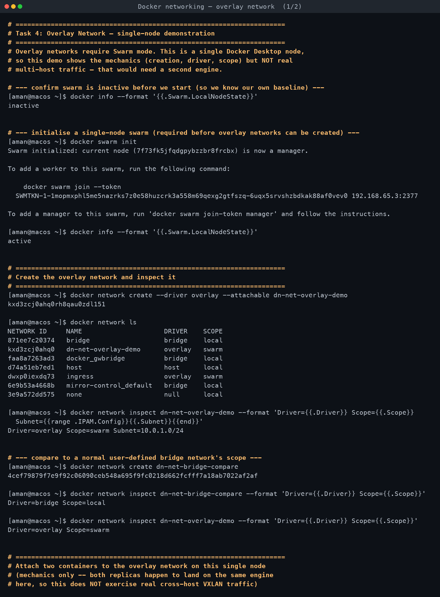
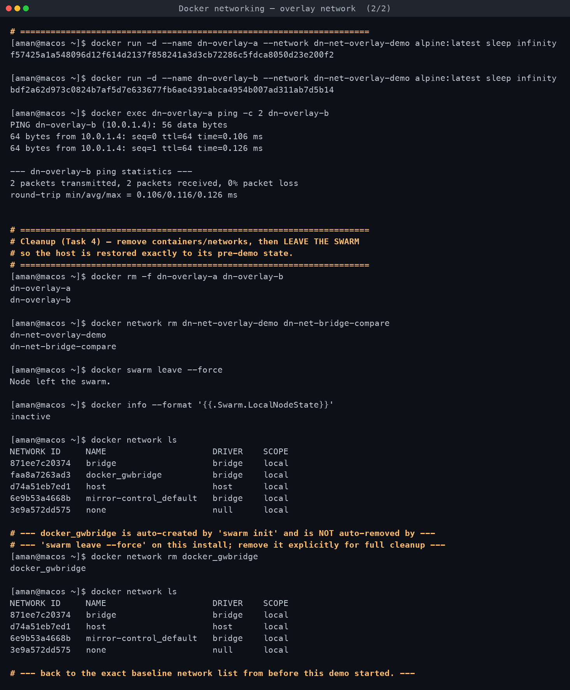

# Task 4 — Overlay Network

**Assignment requirements** (verbatim from `DevOps Homework.docx`):

> - Research Docker overlay networks.
> - Understand their use cases.
> - Understand how overlay networks work across multiple Docker hosts.

*Explanation below, plus a real single-node mechanics demo run on macOS with Docker Desktop
(Docker Engine 29.5.2). This machine is a single Docker host, so the demo shows network
creation/inspection but cannot exercise genuine cross-host traffic — that needs a second
engine. Every command that was run is verbatim; the multi-host behaviour is explained from
documented Docker architecture, clearly separated from what was actually executed here.*

[← Back to Docker Networking](../README.md)

---

## What an overlay network is

A **bridge** network (the driver used in Tasks 1 and 3) only exists inside a single Docker
engine — it's implemented with a Linux bridge device local to that one host's kernel. Two
containers on two different physical/virtual machines can never share a bridge network; there
is no bridge that spans machines.

An **overlay** network solves exactly that: it creates a virtual Layer-2 network that spans
**multiple Docker hosts**, by encapsulating container traffic inside **VXLAN** (Virtual
Extensible LAN) packets and tunnelling it over the hosts' existing physical/IP network. From a
container's point of view, it still just has an `eth0` with an IP on a normal-looking subnet
and can `ping` or resolve another container by name — the VXLAN encapsulation/decapsulation
and the cross-host delivery are handled transparently underneath by each engine's network
driver.

## How it works across multiple hosts (documented mechanism)

1. **Swarm mode is the control plane.** Overlay networks require Docker Swarm (`docker swarm
   init` on the first node, `docker swarm join` on the rest). Swarm's built-in **Raft**
   consensus store is what lets every manager node agree on which networks, services, and
   which container/task is running where.

2. **Each host gets a VTEP (VXLAN Tunnel Endpoint).** When a node joins an overlay network,
   the engine on that node sets up a VXLAN interface. Container-to-container packets on the
   overlay network get wrapped in a VXLAN header (adding a 24-bit VNI — VXLAN Network
   Identifier — that keeps one overlay network's traffic isolated from another's even when
   they share the same physical wire) and sent as ordinary UDP packets (port `4789` by
   default) between the source and destination hosts' real IP addresses.

3. **Name resolution still works the same way** as a single-host user-defined network:
   Docker's embedded DNS server (`127.0.0.11` inside each container) is populated with every
   service/container name on that overlay network, cluster-wide — a container on host A can
   `ping web-service` and reach a container running on host B by name, exactly as demonstrated
   for a single host in Task 1.

4. **Two extra networks appear automatically** the moment you run `docker swarm init`:
   - `ingress` — a built-in overlay network Swarm uses for **routing-mesh** load balancing:
     publish a service port and *any* node in the swarm can accept traffic on it and forward
     it to a container running elsewhere in the cluster.
   - `docker_gwbridge` — a local bridge on each node that gives overlay-network containers a
     path out to the node's own external network (so they can still reach the internet, etc.).
   Both were observed for real in the demo below (`docker network ls` right after
   `docker swarm init`).

5. **Required ports between hosts** for overlay networking to function at all: TCP/UDP `2377`
   (cluster management, manager↔manager), TCP/UDP `7946` (the `gossip`/SWIM-based node
   discovery protocol), and UDP `4789` (the actual VXLAN data traffic). These need to be open
   in any firewall/security-group sitting between the physical/cloud hosts.

## Use cases

- **Multi-host container clusters** — the primary reason overlay networks exist at all: a
  Swarm (or similarly, Kubernetes' own overlay CNI plugins like Flannel/Calico in VXLAN mode)
  spread across several physical or cloud VMs, where services on different hosts still need to
  reach each other by a stable name, as if they were on one flat LAN.
- **Rolling deployments / service scaling across hosts** — a Swarm service can be scaled to N
  replicas that Swarm schedules onto whichever nodes have capacity; the overlay network is what
  lets those replicas discover and load-balance to each other (and to other services)
  regardless of which physical node they landed on.
- **Network isolation per application/tenant on shared infrastructure** — each overlay network
  gets its own VXLAN VNI, so multiple applications' overlay networks can coexist, encrypted and
  isolated from each other, on the same underlying physical network, without needing separate
  physical VLANs.
- **Encrypted inter-host traffic** — overlay networks support an `--opt encrypted` flag that
  wraps the VXLAN traffic in IPSec, useful when the physical network between hosts (e.g. across
  cloud availability zones or over the public internet) isn't itself trusted.

## Overlay vs bridge — the difference that matters

| | bridge (default or user-defined) | overlay |
|---|---|---|
| Scope | Single Docker host only | Spans **multiple** Docker hosts (a Swarm cluster) |
| Requires Swarm mode? | No | Yes (`docker swarm init`/`join` first) |
| Underlying mechanism | Linux bridge device + `iptables`/`nftables` NAT rules, all local to one kernel | VXLAN encapsulation tunnelling container traffic between hosts' real IPs |
| Container-to-container across hosts | Not possible at all | Native — that's the entire point |
| `docker network inspect` → `Scope` | `local` | `swarm` |

## What was actually run (single-node mechanics demo)

Confirmed the baseline first: `docker info --format '{{.Swarm.LocalNodeState}}'` → `inactive`.

1. `docker swarm init` — succeeded, this node became a manager (`Swarm initialized: current
   node (7f73fk5jfqdgpybzzbr8frcbx) is now a manager.`). `LocalNodeState` flipped to `active`.

2. `docker network ls` right after showed exactly the two auto-created networks documented
   above, both with `Scope: swarm`:
   ```
   dn-net-overlay-demo    (created next)
   docker_gwbridge   bridge    local
   ingress           overlay   swarm
   ```

3. `docker network create --driver overlay --attachable dn-net-overlay-demo` — succeeded.
   Inspecting it: `Driver=overlay Scope=swarm Subnet=10.0.1.0/24`. A plain bridge network
   created for comparison in the same moment (`dn-net-bridge-compare`) showed
   `Driver=bridge Scope=local` — the `Scope` field is the one that actually encodes
   "single host" vs "cluster-wide" in Docker's own data model.

4. Two throwaway alpine containers (`dn-overlay-a`, `dn-overlay-b`) were attached to the
   overlay network and pinged each other **by name**: succeeded, `10.0.1.4`, 0% packet loss —
   proving the overlay network's embedded DNS and routing work exactly like a user-defined
   bridge network's do. **Caveat, stated plainly: both containers happened to run on this same
   single engine**, so this only proves the overlay network's mechanics/API surface work
   correctly — it does **not** exercise real VXLAN traffic actually crossing between two
   separate physical/virtual hosts, since there is only one host available here. That part of
   the picture (step 2 in "How it works" above) is documented Docker Swarm architecture, not
   something this environment could physically demonstrate.

## Cleanup — swarm state fully restored

```
docker rm -f dn-overlay-a dn-overlay-b
docker network rm dn-net-overlay-demo dn-net-bridge-compare
docker swarm leave --force        -> "Node left the swarm."
docker info --format '{{.Swarm.LocalNodeState}}'   -> inactive
```

One extra cleanup step was needed: `docker_gwbridge` (auto-created by `swarm init`) was **not**
automatically removed by `docker swarm leave --force` on this Docker Desktop install, so it was
removed explicitly with `docker network rm docker_gwbridge`. A final `docker network ls`
confirmed the network list was back to the exact pre-demo baseline, and
`{{.Swarm.LocalNodeState}}` confirmed `inactive`.

<!-- AUTO-ATTACHED: screenshots & transcripts -->

## Screenshots — practice session




## Full terminal transcript

- [Docker networking — overlay network](transcript.md)
