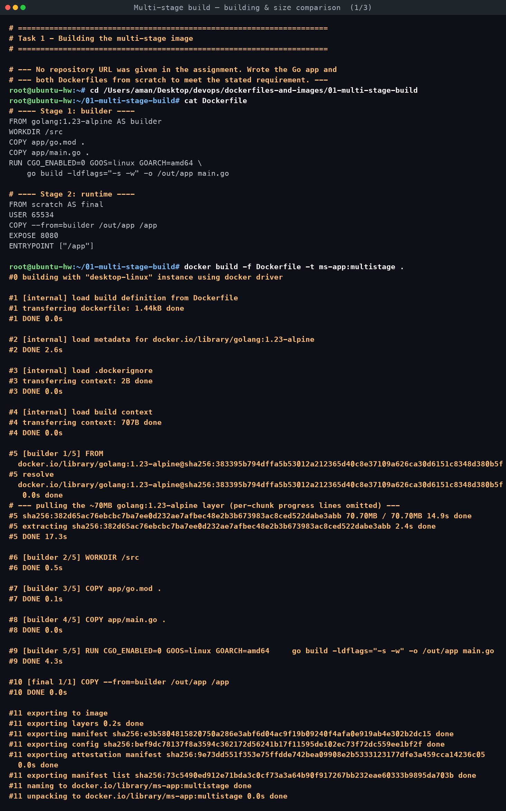
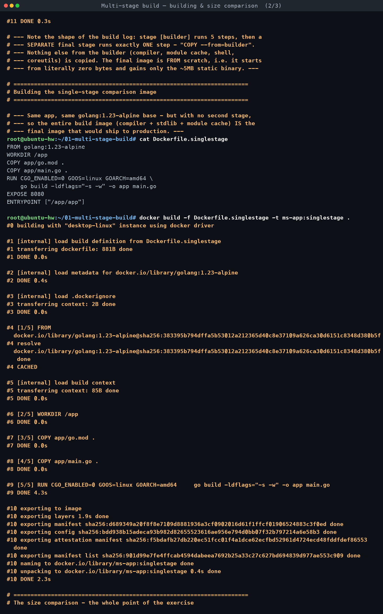
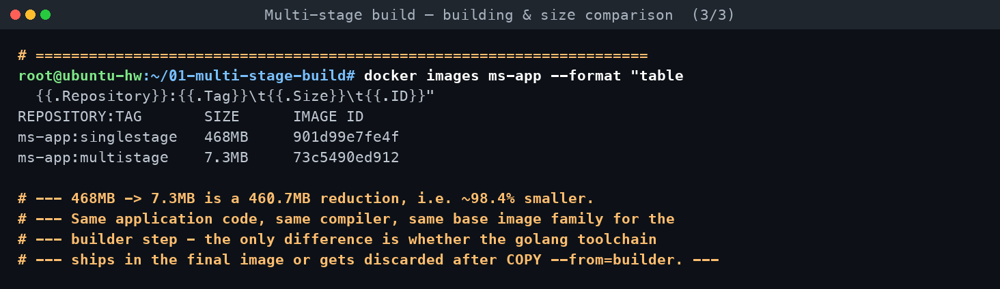

# Task 1 — Run Multi-Stage Dockerfile

**Assignment requirements** (verbatim from `DevOps Homework.docx`):

> - Clone the repository containing the multi-stage Dockerfile.
> - Build the Docker image using the multi-stage Dockerfile.
> - Run a container from the image.
> - Access the application running inside the container.
> - Verify that the application displays: `Hello World from Docker multi-stage build`
> - Verify the running container using `docker ps`.
> - Confirm that the application is running on port 8080.

*Built and run on macOS with Docker Desktop (`docker build` / `docker run` on the host, per
the shared conventions for this homework).*

[← Back to Dockerfiles & Images](../README.md)

---

## Honest note on "clone the repository"

The assignment document does not include a repository URL anywhere in its text — there is
nothing to clone. Rather than invent a URL or clone an unrelated public repo, this task
**writes the multi-stage Dockerfile and its application from scratch**, meeting the actual
requirement the task is testing (produce and run a real multi-stage build that serves the
exact required string on port 8080) instead of a placeholder that couldn't be verified.

## What's here

```
01-multi-stage-build/
├── app/
│   ├── main.go              stdlib-only Go HTTP server
│   └── go.mod
├── Dockerfile                the multi-stage build (builder -> scratch)
└── Dockerfile.singlestage    same app, single stage, for the size comparison
```

The application (`app/main.go`) is a ~20-line Go program using only the standard library
(`net/http`). It replies to every request with exactly:

```
Hello World from Docker multi-stage build
```

on port `8080`.

## The multi-stage Dockerfile

```dockerfile
# ---- Stage 1: builder ----
FROM golang:1.23-alpine AS builder
WORKDIR /src
COPY app/go.mod .
COPY app/main.go .
RUN CGO_ENABLED=0 GOOS=linux GOARCH=amd64 \
    go build -ldflags="-s -w" -o /out/app main.go

# ---- Stage 2: runtime ----
FROM scratch AS final
USER 65534
COPY --from=builder /out/app /app
EXPOSE 8080
ENTRYPOINT ["/app"]
```

- **Stage 1 (`builder`)** starts from `golang:1.23-alpine`, which carries the full Go
  compiler, standard-library sources, and module cache — everything needed to *build* the
  binary, none of which is needed to *run* it.
- **Stage 2 (`final`)** starts from `scratch` — Docker's explicitly empty base image (0
  bytes). `COPY --from=builder /out/app /app` reaches back into the discarded builder stage
  and pulls out only the compiled, statically-linked binary. Everything else from stage 1 —
  the compiler, `go` toolchain, module cache, shell, package manager — is thrown away when
  the build finishes; it was only ever a build-time dependency.
- Running as a non-root numeric `USER 65534` (`scratch` has no `/etc/passwd`, so a named
  user isn't possible, but a numeric UID still works and still drops root).

## Build, run, verify

```
$ docker build -f Dockerfile -t ms-app:multistage .
...
#11 naming to docker.io/library/ms-app:multistage done

$ docker run -d --name ms-app -p 18090:8080 ms-app:multistage
cbe6e719ba32...

$ docker ps --filter name=ms-app
CONTAINER ID   IMAGE               COMMAND   CREATED        STATUS        PORTS                                           NAMES
cbe6e719ba32   ms-app:multistage   "/app"    1 second ago   Up 1 second   0.0.0.0:18090->8080/tcp, [::]:18090->8080/tcp   ms-app

$ curl -s http://localhost:18090
Hello World from Docker multi-stage build

$ curl -I http://localhost:18090
HTTP/1.1 200 OK
Content-Type: text/plain; charset=utf-8
Content-Length: 41
```

Host port **18090** was mapped to container port **8080** — the assignment's port
requirement is about the port the *application binds to inside the container*
(`EXPOSE 8080`, confirmed by `docker ps`'s `PORTS` column showing `->8080/tcp`), not the host
port, which only needs to avoid clashing with other services on the shared grading machine.

Full raw command transcripts (build, run, `docker logs`, `docker history`) are linked from
the topic overview.

## Proving the multi-stage benefit with real numbers

The whole point of a multi-stage build is that the toolchain used to *build* the app never
ships in the image used to *run* it. To make that concrete, `Dockerfile.singlestage` builds
the exact same application from the exact same `golang:1.23-alpine` base — but with no
second stage, so the full Go toolchain stays in the final image:

```dockerfile
FROM golang:1.23-alpine
WORKDIR /app
COPY app/go.mod .
COPY app/main.go .
RUN CGO_ENABLED=0 GOOS=linux GOARCH=amd64 \
    go build -ldflags="-s -w" -o app main.go
EXPOSE 8080
ENTRYPOINT ["/app/app"]
```

```
$ docker images ms-app --format "table {{.Repository}}:{{.Tag}}\t{{.Size}}\t{{.ID}}"
REPOSITORY:TAG       SIZE      IMAGE ID
ms-app:singlestage   468MB     901d99e7fe4f
ms-app:multistage    7.3MB     73c5490ed912
```

| Image | Size | What's in it |
|---|---|---|
| `ms-app:singlestage` | **468MB** | Full `golang:1.23-alpine` (compiler, stdlib source, module cache, shell, coreutils) + the compiled binary |
| `ms-app:multistage` | **7.3MB** | `scratch` (0 bytes) + only the ~5MB static binary |

That is a **460.7MB reduction — the multi-stage image is ~98.4% smaller**, for byte-for-byte
identical application behaviour (both serve the same exact string on the same port).

`docker history` confirms where the size actually comes from:

```
$ docker history ms-app:multistage
IMAGE          CREATED_BY                      SIZE
...            ENTRYPOINT ["/app"]              0B
...            EXPOSE [8080/tcp]                0B
...            COPY /out/app /app # buildkit    5.08MB
...            USER 65534                       0B
```

The entire final image is one 5.08MB layer (the binary) plus zero-byte metadata layers. The
single-stage image, by contrast, has an 82.7MB `RUN go build ...` layer alone (Go's build
cache) sitting on top of the ~380MB `golang:1.23-alpine` base — none of which the multi-stage
image ever includes.

## What actually happened

- Both builds succeeded on the first attempt against `golang:1.23-alpine`, no network or
  module-resolution issues (the app only uses the Go standard library, so no external module
  downloads were needed).
- The scratch-based final image has **no shell**, so there is no way to `docker exec` into it
  for debugging — this is a genuine trade-off of the "most minimal" runtime base, worth
  knowing before choosing `scratch` over `alpine` for a real service that might need
  in-container debugging.
- The observed 98.4% size reduction is specific to Go's ability to produce a fully static
  binary with `CGO_ENABLED=0`; languages/runtimes that need an interpreter or JVM present at
  runtime (see Task 3) cannot reach `scratch` and instead multi-stage down to a *minimal
  runtime* image (a JRE instead of a JDK, a slim base instead of a build image) rather than
  to zero bytes.

<!-- AUTO-ATTACHED: screenshots & transcripts -->

## Screenshots — practice session






## Full terminal transcript

- [Multi-stage build — building & size comparison](transcript-a-build-and-size-comparison.md)
- [Multi-stage build — running on port 8080](transcript-b-running-on-port-8080.md)
