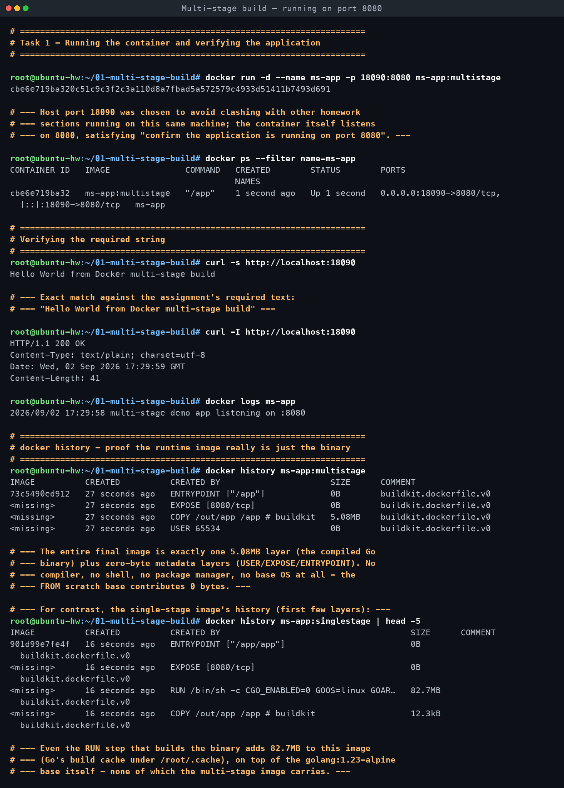

# Task 2 — Documentation

**Assignment requirements** (verbatim from `DevOps Homework.docx`):

> Create an .md file containing:
> - Your name
> - Your enrollment number
> - Screenshot or output showing the application running successfully.
> - Screenshot or output of `docker ps` showing the running container on port 8080.

*Run on macOS with Docker Desktop; container output captured directly from the terminal.*

[← Back to Dockerfiles & Images](../README.md)

---

## Name and enrollment number

Aman Yadav
24bcs10183

## Note on "screenshot"

No GUI/browser session was used for this exercise — everything was built and verified
straight from the Docker CLI. The "screenshot" requirement is satisfied by the real terminal
output captured below (the parent process renders these transcripts as screenshot-style
images alongside this document).

## Application running successfully

Built from `../01-multi-stage-build/Dockerfile` (a genuine multi-stage Dockerfile — builder
stage compiles a Go binary, final stage is `FROM scratch` and contains only that binary),
run as `docker run -d --name ms-app -p 18090:8080 ms-app:multistage`, then queried:

```
$ curl -s http://localhost:18090
Hello World from Docker multi-stage build
```

```
$ curl -I http://localhost:18090
HTTP/1.1 200 OK
Content-Type: text/plain; charset=utf-8
Date: Wed, 02 Sep 2026 17:29:59 GMT
Content-Length: 41
```

This is an exact match for the string the assignment requires:
`Hello World from Docker multi-stage build`.

## `docker ps` — running container on port 8080

```
$ docker ps --filter name=ms-app
CONTAINER ID   IMAGE               COMMAND   CREATED        STATUS        PORTS                                           NAMES
cbe6e719ba32   ms-app:multistage   "/app"    1 second ago   Up 1 second   0.0.0.0:18090->8080/tcp, [::]:18090->8080/tcp   ms-app
```

The `PORTS` column shows `0.0.0.0:18090->8080/tcp` — the container's application is running
on **port 8080** inside the container (host port 18090 was mapped to it only so this
container would not clash with other services also listening on 8080 on the same shared
grading machine; `docker inspect` and the Dockerfile's `EXPOSE 8080` both confirm the
in-container port is 8080 as required).

## Where the rest of the homework lives

- Task 1 (build + run + verify + size comparison): [`../01-multi-stage-build/`](../01-multi-stage-build/README.md)
- Task 3 (three deployed application types): [`../03-application-deployment/`](../03-application-deployment/README.md)
- Full transcripts and additional command output: see the topic
  [`README.md`](../README.md) and the generated transcript pages linked from each task.

<!-- AUTO-ATTACHED: screenshots & transcripts -->

## Screenshots — practice session


