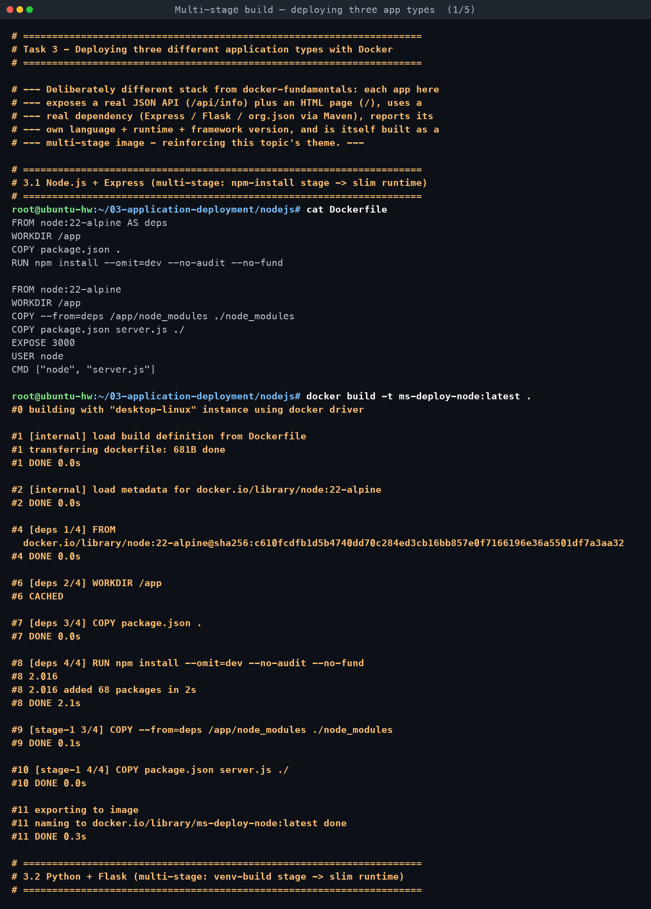
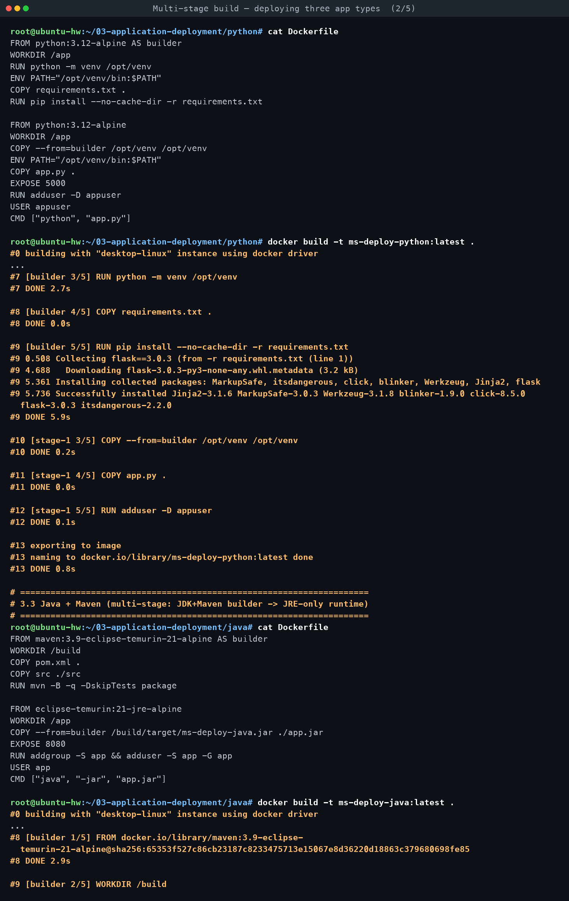
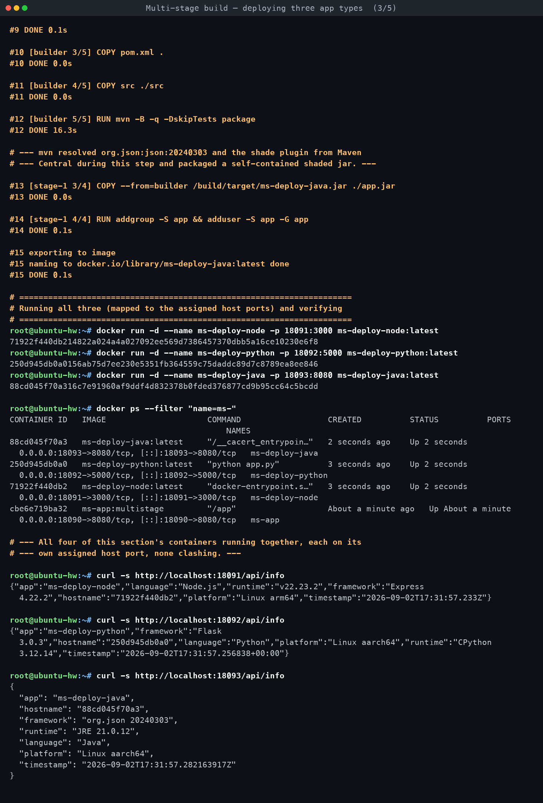
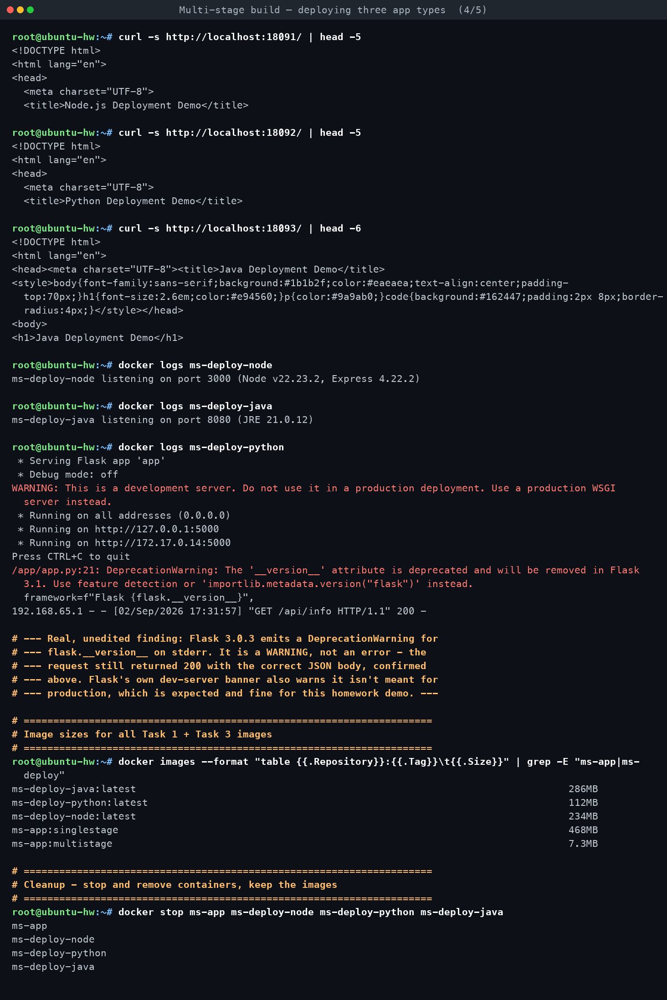
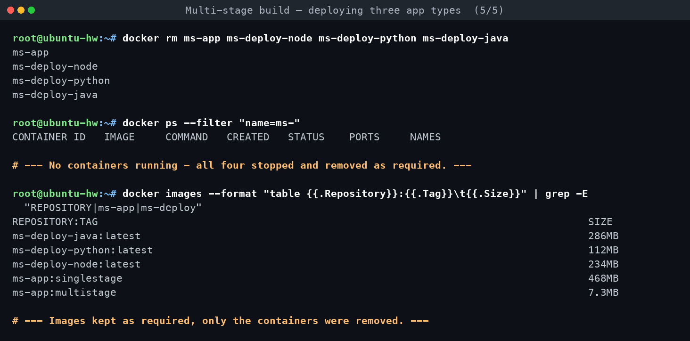

# Task 3 — Docker Application Deployment

**Assignment requirements** (verbatim from `DevOps Homework.docx`):

> Deploy at least 3 different types of applications using Docker, such as: Node.js, Python, Java

*Built and run on macOS with Docker Desktop.*

[← Back to Dockerfiles & Images](../README.md)

---

## What's different about these three apps

`docker-fundamentals/` (a separate homework topic on this machine) already has plain
Node.js/Python/Java "Hello World" containers using only each language's standard library.
To avoid duplicating that section, these three apps are meaningfully different:

- Each uses a **real third-party dependency** (Express, Flask, `org.json` via Maven) instead
  of stdlib-only code.
- Each exposes a **JSON API endpoint** (`GET /api/info`) in addition to an HTML page (`/`).
- Each **reports its own language, runtime version, and framework version** in that JSON.
- Each is itself built with a **multi-stage Dockerfile**, tying back into this topic
  (build-tooling stage discarded, only the built artifact + runtime ships).

| App | Folder | Language / runtime | Framework | Host port | Container port | Image size |
|---|---|---|---|---|---|---|
| Node.js | [`nodejs/`](nodejs/) | Node.js v22.23.2 | Express 4.22.2 | 18091 | 3000 | 234MB |
| Python | [`python/`](python/) | CPython 3.12.14 | Flask 3.0.3 | 18092 | 5000 | 112MB |
| Java | [`java/`](java/) | JRE 21.0.12 | org.json 20240303 (built with Maven) | 18093 | 8080 | 286MB |

Container names: `ms-deploy-node`, `ms-deploy-python`, `ms-deploy-java`.

## How each one is multi-stage

- **Node.js** (`nodejs/Dockerfile`): stage `deps` runs `npm install --omit=dev` on
  `node:22-alpine` (needs npm's registry client); the final stage copies only the resulting
  `node_modules/` + source into a clean `node:22-alpine`, so npm's own cache/tooling never
  ships.
- **Python** (`python/Dockerfile`): stage `builder` creates a virtualenv and `pip install`s
  Flask into it; the final stage copies only `/opt/venv` into a clean `python:3.12-alpine`,
  so pip and its download cache never ship.
- **Java** (`java/Dockerfile`): stage `builder` uses `maven:3.9-eclipse-temurin-21-alpine`
  (a full JDK + Maven, resolving `org.json` from Maven Central and packaging a shaded jar
  with `maven-shade-plugin`); the final stage copies only the built jar into
  `eclipse-temurin:21-jre-alpine` — a **JRE**, not a JDK, so the compiler and Maven itself
  never ship. This is the classic JDK-to-JRE multi-stage pattern.

## Build, run, verify

```
$ docker build -t ms-deploy-node:latest    nodejs/
$ docker build -t ms-deploy-python:latest  python/
$ docker build -t ms-deploy-java:latest    java/

$ docker run -d --name ms-deploy-node   -p 18091:3000 ms-deploy-node:latest
$ docker run -d --name ms-deploy-python -p 18092:5000 ms-deploy-python:latest
$ docker run -d --name ms-deploy-java   -p 18093:8080 ms-deploy-java:latest

$ docker ps --filter "name=ms-"
CONTAINER ID   IMAGE                     COMMAND                  CREATED         STATUS         PORTS                                           NAMES
88cd045f70a3   ms-deploy-java:latest     "/__cacert_entrypoin…"   2 seconds ago   Up 2 seconds   0.0.0.0:18093->8080/tcp, [::]:18093->8080/tcp   ms-deploy-java
250d945db0a0   ms-deploy-python:latest   "python app.py"          3 seconds ago   Up 2 seconds   0.0.0.0:18092->5000/tcp, [::]:18092->5000/tcp   ms-deploy-python
71922f440db2   ms-deploy-node:latest     "docker-entrypoint.s…"   3 seconds ago   Up 2 seconds   0.0.0.0:18091->3000/tcp, [::]:18091->3000/tcp   ms-deploy-node
```

```
$ curl -s http://localhost:18091/api/info
{"app":"ms-deploy-node","language":"Node.js","runtime":"v22.23.2","framework":"Express 4.22.2","hostname":"71922f440db2","platform":"Linux arm64","timestamp":"2026-09-02T17:31:57.233Z"}

$ curl -s http://localhost:18092/api/info
{"app":"ms-deploy-python","framework":"Flask 3.0.3","hostname":"250d945db0a0","language":"Python","platform":"Linux aarch64","runtime":"CPython 3.12.14","timestamp":"2026-09-02T17:31:57.256838+00:00"}

$ curl -s http://localhost:18093/api/info
{
  "app": "ms-deploy-java",
  "hostname": "88cd045f70a3",
  "framework": "org.json 20240303",
  "runtime": "JRE 21.0.12",
  "language": "Java",
  "platform": "Linux aarch64",
  "timestamp": "2026-09-02T17:31:57.282163917Z"
}
```

Each app's `/` also serves a small themed HTML page confirming the runtime + framework
version in human-readable form (verified with `curl -s http://localhost:1809x/`).

## What actually happened

- All three builds succeeded on the first attempt, including Maven resolving `org.json` and
  the shade plugin live from Maven Central inside the build (~16s for the Java build vs a
  couple seconds each for Node/Python — Maven dependency resolution is the visibly slower
  step of the three).
- `docker logs ms-deploy-python` shows a real `DeprecationWarning` for `flask.__version__`
  (Flask 3.0.3 deprecated that attribute in favour of `importlib.metadata.version("flask")`)
  and the standard "this is a development server" banner from Flask's built-in dev server.
  Both are warnings, not failures — the app still returned HTTP 200 with the correct JSON on
  every request, confirmed above.
- Image sizes land in ascending order Python (112MB) < Node.js (234MB) < Java (286MB), which
  tracks each ecosystem's base runtime image size (Alpine + a slim interpreter vs. Alpine + a
  JVM) rather than anything about the application code itself, which is tiny in all three
  cases.
- `platform` in each JSON response reports `arm64`/`aarch64` — this machine's Docker Desktop
  is running the images under Apple Silicon's native architecture, not `amd64`; that's an
  artifact of the build host, not the application.

## Cleanup

Containers were stopped and removed at the end of this exercise; the images were kept:

```
$ docker stop ms-app ms-deploy-node ms-deploy-python ms-deploy-java
$ docker rm   ms-app ms-deploy-node ms-deploy-python ms-deploy-java
$ docker ps --filter "name=ms-"
CONTAINER ID   IMAGE     COMMAND   CREATED   STATUS    PORTS     NAMES

$ docker images --format "table {{.Repository}}:{{.Tag}}\t{{.Size}}" | grep -E "ms-app|ms-deploy"
ms-deploy-java:latest       286MB
ms-deploy-python:latest     112MB
ms-deploy-node:latest       234MB
ms-app:singlestage          468MB
ms-app:multistage           7.3MB
```

<!-- AUTO-ATTACHED: screenshots & transcripts -->

## Screenshots — practice session







## Full terminal transcript

- [Multi-stage build — deploying three app types](transcript.md)
