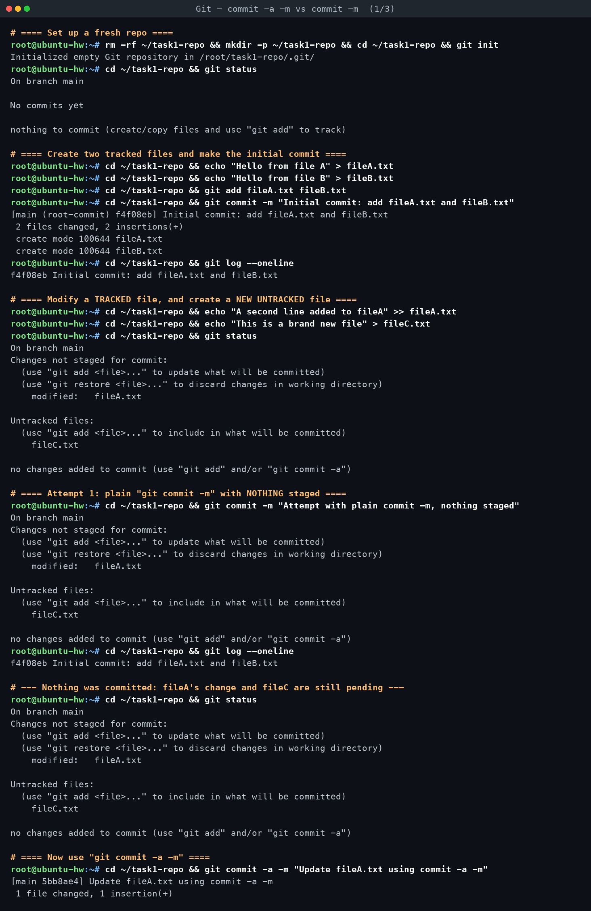
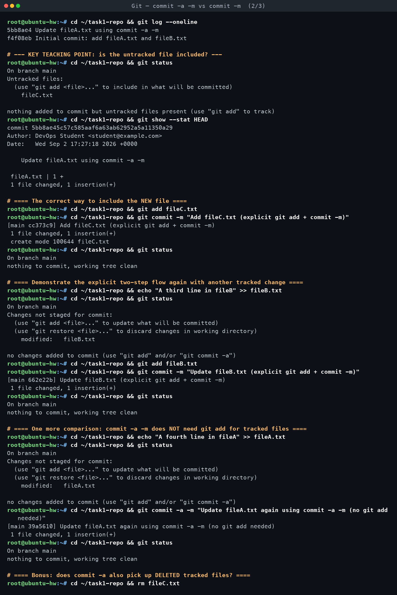
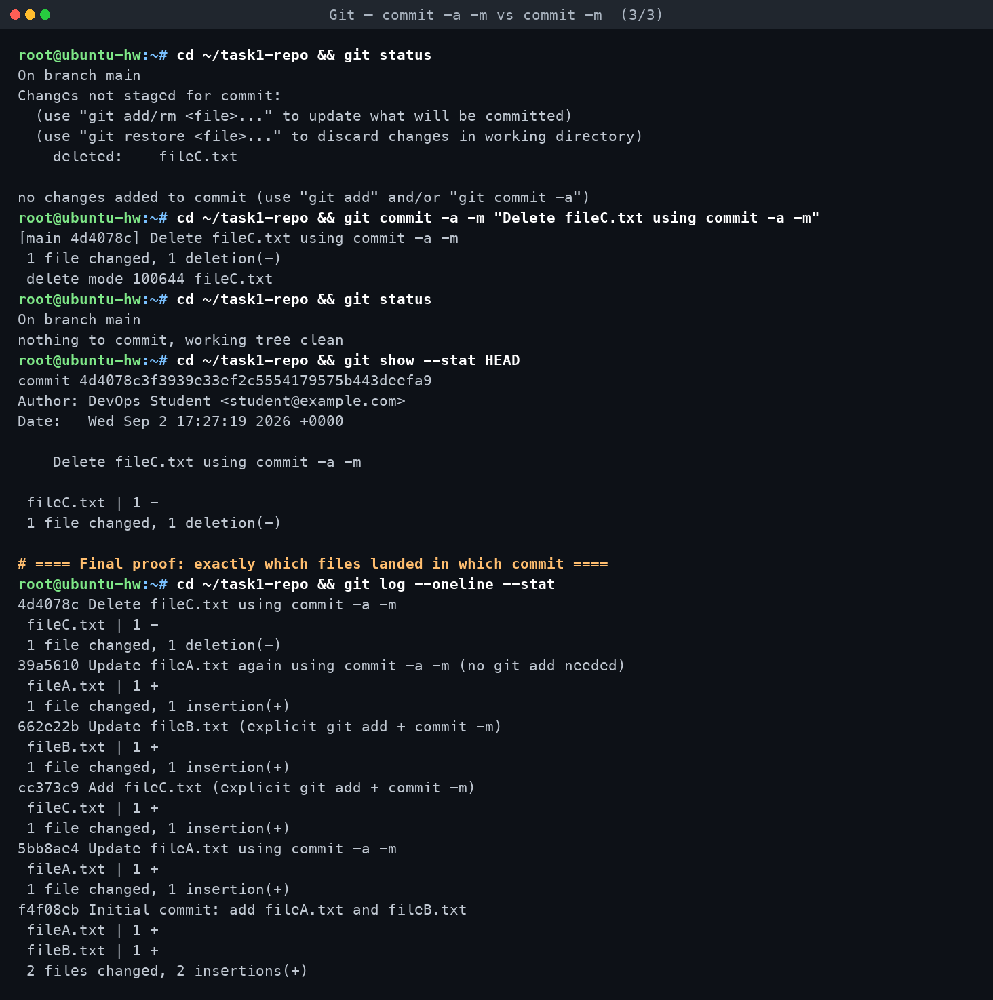

# Task 1 — `git commit -a -m` vs `git commit -m`

**Assignment requirements** (verbatim from `DevOps Homework.docx`):

> - Practice `git commit -a -m "message"`.
> - Understand the difference between `git commit -a -m` and `git commit -m`.
> - Test both commands and observe the difference.

*Practised for real on Ubuntu 24.04 (git 2.43.0) in container `git-t1`. Every command below
was executed; all output is verbatim.*

[← Back to Git & GitHub](../README.md)

---

## The staging area / index model

Git has three working areas, and every one of these commands only makes sense once you can
name them:

```
 working tree  --git add-->    index (staging area)  --git commit-->   repository (HEAD)
 (your files      "what will be      "the snapshot that       "permanent history,
  on disk)         committed next"    the next commit takes"    one commit per state"
```

- **Working tree** — the actual files on disk, in whatever state you left them. `git status`
  compares this against the index to report "modified" / "untracked" / "deleted".
- **Index (a.k.a. "the stage" / "cache")** — a separate, hidden snapshot (`.git/index`) that
  sits *between* the working tree and history. `git add` is the only normal way to update it.
  A commit never looks at the working tree directly — it commits **whatever is in the index**
  at the moment `git commit` runs.
- **Repository** — the committed, immutable history. `git commit` takes the current index
  content, wraps it in a commit object pointing at the previous commit, and moves the branch
  pointer (`HEAD`) forward.

`git commit -m "msg"` commits **only what is already in the index**. If nothing was staged
with `git add`, there is nothing to commit, no matter what changed on disk.

`git commit -a -m "msg"` adds one extra, automatic step *before* the normal commit: it stages
every change to a file **git already tracks** (modified or deleted) — as if you had run
`git add -u` first — and then commits. It never touches files git doesn't know about yet.

## Comparison table

| | `git commit -m "msg"` | `git commit -a -m "msg"` |
|---|---|---|
| What gets staged first | Nothing — commits exactly what is already in the index from a prior `git add` | Modifications and deletions to **already-tracked** files (equivalent to an implicit `git add -u`) |
| **New / untracked files** | Not included (never touches the index for files never added) | **Still not included** — this is the #1 misconception, see the "gotcha" below |
| **Deleted tracked files** | Not included unless you ran `git add <file>` or `git rm <file>` first | **Included automatically** — confirmed below (`fileC.txt` deletion was committed with `-a` alone) |
| **Modified tracked files** | Not included unless staged with `git add <file>` | **Included automatically** |
| If nothing is staged and `-a` is omitted | Fails: `no changes added to commit` — no new commit is created | N/A |
| Typical use | Deliberate, reviewed commits — you choose exactly which hunks/files go in (`git add -p`, partial staging) | Quick "commit everything I changed" for files you already track — a shortcut for `git add -u && git commit -m` |
| Risk | None specific — the risk is forgetting to `git add` and being confused why the commit is empty/missing files | **Silently omits brand-new files** you meant to include, and can sweep in unrelated tracked-file edits you forgot about, producing an unreviewed, noisy commit |

## What actually happened (real evidence)

Repo `~/task1-repo` in container `git-t1`. Two tracked files (`fileA.txt`, `fileB.txt`) were
committed first (`f4f08eb`). Then `fileA.txt` was modified **and** a brand-new `fileC.txt`
was created — both uncommitted, nothing staged:

```
$ git status
Changes not staged for commit:
        modified:   fileA.txt
Untracked files:
        fileC.txt
no changes added to commit (use "git add" and/or "git commit -a")
```

**Attempt 1 — plain `git commit -m` with nothing staged:**

```
$ git commit -m "Attempt with plain commit -m, nothing staged"
On branch main
Changes not staged for commit:
        modified:   fileA.txt
Untracked files:
        fileC.txt
no changes added to commit (use "git add" and/or "git commit -a")
```

Git **refused to create a commit** and printed the same status report instead of an error.
`git log --oneline` right after confirms only the original `f4f08eb` exists — nothing new.

**Attempt 2 — `git commit -a -m`:**

```
$ git commit -a -m "Update fileA.txt using commit -a -m"
[main 5bb8ae4] Update fileA.txt using commit -a -m
 1 file changed, 1 insertion(+)
```

This time it committed — but `git show --stat 5bb8ae4` proves **only `fileA.txt`** was
included. And immediately after:

```
$ git status
Untracked files:
        fileC.txt
nothing added to commit but untracked files present (use "git add" to track)
```

**`fileC.txt` is still sitting there, completely untracked**, even though `-a` had just run.
`-a` staged the modification to the file git already tracked (`fileA.txt`) and committed it,
and simply never looked at `fileC.txt` because `-a` only ever expands to "stage tracked-file
changes," never "stage everything."

**The correct way to include a new file** is the explicit two-step flow:

```
$ git add fileC.txt
$ git commit -m "Add fileC.txt (explicit git add + commit -m)"
[main cc373c9] Add fileC.txt (explicit git add + commit -m)
```

This was repeated for `fileB.txt` (explicit `git add` + `git commit -m`, commit `662e22b`)
and again for `fileA.txt` with `-a -m` (no `git add` needed since it was already tracked,
commit `39a5610`) to show the pattern holds symmetrically.

**Bonus — does `-a` pick up *deletions* of tracked files?** Yes:

```
$ rm fileC.txt
$ git status
        deleted:    fileC.txt
$ git commit -a -m "Delete fileC.txt using commit -a -m"
[main 4d4078c] Delete fileC.txt using commit -a -m
 1 file changed, 1 deletion(-)
 delete mode 100644 fileC.txt
```

Deletions of tracked files are treated the same as modifications by `-a` — both are staged
automatically. Only brand-new, never-added files are excluded.

Final proof of exactly which files landed in which commit (`git log --oneline --stat`):

```
4d4078c Delete fileC.txt using commit -a -m
 fileC.txt | 1 -
39a5610 Update fileA.txt again using commit -a -m (no git add needed)
 fileA.txt | 1 +
662e22b Update fileB.txt (explicit git add + commit -m)
 fileB.txt | 1 +
cc373c9 Add fileC.txt (explicit git add + commit -m)
 fileC.txt | 1 +
5bb8ae4 Update fileA.txt using commit -a -m
 fileA.txt | 1 +
f4f08eb Initial commit: add fileA.txt and fileB.txt
 fileA.txt | 1 +
 fileB.txt | 1 +
```

Every file/commit pairing above matches exactly what was staged at that step — no surprises,
no invented output.

## Gotcha: `-a` silently skips new files

This is the single most common mistake with `git commit -a`: developers treat `-a` as "commit
absolutely everything I changed," run it, and are then confused later when a brand-new file
never made it into the repository — or worse, never notice until a teammate reports a missing
file, or a build breaks because a new source file was never pushed.

**Why it happens:** `-a` is documented as staging files that are "known to Git" — i.e., already
in the index from some previous commit. A new file has no index entry yet, so there is nothing
for `-a` to "re-stage." Git has no way to guess that you want a file it has never seen tracked.

**How to avoid it:**
- Always run `git status` before committing and actually read the "Untracked files" section.
- If you want everything, including new files, use `git add -A && git commit -m "..."` (or the
  older `git add .` from the repo root) instead of relying on `-a`.
- Treat `-a` as a shortcut *only* for "I edited/deleted files git already tracks and I'm sure
  that's all I want in this commit" — not as a general-purpose "stage everything" flag.

## Interview-style Q&A

**Q1. What exactly does the `-a` flag in `git commit -a` do, under the hood?**
It runs the equivalent of `git add -u` (stage modifications and deletions to already-tracked
files) immediately before the commit step, then proceeds with a normal `git commit`. It never
calls the general `git add .` / `git add -A`, so new files are never included.

**Q2. Why did `git commit -m "..."` with nothing staged not create a commit, and what did Git
print instead?**
Git compares the index to the last commit; if they're identical, there is nothing to record,
so it refuses and prints a status-style message ("no changes added to commit") along with the
current unstaged/untracked state — it does not error out loudly, which is itself a common
source of confusion when someone expects a hard failure.

**Q3. If you `rm` a tracked file (delete it from disk) without `git rm`, will `git commit -a`
commit that deletion?**
Yes — confirmed directly in this exercise (`fileC.txt` deletion, commit `4d4078c`). `-a`
treats "deleted from disk" the same as "modified" for files git already tracks: both get
staged automatically. Only *new, untracked* files are excluded.

**Q4. When would you deliberately avoid `git commit -a`?**
Whenever you want a reviewed, atomic commit — e.g. using `git add -p` to stage only specific
hunks, splitting one logical change from an unrelated one you happened to also edit, or when
your working tree has debug/local-only edits mixed in with the real change you want to ship.
`-a` removes that control by staging *all* tracked-file changes indiscriminately.

**Q5. Does `git commit -a -m` ever fail the same way plain `git commit -m` does?**
Yes — if there are no modifications/deletions to tracked files at all (e.g. only a new
untracked file exists, or the working tree is already clean), `-a` has nothing to stage and
the commit is refused with the same "nothing to commit" style message.

**Q6. Is `git commit -a` equivalent to `git add -A && git commit`?**
No, and this is a frequent misstatement. `git add -A` (or `git add .`) stages *everything*,
including brand-new files. `git commit -a` only stages tracked-file modifications and
deletions. They coincide only when there happen to be no untracked new files present.

<!-- AUTO-ATTACHED: screenshots & transcripts -->

## Screenshots — practice session





## Full terminal transcript

- [Git — commit -a -m vs commit -m](transcript.md)
