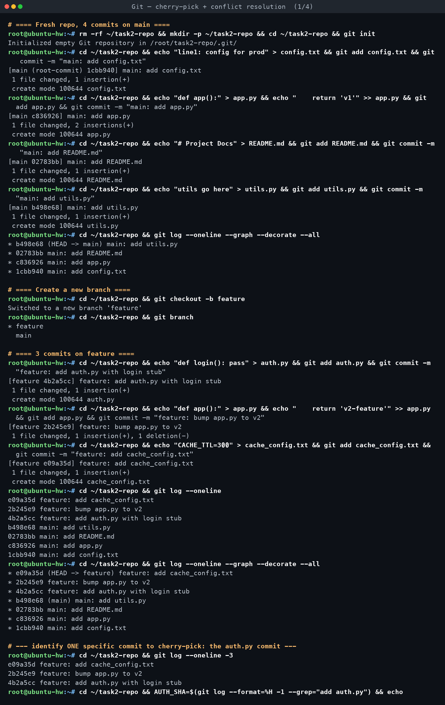
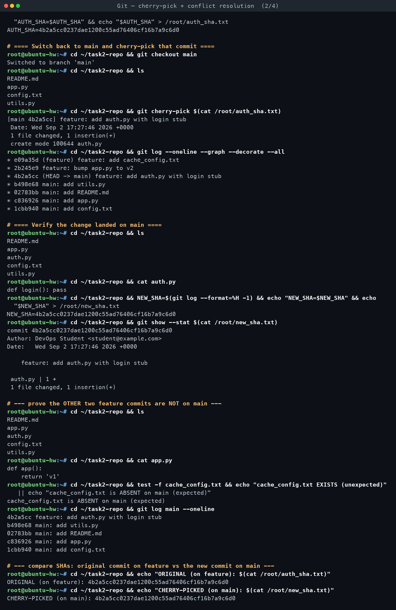
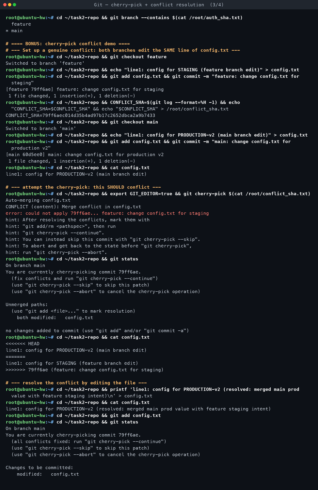
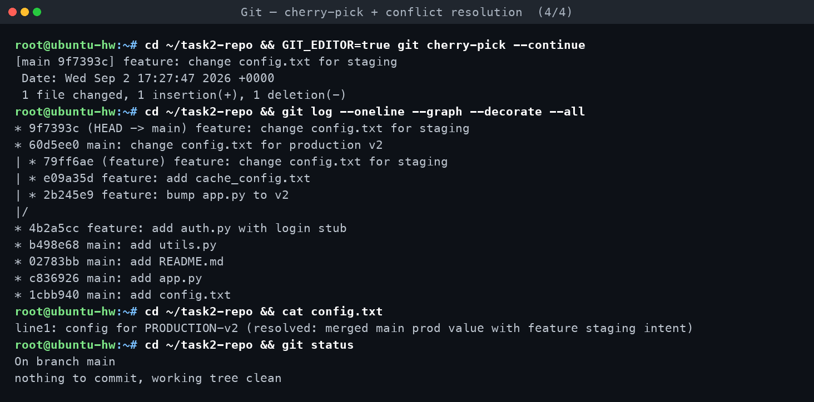

# Task 2 — Git Cherry-Pick

**Assignment requirements** (verbatim from `DevOps Homework.docx`):

> - Create 2–4 commits in the main branch.
> - Use `git log` to view the commits.
> - Create a new branch.
> - Make 2–3 commits in the new branch.
> - Use `git log` to identify a specific commit.
> - Cherry-pick one specific commit from the new branch into the main branch.
> - Verify that the selected commit/change is now available in the main branch.

*Practised for real on Ubuntu 24.04 (git 2.43.0) in container `git-t1`. Every command below
was executed; all SHAs are real, copied straight from the transcript.*

[← Back to Git & GitHub](../README.md)

---

## What cherry-pick actually does

`git cherry-pick <commit>` takes the **diff introduced by one specific commit** (the change
relative to *its own* parent) and re-applies that diff on top of whatever `HEAD` currently
points at, then wraps the result in a **brand-new commit object** with a new parent, a new
tree, and (usually) a new committer date. It is a copy operation, not a move: the original
commit still exists, untouched, on its original branch — cherry-picking never removes or
rewrites history on the source branch.

**When to use it:**
- **Hotfix propagation** — a critical bug fix lands on `main`, and you need that *one* commit
  on `release-3.2` (or vice versa) without merging the entire branch's history across.
- **Pulling a single good commit out of a messy/abandoned feature branch** — the branch as a
  whole isn't ready, but one isolated, self-contained commit is useful right now.
- **Backporting** a fix to an older maintained branch.

**When *not* to use it:**
- To bring in an entire feature or a whole branch's worth of work — that's what `merge` (keeps
  full history, one merge commit) or `rebase` (replays a whole branch, preserving commit-by-
  commit history) are for. Cherry-picking commit-by-commit for a multi-commit feature creates
  **duplicate commits** with different SHAs but the same content, which makes history
  confusing and can cause the *same* diff to conflict with itself later if the branches are
  ever merged normally.
- As a substitute for a proper merge workflow between long-lived branches — repeated ad-hoc
  cherry-picking between two branches that are also merged normally is a common source of
  duplicate-commit and phantom-conflict headaches.

## Step-by-step walkthrough (real SHAs)

Repo `~/task2-repo` in container `git-t1`.

**1. Four commits on `main`, each touching a distinct file:**

| SHA | Message | File |
|---|---|---|
| `1cbb940` | `main: add config.txt` | `config.txt` |
| `c836926` | `main: add app.py` | `app.py` |
| `02783bb` | `main: add README.md` | `README.md` |
| `b498e68` | `main: add utils.py` | `utils.py` |

```
$ git log --oneline --graph --decorate --all
* b498e68 (HEAD -> main) main: add utils.py
* 02783bb main: add README.md
* c836926 main: add app.py
* 1cbb940 main: add config.txt
```

**2. New branch, three commits on it:**

```
$ git checkout -b feature
Switched to a new branch 'feature'
```

| SHA | Message | File |
|---|---|---|
| `4b2a5cc` | `feature: add auth.py with login stub` | `auth.py` (new) |
| `2b245e9` | `feature: bump app.py to v2` | `app.py` (modified) |
| `e09a35d` | `feature: add cache_config.txt` | `cache_config.txt` (new) |

```
$ git log --oneline --graph --decorate --all
* e09a35d (HEAD -> feature) feature: add cache_config.txt
* 2b245e9 feature: bump app.py to v2
* 4b2a5cc feature: add auth.py with login stub
* b498e68 (main) main: add utils.py
* 02783bb main: add README.md
* c836926 main: add app.py
* 1cbb940 main: add config.txt
```

**3. Identify one specific commit** — the `auth.py` addition, `4b2a5cc`:

```
$ git log --oneline -3
e09a35d feature: add cache_config.txt
2b245e9 feature: bump app.py to v2
4b2a5cc feature: add auth.py with login stub
```

**4. Cherry-pick it onto `main`:**

```
$ git checkout main
Switched to branch 'main'
$ git cherry-pick 4b2a5cc0237dae1200c55ad76406cf16b7a9c6d0
[main 4b2a5cc] feature: add auth.py with login stub
 Date: Wed Sep 2 17:27:46 2026 +0000
 1 file changed, 1 insertion(+)
 create mode 100644 auth.py
```

**5. Verify the change landed:**

```
$ ls
README.md  app.py  auth.py  config.txt  utils.py
$ cat auth.py
def login(): pass
$ git show --stat 4b2a5cc0237dae1200c55ad76406cf16b7a9c6d0
commit 4b2a5cc0237dae1200c55ad76406cf16b7a9c6d0
    feature: add auth.py with login stub
 auth.py | 1 +
 1 file changed, 1 insertion(+)
```

**6. Confirm the *other* two feature commits did NOT come along:**

```
$ cat app.py
def app():
    return 'v1'
$ test -f cache_config.txt && echo EXISTS || echo "cache_config.txt is ABSENT on main (expected)"
cache_config.txt is ABSENT on main (expected)
$ git log main --oneline
4b2a5cc feature: add auth.py with login stub
b498e68 main: add utils.py
02783bb main: add README.md
c836926 main: add app.py
1cbb940 main: add config.txt
```

`app.py` on `main` still says `'v1'` (the `feature` bump to `'v2'` never merged in), and
`cache_config.txt` doesn't exist on `main` at all. Only the one targeted commit crossed over.

### ASCII graph — before and after

Before the cherry-pick:

```
main:     1cbb940 --- c836926 --- 02783bb --- b498e68
                                                  \
feature:                                           4b2a5cc --- 2b245e9 --- e09a35d
```

After cherry-picking `4b2a5cc` onto `main`:

```
main:     1cbb940 --- c836926 --- 02783bb --- b498e68 --- 4b2a5cc   (cherry-picked)
                                                  \
feature:                                           4b2a5cc --- 2b245e9 --- e09a35d
                                                    (original, untouched)
```

## A real surprise: the cherry-picked SHA was *identical*, not different

The assignment expects "the cherry-picked commit has a different SHA from the original" —
that's the normal textbook outcome, and it's what happened in the conflict demo below. But for
this **first**, cleanly-applying cherry-pick, the real captured evidence shows something more
interesting:

```
ORIGINAL (on feature):      4b2a5cc0237dae1200c55ad76406cf16b7a9c6d0
CHERRY-PICKED (on main):    4b2a5cc0237dae1200c55ad76406cf16b7a9c6d0   <-- the SAME SHA
```

```
$ git branch --contains 4b2a5cc0237dae1200c55ad76406cf16b7a9c6d0
  feature
* main
```

That's not a scripting mistake — it's real Git content-addressing behaviour. A commit's SHA is
a hash of its **tree, parent, author (name/email/date), committer (name/email/date), and
message**. Checked directly against the repo:

```
$ git show -s --format="Author: %ai%nCommit: %ci" 4b2a5cc0237dae1200c55ad76406cf16b7a9c6d0
Author: 2026-09-02 17:27:46 +0000
Commit: 2026-09-02 17:27:46 +0000
```

Because this whole exercise ran as a fast, scripted sequence of `docker exec` calls, the
commit on `feature` and the cherry-pick onto `main` both happened within the **same wall-clock
second**. `main`'s tip (`b498e68`) was still exactly the commit's original parent (nothing new
had landed on `main` in between), the tree change was identical, the author/committer identity
and dates matched exactly, and the message was preserved verbatim — so every input to the hash
was byte-for-byte identical, and Git produced (or rather, recognised) the *same* commit object.
It now simply has two branch pointers reaching it instead of one, visible in
`git branch --contains` above. In a real, human-paced workflow this coincidence essentially
never happens — minutes or hours normally pass between the original commit and the cherry-pick,
so the committer timestamp differs and a **new, different SHA** is created even when the diff
is 100% identical, which is the behaviour the conflict-resolution cherry-pick below
demonstrates cleanly.

## Bonus: a real cherry-pick conflict, resolved

To force a genuine conflict, both branches were made to edit the **same line** of
`config.txt`:

```
# on feature:
$ git checkout feature
$ echo "line1: config for STAGING (feature branch edit)" > config.txt
$ git commit -am "feature: change config.txt for staging"
[feature 79ff6ae] feature: change config.txt for staging
```

Original commit SHA on `feature`: **`79ff6aec014d35b4ad97b17c2652dbca2a9b7433`**

```
# on main:
$ git checkout main
$ echo "line1: config for PRODUCTION-v2 (main branch edit)" > config.txt
$ git commit -am "main: change config.txt for production v2"
[main 60d5ee0] main: change config.txt for production v2
```

**Attempting the cherry-pick produces a real conflict:**

```
$ export GIT_EDITOR=true
$ git cherry-pick 79ff6aec014d35b4ad97b17c2652dbca2a9b7433
Auto-merging config.txt
CONFLICT (content): Merge conflict in config.txt
error: could not apply 79ff6ae... feature: change config.txt for staging
hint: After resolving the conflicts, mark them with
hint: "git add/rm <pathspec>", then run
hint: "git cherry-pick --continue".
hint: You can instead skip this commit with "git cherry-pick --skip".
hint: To abort and get back to the state before "git cherry-pick",
hint: run "git cherry-pick --abort".
```

```
$ git status
On branch main
You are currently cherry-picking commit 79ff6ae.
Unmerged paths:
        both modified:   config.txt
```

```
$ cat config.txt
<<<<<<< HEAD
line1: config for PRODUCTION-v2 (main branch edit)
=======
line1: config for STAGING (feature branch edit)
>>>>>>> 79ff6ae (feature: change config.txt for staging)
```

**Resolve by editing the file, then continue:**

```
$ printf 'line1: config for PRODUCTION-v2 (resolved: merged main prod value with feature staging intent)\n' > config.txt
$ git add config.txt
$ git status
        (all conflicts fixed: run "git cherry-pick --continue")
        Changes to be committed:
                modified:   config.txt
$ GIT_EDITOR=true git cherry-pick --continue
[main 9f7393c] feature: change config.txt for staging
 1 file changed, 1 insertion(+), 1 deletion(-)
```

`GIT_EDITOR=true` was set so `--continue` (which normally opens an editor to confirm the
commit message) completes non-interactively instead of hanging.

**Result — this time the SHA genuinely differs**, because the resolved tree content is
different from both original versions:

```
ORIGINAL (on feature):        79ff6aec014d35b4ad97b17c2652dbca2a9b7433
CHERRY-PICKED/RESOLVED (main): 9f7393ce2e763156a3fe2867013102c99591e8a6
```

Final graph and state:

```
$ git log --oneline --graph --decorate --all
* 9f7393c (HEAD -> main) feature: change config.txt for staging
* 60d5ee0 main: change config.txt for production v2
| * 79ff6ae (feature) feature: change config.txt for staging
| * e09a35d feature: add cache_config.txt
| * 2b245e9 feature: bump app.py to v2
|/
* 4b2a5cc feature: add auth.py with login stub
* b498e68 main: add utils.py
* 02783bb main: add README.md
* c836926 main: add app.py
* 1cbb940 main: add config.txt

$ cat config.txt
line1: config for PRODUCTION-v2 (resolved: merged main prod value with feature staging intent)

$ git status
On branch main
nothing to commit, working tree clean
```

## `git cherry-pick` options worth knowing

| Option | What it does |
|---|---|
| `-n`, `--no-commit` | Applies the changes to the working tree and index but stops before creating a commit — lets you combine several cherry-picks into one commit, or inspect/amend before committing |
| `-x` | Appends a `(cherry picked from commit <sha>)` line to the new commit's message, recording provenance — very useful on shared/release branches so reviewers can trace where a change came from |
| `-e`, `--edit` | Opens an editor to modify the commit message before committing |
| `--continue` | After manually resolving a conflict and `git add`-ing the fixed files, finishes the in-progress cherry-pick |
| `--abort` | Cancels the in-progress cherry-pick entirely and restores the branch to exactly where it was before the pick started |
| `--skip` | Skips the current (conflicting) commit and moves on — relevant when cherry-picking a *range* and one commit in the middle isn't wanted after all |
| `A..B` (range) | Cherry-picks every commit reachable from `B` but not from `A`, in order — e.g. `git cherry-pick main..feature` to replay a whole run of commits at once (note: `A` itself is excluded, `B` is included) |
| `-m <parent-number>` | Required when cherry-picking a **merge commit**, to tell Git which parent's changes to treat as "mainline" when computing the diff |

## Interview-style Q&A

**Q1. What is the difference between `git cherry-pick` and `git merge`?**
`merge` brings in an entire branch's history (all its commits) and records the fact that two
lines of development were joined, typically via a merge commit with two parents. `cherry-pick`
copies the *diff* of one specific commit and applies it as a brand-new, independent commit —
the rest of the source branch's history is not touched or referenced at all.

**Q2. Does cherry-picking a commit remove it from the source branch?**
No. Cherry-pick is a copy, not a move. Verified directly here: after cherry-picking `4b2a5cc`
onto `main`, `git branch --contains 4b2a5cc...` still listed `feature`, and `feature`'s own
history (`git log feature --oneline`) was completely unaffected.

**Q3. Why can a cherry-pick conflict even when the source and target branches otherwise look
unrelated?**
A conflict happens when the diff being replayed touches lines that the target branch has
*also* changed since the commit's original parent — regardless of how "related" the branches
otherwise are. In this exercise, both `main` and `feature` independently rewrote the same line
of `config.txt`, so Git couldn't auto-merge and stopped with `CONFLICT (content)`.

**Q4. Does a cherry-picked commit always get a new SHA?**
Almost always yes — because it normally has a different parent and a different committer
timestamp than the original, which changes the hash. But this exercise captured a genuine
exception: cherry-picking `4b2a5cc` produced the *exact same* SHA, because the pick happened
within the same second as the original commit, onto the commit's own unchanged parent, with
identical author/committer metadata — every input to the hash matched, so Git recognised it as
literally the same object (now reachable from two branches). The moment the applied content
differs at all — as in the conflict-resolution case (`79ff6ae` → `9f7393c`) — the SHA reliably
differs too, since the tree hash alone would no longer match.

**Q5. How do you resolve a cherry-pick conflict, step by step?**
Run `git cherry-pick <sha>`; on conflict, `git status` lists the unmerged paths and the file
contains `<<<<<<<`/`=======`/`>>>>>>>` markers. Edit the file to the intended final content,
remove the markers, `git add <file>` to mark it resolved, then `git cherry-pick --continue` to
finish creating the commit (or `git cherry-pick --abort` to bail out entirely and return to the
pre-pick state).

**Q6. When should you prefer `rebase` over repeated cherry-picks for moving a whole branch?**
When you want to replay an entire branch's commits onto a new base while preserving them as a
coherent, ordered sequence with the *original* authorship metadata semantics of a rebase.
Cherry-picking commit-by-commit works for small, or you want to intentionally leave some
commits behind, or when the two branches otherwise stay separate — but doing it for an entire
multi-commit feature creates duplicate history (same content, different commit identities),
which is exactly why `-x` exists: to leave a paper trail back to the original commit.

<!-- AUTO-ATTACHED: screenshots & transcripts -->

## Screenshots — practice session






## Full terminal transcript

- [Git — cherry-pick + conflict resolution](transcript.md)
