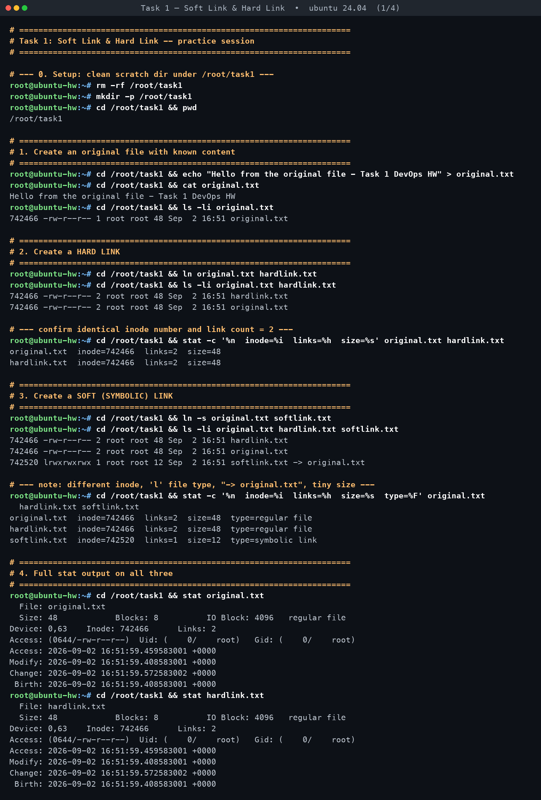
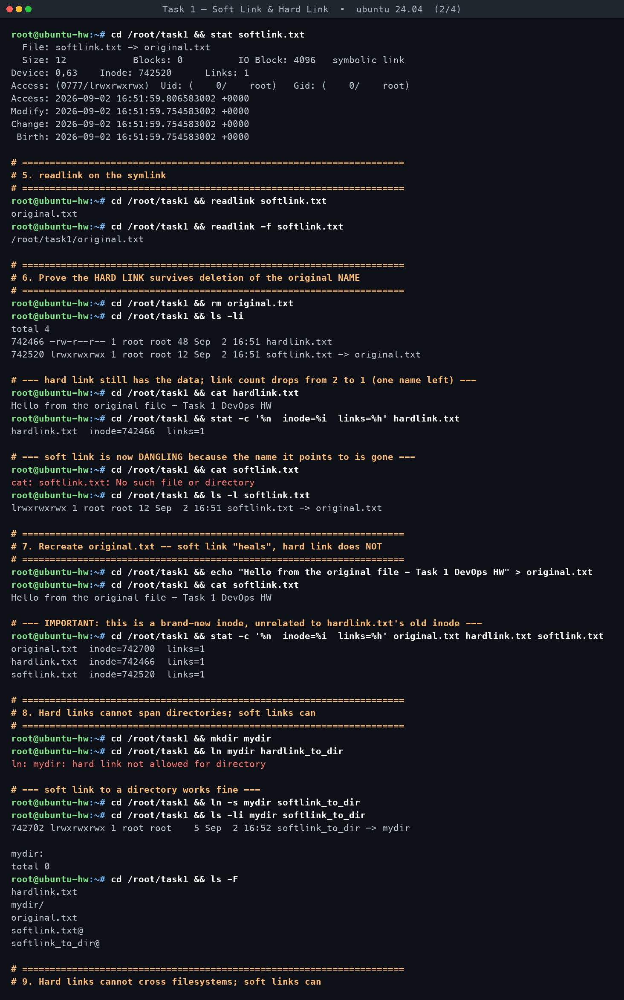
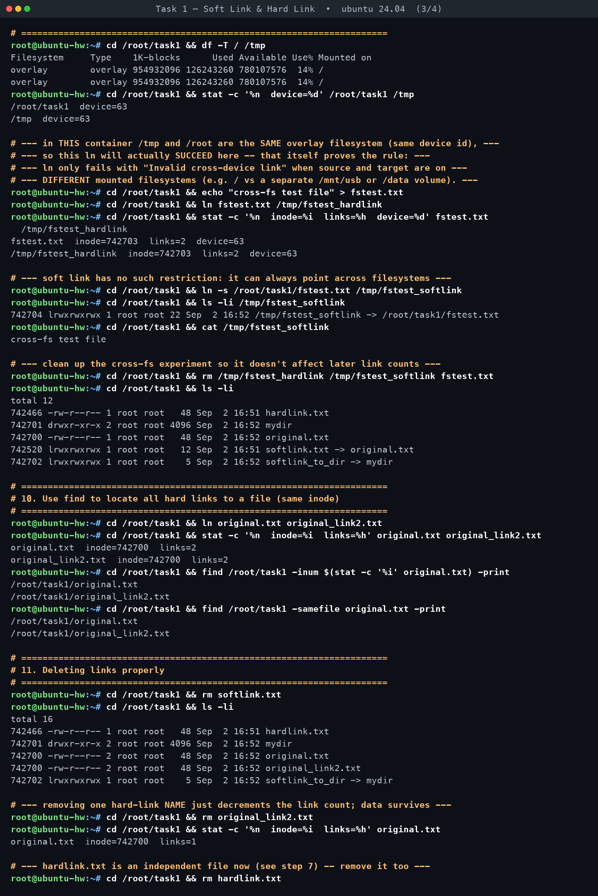
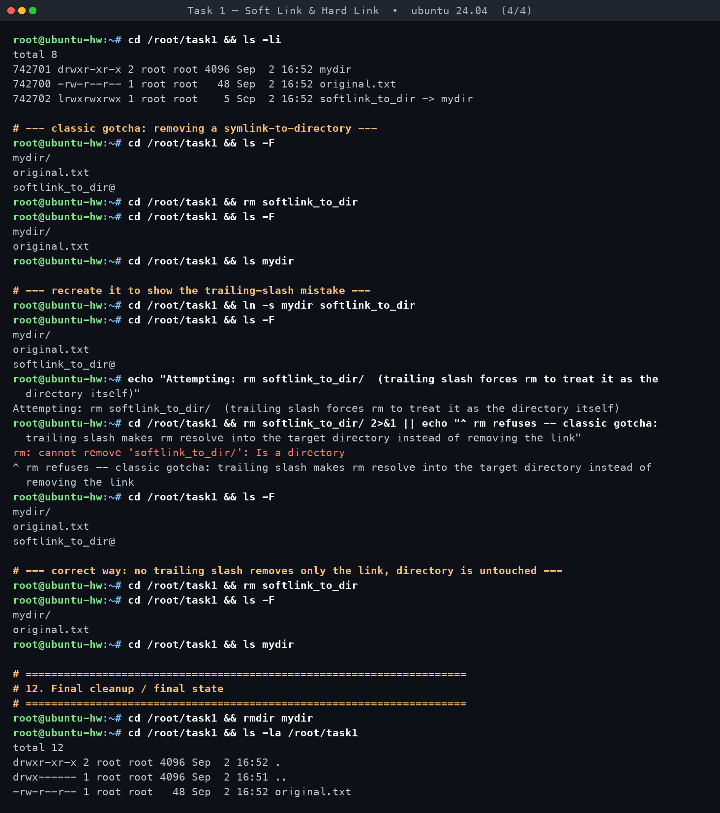

# Task 1 — Soft Link & Hard Link

**Assignment requirements** (verbatim from `DevOps Homework.docx`):

> - Learn the difference between soft links and hard links.
> - Learn the commands to create both.
> - Practice creating and deleting soft and hard links.
> - Prepare for this as an interview question.

*Practised for real on Ubuntu 24.04 in container `hw-t1`. Every command below was executed; all output is verbatim.*

[← Back to Linux Fundamentals](../README.md)

---

### What a link actually is

On Linux/ext-style and overlay filesystems, a file's data lives in an **inode** — a
data structure holding the file's metadata (owner, permissions, timestamps, size,
pointers to data blocks) and, critically, a **link count** (`Links:` in `stat`,
the second column of `ls -l`). A directory entry ("filename") is just a mapping
of a **name** to an **inode number**. A "file" as most people picture it is really
just one name pointing at one inode.

**Hard link** — a second directory entry that points at the *same inode number*
as an existing file. There is no "original" and "copy" after creation; both
names are equally valid, equal-weight references to the same data. The kernel
increments the inode's link count each time a hard link is added, and decrements
it each time a name is removed (`rm`/`unlink`). The actual data blocks are only
freed once the link count reaches **0** *and* no process still has the file
open.

**Soft link (symbolic link / symlink)** — a *separate, tiny file* that has its
**own inode** and whose content is nothing but a text string: the path of the
target. When the kernel resolves a symlink, it reads that path and re-does the
lookup from there. It is indirection by **name**, not by inode, so it can point
to files that do not exist (yet), to directories, and to paths on other
filesystems.

### Comparison table

| Property | Hard Link | Soft (Symbolic) Link |
|---|---|---|
| Inode | Shares the **same inode** as the target | Has its **own, different inode** |
| Cross-filesystem | **No** — target and link must be on the same filesystem/mount (same device id); attempting otherwise fails with `Invalid cross-device link` (EXDEV) | **Yes** — stores a path string, so it can point anywhere, including another mounted filesystem |
| Can link to a directory | **No** — `ln dir link` fails with `hard link not allowed for directory` (prevents filesystem-tree loops) | **Yes** — `ln -s dir link` works fine |
| Survives deletion of the "original" name | **Yes** — data lives on as long as link count > 0; the hard link is not "secondary," it's an equal reference | **No** — becomes a "dangling"/"broken" symlink; the name it stores no longer resolves |
| Size on disk | Same as the target (it *is* the target, just under another name) | Tiny — just the length of the stored target path (e.g. 12 bytes for `original.txt`) |
| Permissions | Identical to the target (same inode = same permission bits) | Symlinks themselves are always shown as `lrwxrwxrwx`; the permissions that actually apply on access are the **target's** |
| `ls -l` type letter | `-` (regular file) | `l` (symbolic link), shown with a `name -> target` arrow |
| Typical use cases | Backups/snapshots that must not duplicate disk space, deduplication, multiple "official" names for the same data | Shortcuts, versioned "current" pointers (`/usr/bin/python3 -> python3.12`), config file management, pointing across filesystems/mounts, linking to directories |

### Commands

```bash
# Create
ln target hardlink_name        # hard link
ln -s target softlink_name     # soft/symbolic link (relative or absolute target)

# Inspect
ls -li file...                 # -i shows inode number, first column
stat file                      # full metadata incl. "Links:" count and type
stat -c '%n inode=%i links=%h' file   # compact custom format
readlink softlink_name         # show what a symlink literally stores
readlink -f softlink_name      # fully resolve to the real absolute path
file softlink_name             # also reports symlink + target

# Find every hard link to a given file (i.e., every name sharing its inode)
find /path -inum $(stat -c '%i' file) -print
find /path -samefile file -print

# Delete
rm hardlink_name                # removes this name; data survives if links remain
rm softlink_name                # removes only the link; target untouched
rm symlink_to_dir               # correct: removes just the link
rm symlink_to_dir/              # WRONG / gotcha: trailing slash makes rm try to
                                 # resolve into the target directory -> "Is a directory"
```

### What actually happened in the practice session

All work was done in `/root/task1` inside the `hw-t1` Ubuntu 24.04 container
(transcript: `transcripts/task1.txt`).

- `original.txt` was created and got **inode `742466`**, link count `1`.
- After `ln original.txt hardlink.txt`, **both** `original.txt` and
  `hardlink.txt` reported inode `742466` with link count `2` — proving they
  are two names for one file, not two files.
- After `ln -s original.txt softlink.txt`, the symlink got its **own inode
  `742520`**, link count `1`, type `symbolic link`, size **12 bytes** (the
  length of the string `original.txt`), and `ls -li` showed the
  `softlink.txt -> original.txt` arrow. `readlink softlink.txt` printed the
  raw target `original.txt`; `readlink -f` resolved it to
  `/root/task1/original.txt`.
- Deleting `original.txt` dropped `hardlink.txt`'s link count from `2` to `1`
  on the **same inode `742466`**, and `cat hardlink.txt` still printed the
  original content — the data was never touched. `cat softlink.txt` failed
  with `No such file or directory` (a **dangling symlink**), while
  `ls -l softlink.txt` still happily showed the link itself, `-> original.txt`,
  because the link object exists even though its target doesn't.
- Recreating `original.txt` gave it a **brand-new inode, `742700`**. This is
  the important, easy-to-miss real result: the softlink healed automatically
  (`cat softlink.txt` worked again) because it resolves by *name* at access
  time — but `hardlink.txt` stayed on the old inode `742466` with link count
  `1`, now a fully independent file that just happens to contain identical
  bytes. Recreating a filename does **not** restore a hard-link relationship.
- `ln mydir hardlink_to_dir` failed exactly as the man page promises:
  `ln: mydir: hard link not allowed for directory`. `ln -s mydir
  softlink_to_dir` succeeded immediately, confirming only symlinks can target
  directories.
- For the cross-filesystem test, `stat -c '%d' /root/task1 /tmp` showed
  **device `63` for both** — in this container `/tmp` and `/root` sit on the
  same overlay filesystem, so `ln fstest.txt /tmp/fstest_hardlink` actually
  **succeeded** (inode `742703`, links `2`, same device `63` on both names).
  That null result is itself the proof of the rule: `ln` only refuses with
  `Invalid cross-device link` (EXDEV) when source and target live on genuinely
  different mounted filesystems (e.g. `/` vs. a separate `/mnt/data` volume),
  which this single-mount container doesn't have. `ln -s
  /root/task1/fstest.txt /tmp/fstest_softlink` worked regardless, as expected,
  since a symlink is just a stored path with no same-device requirement.
- `ln original.txt original_link2.txt` gave both names inode `742700`, links
  `2`. `find /root/task1 -inum 742700 -print` and
  `find /root/task1 -samefile original.txt -print` both correctly listed
  **both** `original.txt` and `original_link2.txt` — a real way to discover
  every hard link to a piece of data when you don't already know its other
  name(s). Removing `original_link2.txt` dropped the count back to `1` on
  inode `742700`, again with the data intact.
- The `rm symlink_to_dir/` (trailing slash) gotcha reproduced exactly as
  expected: `rm: cannot remove 'softlink_to_dir/': Is a directory` — the
  trailing slash forces path resolution to follow the symlink into `mydir`
  and then `rm` (without `-r`) correctly refuses to remove a directory. Without
  the trailing slash, `rm softlink_to_dir` removed only the link and left
  `mydir/` and its contents completely untouched.
- Final state of `/root/task1`: only `original.txt` remains, inode `742700`,
  link count `1` — everything else (both link types, the test directory, and
  the cross-filesystem test files) was cleanly removed.

### Interview Q&A

**Q1: What's the fundamental difference between a hard link and a soft link?**
A hard link is a second directory entry pointing at the exact same inode as
another file — same data, same permissions, same size, indistinguishable from
the "original." A soft link is a separate small file with its own inode whose
content is just the target's path string; the kernel follows that path at
access time. Hard links are inode-level aliases; soft links are name-level
pointers.

**Q2: Why can't you create a hard link to a directory?**
Two reasons. First, the filesystem's link count and structure assume a strict
tree — allowing arbitrary hard links to directories would let you create
cycles (a directory that is its own ancestor), which breaks tools like `find`,
`du`, and even `fsck` that assume no cycles when walking the tree. Second,
historically `..` and `.` are themselves implemented as hard links a
directory holds to its parent and to itself — letting users add more would
corrupt that bookkeeping. The kernel enforces this and `ln` fails with
`hard link not allowed for directory`. (`mount --bind` or `ln -s` are the
sanctioned ways to make a directory reachable from two places.)

**Q3: If you delete the file a hard link and a soft link both point to, what
happens to each?**
The hard link is unaffected — it *is* the data, just under another name. The
kernel only frees the underlying blocks when the link count drops to 0, so as
long as one hard-linked name still exists, `cat`, editing, etc. all keep
working through it. The soft link becomes a "dangling"/"broken" symlink: the
link object itself still exists (`ls -l` still shows it and its `-> target`
arrow) but any attempt to open it (`cat`, `vim`, etc.) fails with "No such
file or directory," because there's no longer anything at the path it
stores.

**Q4: What is a dangling (broken) symlink, and how do you find all of them
under a directory?**
It's a symlink whose stored target path doesn't currently resolve to a real
file — deleted, moved, or on unmounted media. Find them with
`find /path -xtype l` (or the more portable
`find /path -type l ! -exec test -e {} \; -print`). `ls -l` will render a
broken symlink's target in red on many terminals as a visual cue.

**Q5: Can a hard link cross filesystems / mount points? Why or why not?**
No. A hard link is literally a directory entry pointing at an inode number,
and inode numbers are only unique *within* a single filesystem — the same
number could legitimately refer to a completely different file on another
mounted filesystem. The kernel refuses with `errno EXDEV`
("Invalid cross-device link") if source and target aren't on the same
mounted filesystem. A soft link has no such restriction because it just
stores a path string and is resolved fresh at access time — it can point at
another mount, an NFS share, or a target that doesn't even exist yet.

**Q6: What does the "link count" shown by `ls -l` / `stat` actually mean, and
when does the space get freed?**
It's the number of directory entries (names) currently pointing at that
inode — i.e., how many hard links exist to that data, counting the first
"original" name as one of them. `rm` (unlink) on any one of those names just
decrements the count by one and removes that directory entry; the actual
disk blocks are only reclaimed once the count reaches 0 **and** no process
still has the file open (which is also why deleting a file that a running
process has open doesn't immediately free space — Linux keeps it alive as an
unlinked-but-open inode until the process closes it or exits).

**Q7: For config management (e.g. `/etc/nginx/sites-enabled/site.conf ->
../sites-available/site.conf`, or switching app versions with a `current ->
v2.3` pointer), why do people almost always reach for a symlink instead of a
hard link?**
Several reasons converge: (1) you usually want to point across directories or
even filesystems, which only symlinks support; (2) you want the pointer to be
visibly a pointer (`ls -l` shows the arrow and target — self-documenting;
a hard link is invisible, it just looks like a regular file); (3) you want
swapping the target to be atomic and effective everywhere at once — replace
what `current` points to (`ln -sfn v2.4 current`) and every consumer that
reads through the symlink instantly sees the new version, whereas a hard
link's name is permanently bound to one specific inode/version, not a
"pointer" you can repoint; (4) directories are common in this pattern
(pointing at a whole versioned release directory), and hard links can't
target directories at all.

**Q8 (bonus, classic sysadmin gotcha): What's wrong with running
`rm my_symlink_to_a_dir/` (with a trailing slash) instead of
`rm my_symlink_to_a_dir`?**
The trailing slash tells the path-resolution code to follow the symlink and
treat the result as the directory itself, not as the link. Since plain `rm`
(no `-r`) refuses to remove directories, you get
`rm: cannot remove 'link/': Is a directory` instead of removing the link —
confirmed in the practice session's transcript. Some tools/older `rm`
implementations under certain flags could instead try to act *inside* the
target directory, which is the dangerous version of this gotcha — always
drop the trailing slash when your intent is to delete the symlink itself.

---

## Screenshots — practice session

**Creating, inspecting and deleting soft & hard links**






## Full terminal transcripts

- [Task 1 — Soft Link & Hard Link · terminal transcript](transcript.md)
