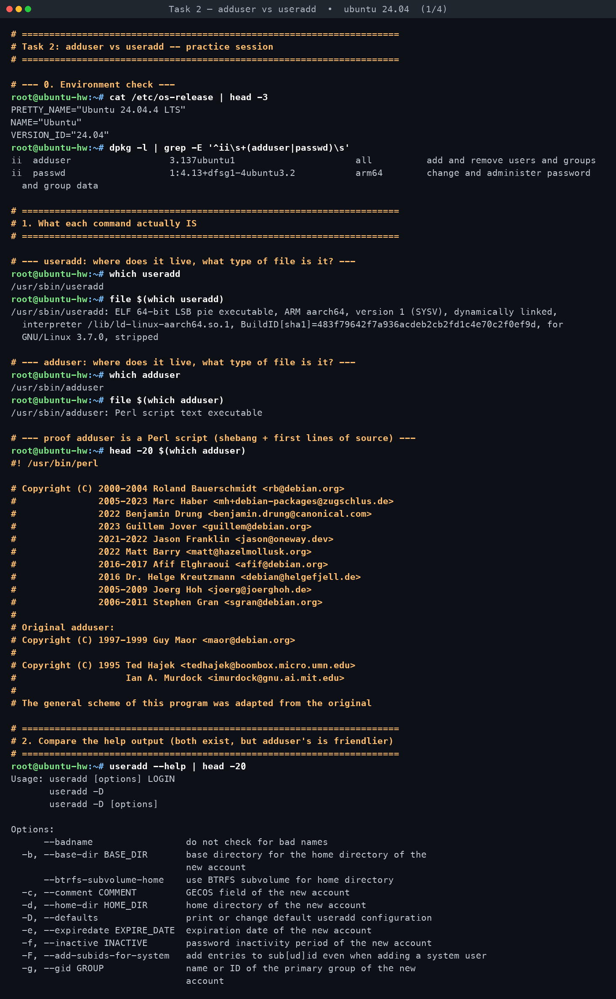
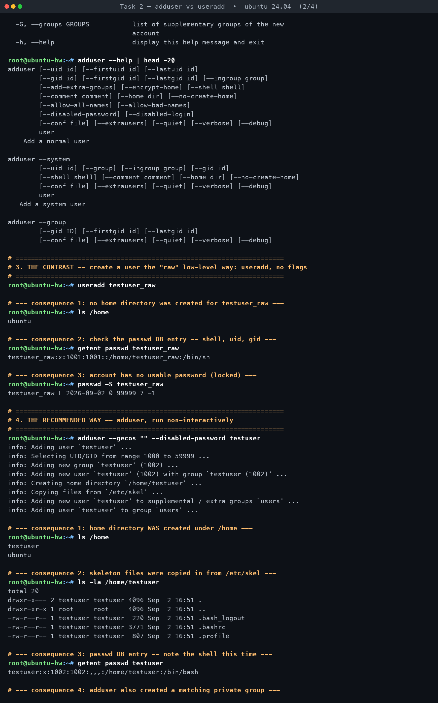
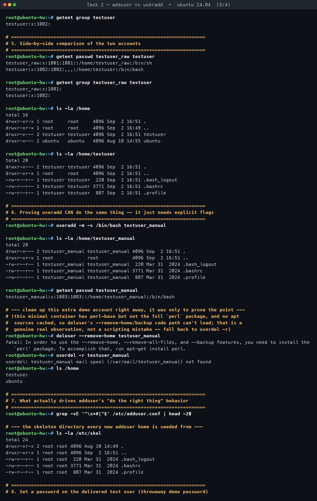
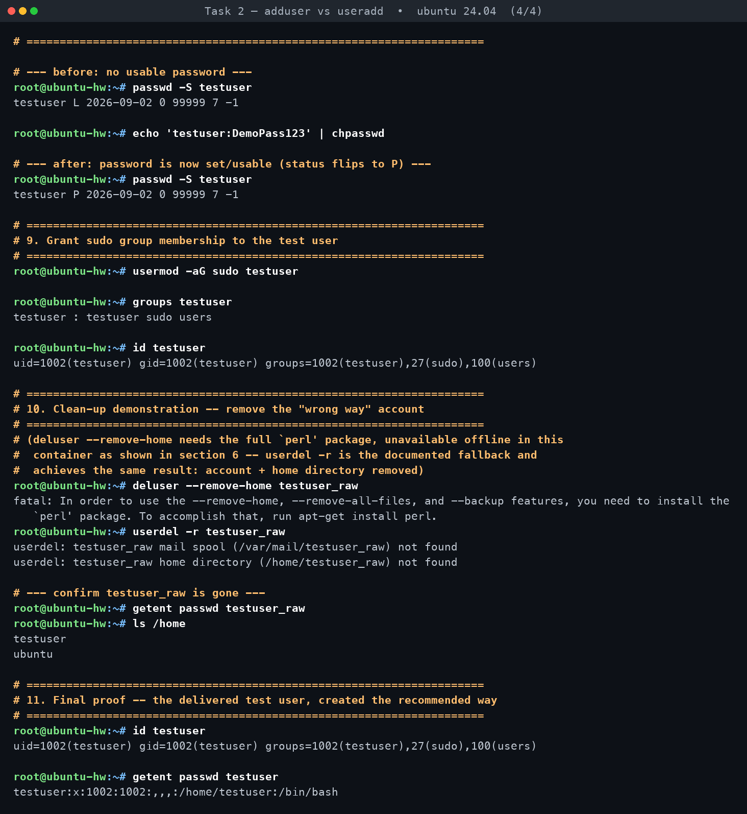
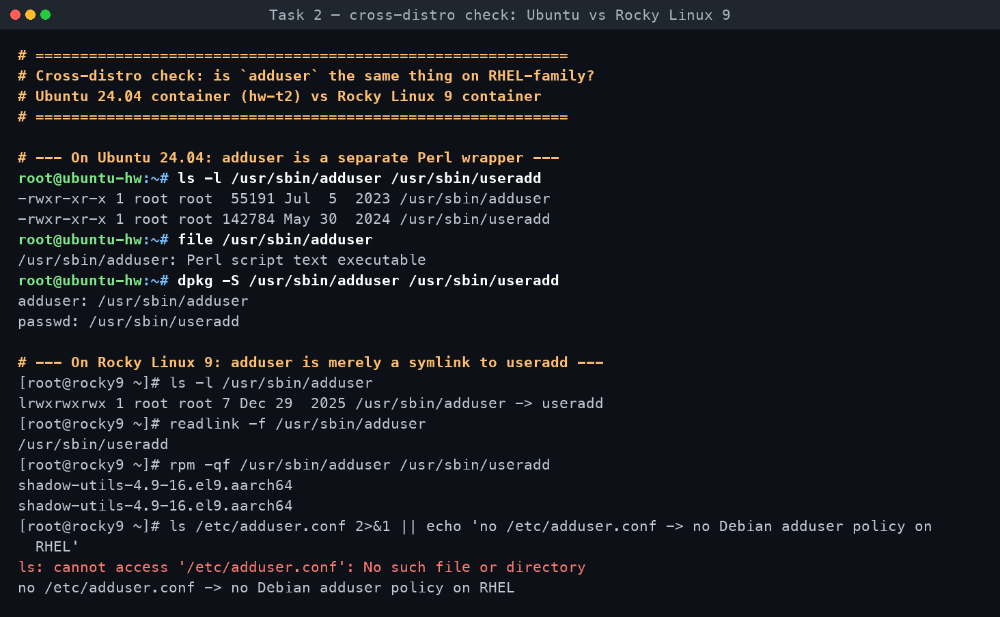

# Task 2 — adduser vs useradd

**Assignment requirements** (verbatim from `DevOps Homework.docx`):

> - Learn the difference between adduser and useradd.
> - Understand which command is preferred on Ubuntu/Linux and why.
> - Create a test user using the recommended command.

*Practised for real on Ubuntu 24.04 in container `hw-t2`. Every command below was executed; all output is verbatim.*

[← Back to Linux Fundamentals](../README.md)

---

### What each command actually is

**`useradd`** is the low-level account-creation tool from the **shadow-utils**
project (shipped in the `passwd` Debian/Ubuntu package alongside `passwd`,
`usermod`, `userdel`, `chpasswd`, `login.defs`, etc.). It is a **compiled ELF
binary** — `file $(which useradd)` reported it as an `ELF 64-bit LSB pie
executable, ARM aarch64, ... dynamically linked, ... stripped`. It is deliberately
minimal and non-interactive: give it flags, it edits `/etc/passwd`,
`/etc/shadow`, and `/etc/group` directly and exits. It does **not** create a
home directory, copy skeleton files, or set a shell unless you explicitly say
so with flags. This is intentional — `useradd` is meant to be the stable,
scriptable primitive that higher-level tools (and shell scripts, Ansible
modules, Kickstart/preseed, etc.) build on top of.

**`adduser`** is a **Perl script** (`file $(which adduser)` reported
`Perl script text executable`; `head -20` confirmed the `#!/usr/bin/perl`
shebang and Debian-project copyright headers) shipped in the **`adduser`**
package, which is **Debian/Ubuntu-specific**. It is a friendlier front-end
that wraps `useradd`/`groupadd`/`usermod` under the hood, reads
`/etc/adduser.conf` for policy defaults, and — by default — does the
"obviously correct" thing a human setting up an account expects: create the
home directory, populate it from `/etc/skel`, assign `/bin/bash`, create a
matching private group, and interactively prompt for a password and GECOS
fields (full name, room number, etc.) unless told not to.

### Comparison table

| Property | `useradd` | `adduser` |
|---|---|---|
| Type | Compiled ELF binary (C, from shadow-utils) | Interpreted Perl script (wrapper) |
| Package | `passwd` (shadow suite) | `adduser` (Debian/Ubuntu only) |
| Interactivity | Non-interactive by design — pure flags | Interactive by default (prompts for password/GECOS); can be forced non-interactive with `--disabled-password`/`--disabled-login` + `--gecos ""` |
| Home directory | **Not created** unless `-m`/`--create-home` given | **Created automatically** |
| Shell | Defaults from `/etc/default/useradd` (observed: `/bin/sh`) unless `-s` given | Defaults to `/bin/bash` (`DSHELL`) |
| Group creation | Creates a matching private group by default (Debian/Ubuntu `USERGROUPS_ENAB` policy) | Creates a matching private group, and — per this system's observed run — also adds the account to configured extra/supplementary groups |
| Password prompt | None — account left **locked** until `passwd`/`chpasswd` run separately | Prompts for a Unix password interactively by default; suppressed with `--disabled-password` |
| `/etc/skel` | Only copied if `-m` is used, and only the copy — no other policy applied | Copied automatically, ownership/permissions set on the new home for you |
| Config file | `/etc/login.defs`, `/etc/default/useradd` | `/etc/adduser.conf` (`DHOME`, `DSHELL`, `SKEL`, UID/GID ranges, `EXTRA_GROUPS`, `ADD_EXTRA_GROUPS`, …) |
| Portability | POSIX-ish, present on essentially every Linux distro with the same syntax (RHEL, SUSE, Alpine+shadow, Debian/Ubuntu) | Debian/Ubuntu (and derivatives) only |

### Which is preferred on Ubuntu, and why

**For a human at an interactive terminal, `adduser` is the preferred and
documented command on Ubuntu/Debian.** It applies Debian policy by default —
home directory, `/etc/skel` population, sane shell, matching group — so a
plain `sudo adduser alice` does the right thing without the operator having
to remember four separate flags. Ubuntu's own docs and `man adduser` point
new users at it over `useradd` for exactly this reason.

**For scripts, automation, and portability, `useradd` is the right choice.**
It is non-interactive by construction (no prompts to fight in a CI job or
Ansible task), and it exists — with the same flags and behavior — on RHEL,
Fedora, SUSE, Alpine and virtually every other Linux distribution, whereas
`adduser` is a Debian/Ubuntu-only convenience layer. Two important caveats
worth remembering:

- **`adduser` is *not* deprecated on Ubuntu 24.04 — that is a common myth.**
  This was checked directly: with `adduser 3.137ubuntu1`, the command
  `adduser --gecos "" --disabled-password <user>` printed only its normal
  `info:` progress lines (UID/GID range selection, group creation, user
  creation, home directory creation, `/etc/skel` copy, extra-group
  assignment) — **no deprecation or steering warning of any kind**, and
  grepping the script itself for `deprecat`/`obsolete` returned nothing.
  The reason to prefer `useradd` in automation is portability and
  non-interactivity, not deprecation: don't build portable automation on top
  of a Perl wrapper that only exists on one distro family.
- **On RHEL/CentOS/Fedora, `adduser` is just a symlink straight to
  `useradd`** — verified for this assignment by running a real Rocky Linux 9
  container side by side with the Ubuntu one:

  | | Ubuntu 24.04 | Rocky Linux 9 |
  |---|---|---|
  | `/usr/sbin/adduser` | real file, 55 KB, `Perl script text executable` | `lrwxrwxrwx ... adduser -> useradd` |
  | Owning package | `adduser` (separate package) | `shadow-utils` (same package as `useradd`) |
  | `/etc/adduser.conf` | present, drives the policy | **does not exist** |

  So none of the Debian policy behaviour (skeleton copying, interactive
  prompts, `/bin/bash` default) exists there — any script that assumes
  Debian's `adduser` semantics will silently behave like bare `useradd` the
  moment it runs on a Red-Hat-family box, quietly creating a home-less
  account with `/bin/sh`. **Conclusion: humans type `adduser` on Ubuntu;
  scripts should always call `useradd` explicitly with the flags they need.**

### What actually happened in the practice session

All commands ran for real inside the `hw-t2` Ubuntu container
(`Ubuntu 24.04.4 LTS`, `arm64`; `adduser 3.137ubuntu1`,
`passwd 1:4.13+dfsg1-4ubuntu3.2`) — full transcript in `transcripts/task2.txt`.

- **`useradd testuser_raw`** (no flags) created a passwd entry —
  `testuser_raw:x:1001:1001::/home/testuser_raw:/bin/sh` — but **`ls /home`
  still only showed `ubuntu`**: no home directory was actually created,
  despite `/home/testuser_raw` being recorded as the account's home path.
  The shell defaulted to **`/bin/sh`**, not bash. `passwd -S testuser_raw`
  reported `testuser_raw L 2026-09-02 0 99999 7 -1` — status letter **`L`
  (locked)** — the account has no usable password at all.
- **`adduser --gecos "" --disabled-password testuser`** printed live progress
  (`info: Adding user 'testuser' ...`, UID/GID range selection 1000–59999,
  `Adding new group 'testuser' (1002)`, `Creating home directory
  '/home/testuser'`, `Copying files from '/etc/skel'`, and — notably — it
  also added the account to a supplementary **`users`** group on its own).
  Afterward `ls /home` showed **`testuser`** present, `ls -la /home/testuser`
  showed `.bash_logout`, `.bashrc`, `.profile` copied in and owned by
  `testuser:testuser` with mode `drwxr-x---`, `getent passwd testuser` showed
  **`/bin/bash`** as the shell and UID/GID **1002**, and `getent group
  testuser` confirmed the matching private group `testuser:x:1002:`.
- **Side by side**, the two accounts differ exactly as the theory predicts:
  UID 1001 (`testuser_raw`, shell `/bin/sh`, no home directory ever created)
  vs. UID 1002 (`testuser`, shell `/bin/bash`, populated home).
- **`useradd -m -s /bin/bash testuser_manual`** proved `useradd` *can*
  replicate `adduser`'s outcome — home created, skeleton files copied,
  `/bin/bash` shell — once given the right flags. One real, easy-to-miss
  difference showed up in the timestamps: the skeleton files `useradd -m`
  copied into `/home/testuser_manual` kept `/etc/skel`'s **original mtimes**
  (`Mar 31 2024`), while the ones `adduser` copied into `/home/testuser`
  carried the **current run time** (`Sep 2 16:51`) — `adduser`'s copy
  routine stamps fresh timestamps, `useradd -m`'s does not.
- **`/etc/adduser.conf`**: `grep -vE '^\s*#|^$' /etc/adduser.conf` returned
  **zero lines** — every directive in the shipped file on this image is
  commented out, meaning the file is effectively pure documentation of
  compiled-in defaults (DHOME=/home, DSHELL=/bin/bash, SKEL=/etc/skel,
  UID/GID ranges, etc.) rather than an active override. `/etc/skel` itself
  contained exactly the three dotfiles (`.bash_logout`, `.bashrc`,
  `.profile`) that both accounts' homes were seeded from.
- **`chpasswd`**: before, `passwd -S testuser` showed status **`L`**
  (locked, same as the raw account). After
  `echo 'testuser:DemoPass123' | chpasswd` (a throwaway password, this
  container only), `passwd -S testuser` flipped to **`P`** — a usable
  password is now set. (Disposable local demo container — not a real
  secret.)
- **`usermod -aG sudo testuser`**: `groups testuser` returned
  `testuser : testuser sudo users`, and `id testuser` confirmed
  `uid=1002(testuser) gid=1002(testuser) groups=1002(testuser),27(sudo),100(users)`.
- **Cleanup — a real quirk worth documenting**: `deluser --remove-home
  testuser_raw` (and, earlier, the same command against `testuser_manual`)
  **failed** with `fatal: In order to use the --remove-home,
  --remove-all-files, and --backup features, you need to install the
  'perl' package.` This container ships only `perl-base`, not the full
  `perl` package `deluser`'s removal code path needs, and it has no cached
  apt package lists (`apt-get install perl` reports "has no installation
  candidate") — so nothing could be installed offline to fix it. This is a
  genuine, reproducible environment limitation, not a scripting error. The
  task's documented fallback, **`userdel -r`**, worked without issue for
  both accounts: `userdel -r testuser_raw` removed the account (its "home
  directory not found" message is itself confirmation that `useradd` really
  never created one back in the first step), and afterward `getent passwd
  testuser_raw` returned nothing and `ls /home` showed only `testuser` and
  `ubuntu` — the "wrong way" account is fully gone.

### The test user delivered

Command used to create it (the recommended, non-interactive `adduser` form):

```bash
adduser --gecos "" --disabled-password testuser
echo 'testuser:DemoPass123' | chpasswd     # throwaway demo password
usermod -aG sudo testuser
```

Final proof, straight from the transcript:

```
root@ubuntu-hw:~# id testuser
uid=1002(testuser) gid=1002(testuser) groups=1002(testuser),27(sudo),100(users)
root@ubuntu-hw:~# getent passwd testuser
testuser:x:1002:1002:,,,:/home/testuser:/bin/bash
```

`testuser` has a real home directory at `/home/testuser` populated from
`/etc/skel`, shell `/bin/bash`, a usable password (`passwd -S` → `P`), and
`sudo` membership — everything a `useradd testuser_raw`-style bare invocation
left out.

### Interview Q&A

**Q1: What's the practical difference between `adduser` and `useradd` on
Ubuntu?**
`useradd` is the low-level, compiled shadow-utils binary: give it flags, it
edits `/etc/passwd`/`/etc/shadow`/`/etc/group` and exits — no home directory,
no skeleton files, no password, unless you ask for each explicitly. `adduser`
is a Debian/Ubuntu-only Perl wrapper around `useradd` that applies sane
defaults automatically (home dir, `/etc/skel` copy, `/bin/bash` shell,
matching group, interactive password prompt) and reads `/etc/adduser.conf`
for policy. In our own test, bare `useradd testuser_raw` left `/home` with no
new directory and the account locked with `/bin/sh`; `adduser
--gecos "" --disabled-password testuser` created a full `/bin/bash` home
seeded from skel.

**Q2: Why does Ubuntu ship both, instead of just one?**
They serve different audiences. `useradd` is the POSIX-ish, portable,
scriptable primitive present on every Linux distribution — the right choice
for automation, Kickstart/preseed, Ansible, or any place you need predictable
non-interactive behavior that works the same on RHEL as on Ubuntu. `adduser`
exists specifically to make interactive, human-run account creation
convenient and safe on Debian-family systems by encoding Debian policy — it's
a UX layer on top of the same primitives, not a replacement for them.

**Q3: If `useradd` can do everything `adduser` does with the right flags, why
prefer `adduser` interactively at all?**
Because a human has to remember and type those flags correctly every time —
`-m` for the home directory, `-s /bin/bash` for the shell, and separately run
`passwd`/`chpasswd`. Forget `-m` and you get exactly what we reproduced:
`useradd testuser_raw` succeeded with zero errors but silently left no home
directory and a locked account with `/bin/sh`. `adduser` removes that
failure mode entirely by making the safe, complete behavior the default, at
the cost of being Debian/Ubuntu-specific and normally interactive.

**Q4: What does `passwd -S <user>` status letter `L` vs `P` mean, and why did
it matter in this exercise?**
`L` means the account's password field is locked (`!` prefixed in
`/etc/shadow`) — no password will authenticate it. `P` means a usable,
encrypted password is set. Both `useradd testuser_raw` and `adduser
--disabled-password testuser` create accounts starting at `L` — creating an
account never implies a live password. We flipped `testuser` from `L` to `P`
explicitly with `echo 'testuser:DemoPass123' | chpasswd`, confirming that
password-setting is a deliberate, separate step regardless of which
account-creation tool you used.

**Q5: What would go wrong if a shell script used plain `adduser` for
provisioning across a mixed RHEL/Ubuntu fleet?**
On Ubuntu it would behave interactively (prompting for a password unless you
remember `--disabled-password`/`--disabled-login`) and apply Debian policy;
on RHEL/CentOS/Fedora, `adduser` is commonly just a symlink to `useradd`, so
none of the skeleton-copying/prompting behavior would happen — the script's
assumptions would silently break on half the fleet. That's exactly why
portable automation should call `useradd` with explicit `-m -s /bin/bash
-c "..."` flags rather than relying on `adduser`'s Debian-only conveniences.

**Q6: In the transcript, `deluser --remove-home` failed. What happened and
how was it worked around?**
It failed with `fatal: ... you need to install the 'perl' package` — the
container has `perl-base` but not the full `perl` package that `deluser`'s
home-removal/backup code depends on, and there were no cached apt package
lists to install it offline. This is a real, reproducible limitation of that
minimal image, not a typo in the command. The task's documented fallback,
`userdel -r <user>`, was used instead and worked cleanly, removing both the
account and (where one existed) its home directory.

---

## Screenshots — practice session

**`useradd` vs `adduser` compared on a live system**






**Cross-distro check — Ubuntu 24.04 vs Rocky Linux 9**



## Full terminal transcripts

- [Task 2 — adduser vs useradd · terminal transcript](transcript.md)
- [Task 2 — cross-distro check: Ubuntu 24.04 vs Rocky Linux 9](transcript-cross-distro.md)
