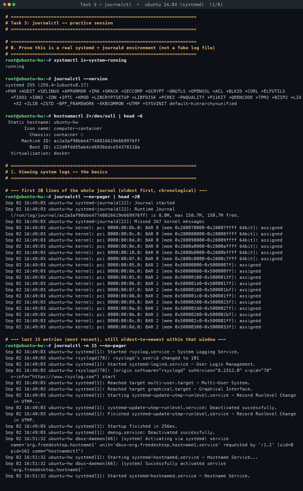
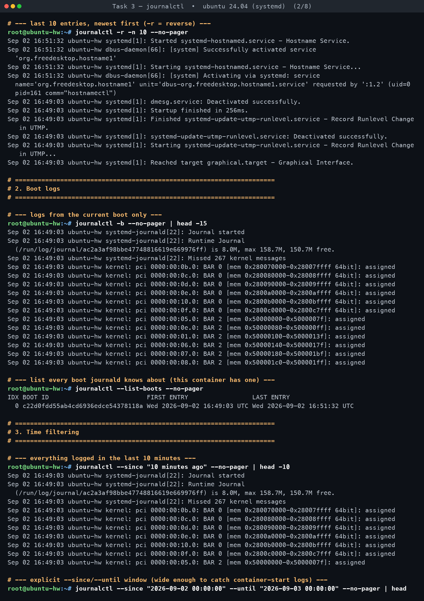
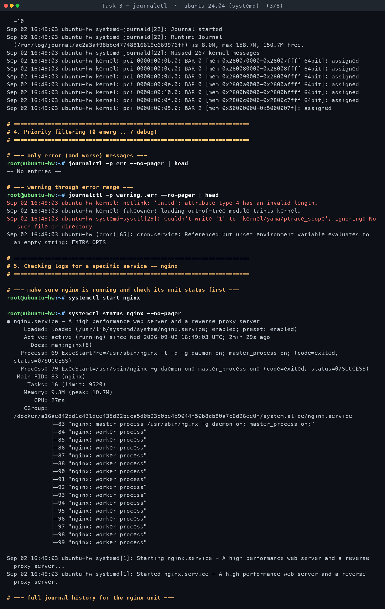
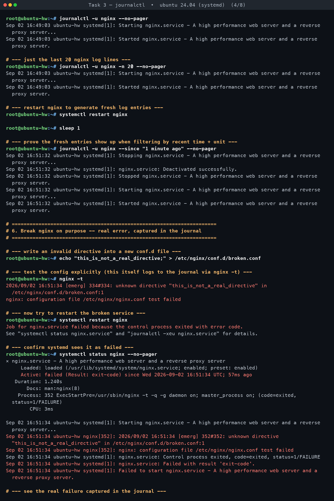
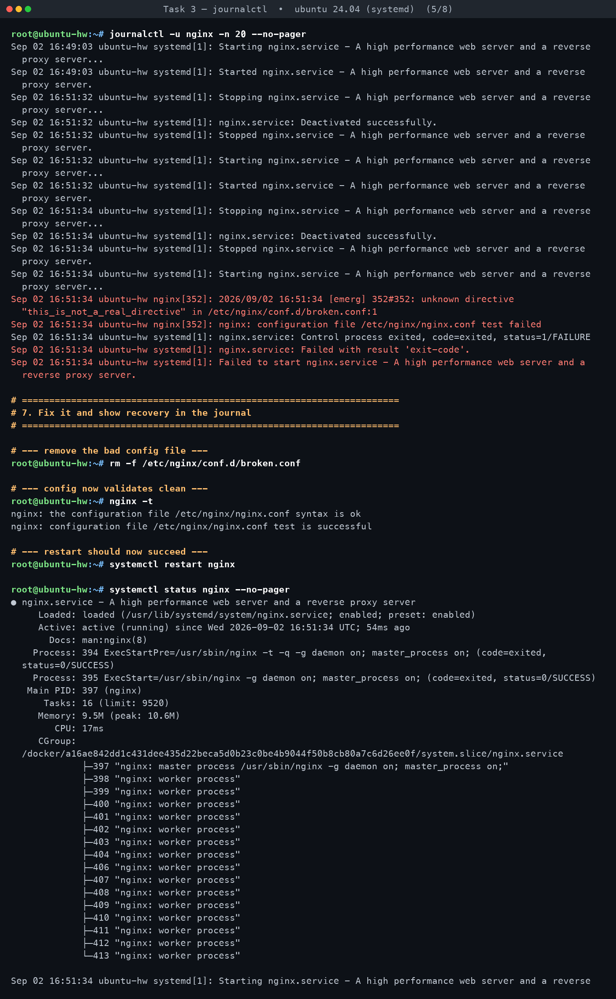
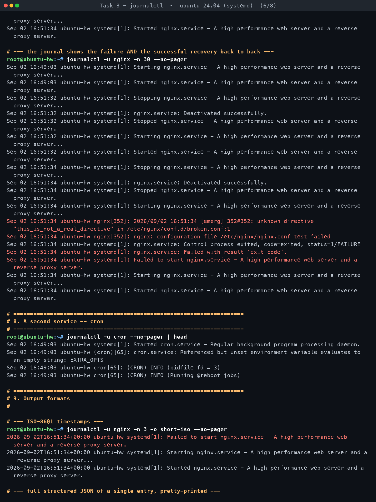
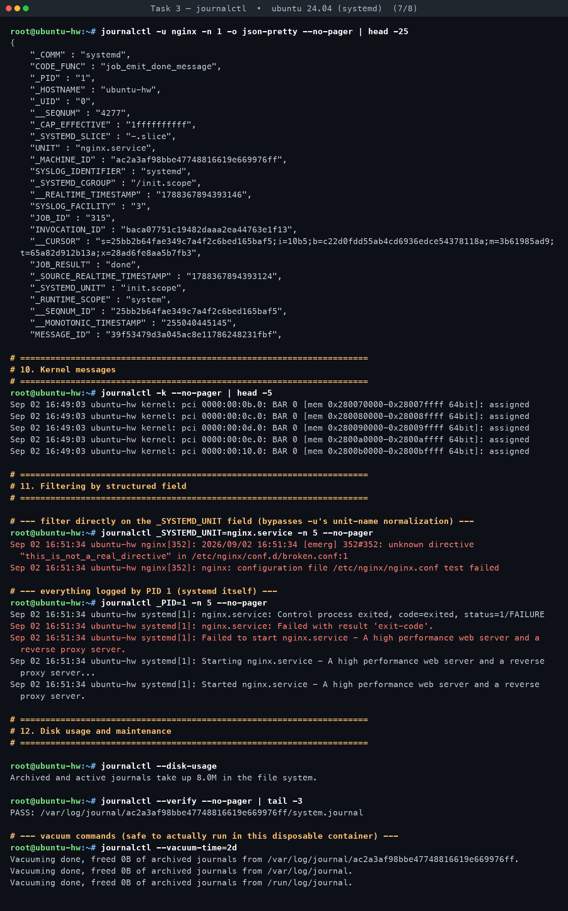
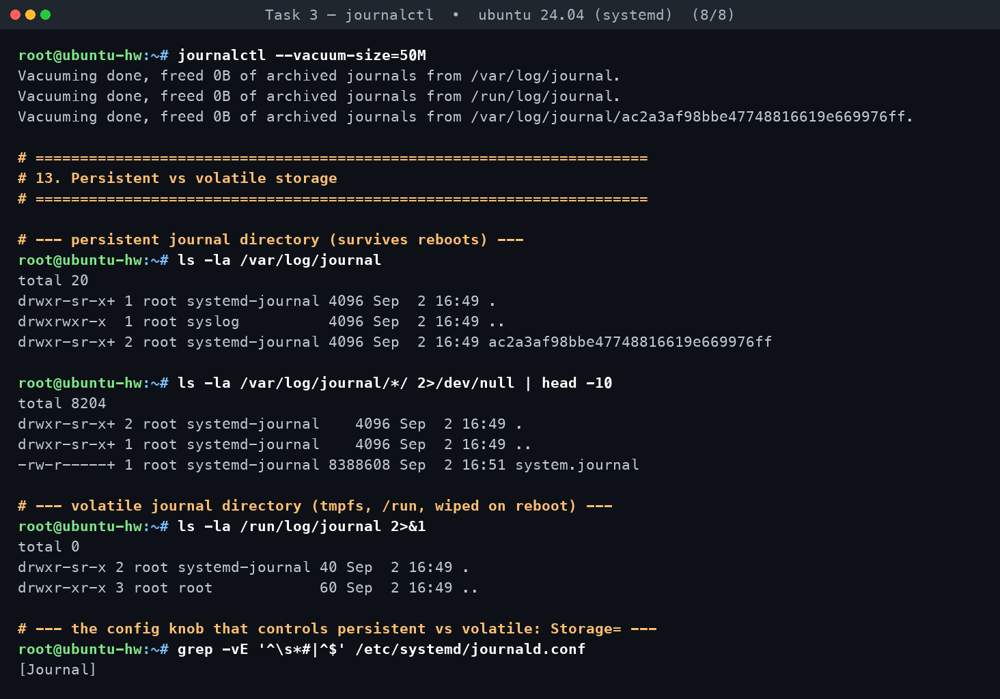

# Task 3 — journalctl

**Assignment requirements** (verbatim from `DevOps Homework.docx`):

> - Learn what journalctl is used for.
> - Learn how to view system and service logs using journalctl.
> - Practice checking logs for a specific service.

*Practised for real on Ubuntu 24.04 in container `hw-t3`. Every command below was executed; all output is verbatim.*

[← Back to Linux Fundamentals](../README.md)

---

### What `journalctl` actually is

`journalctl` is the query/read interface for **`systemd-journald`**, the logging daemon that ships with systemd. Instead of processes appending plain text lines to files under `/var/log` (the traditional rsyslog/syslog model), journald collects log data from the kernel ring buffer, every systemd unit's stdout/stderr, `syslog()` calls, and structured messages sent over its native API, and writes them into a **binary, indexed, structured** store — the journal files under `/run/log/journal` or `/var/log/journal`.

Practically, that means every log entry is a set of key/value fields (`MESSAGE`, `_SYSTEMD_UNIT`, `_PID`, `_UID`, `PRIORITY`, `_COMM`, `_BOOT_ID`, `__REALTIME_TIMESTAMP`, ...) rather than one opaque text line, and the store is indexed so `journalctl` can filter and jump around without scanning the whole file. On this container, `journalctl --version` reported `systemd 255`, and `journalctl -u nginx -n 1 -o json-pretty` (captured below) shows the real field set journald keeps per entry — `_PID`, `_UID`, `_CAP_EFFECTIVE`, `_SYSTEMD_CGROUP`, `INVOCATION_ID`, `__CURSOR`, `SYSLOG_FACILITY`, etc.

This is the key difference from `tail -f /var/log/syslog` + rsyslog:

| | Plain text logs (`/var/log/*.log`, rsyslog) | journald (`journalctl`) |
|---|---|---|
| Storage format | Flat text, one line per event | Binary, structured, indexed (`.journal` files) |
| Fields available | Whatever the app put in the line | Rich metadata always attached (PID, UID, unit, cgroup, boot ID, SELinux/AppArmor context, capabilities, executable path, cursor, ...) |
| Filtering | `grep`/`awk` over text | Native filters: `-u unit`, `-p priority`, `--since/--until`, `-k`, `FIELD=value`, `-b boot` |
| Per-service view | Only if the app logs to its own file | `journalctl -u <service>` always works, because systemd tags every line a unit emits |
| Tamper-evidence | None built in | Optional sealing/FSS (forward-secure sealing) |
| Rotation/size cap | Managed by `logrotate` | Managed by journald itself (`SystemMaxUse=`, `--vacuum-*`) |
| Boot correlation | Not built in | `-b`/`--list-boots` group entries by boot ID |

rsyslog is still installed and running in this environment (`Started rsyslog.service` appears in the journal itself), and it can still write to `/var/log/syslog`-style files if configured to — but journald is the primary collector; rsyslog in modern Ubuntu typically just reads *from* the journal and re-writes plain-text copies for compatibility.

### Volatile vs persistent storage

journald keeps its files in one of two places, controlled by `Storage=` in `/etc/systemd/journald.conf` (default: `auto`):

- **Volatile**: `/run/log/journal/<machine-id>/` — `/run` is a tmpfs, so this is wiped on every reboot/power-loss.
- **Persistent**: `/var/log/journal/<machine-id>/` — a real on-disk directory, survives reboots.

With `Storage=auto` (the default — confirmed below, the whole file is commented out except the `[Journal]` header), journald uses persistent storage *only if* `/var/log/journal/` already exists; otherwise it falls back to volatile-only logging in `/run`.

In this container the Dockerfile pre-created `/var/log/journal` and ran `systemd-tmpfiles --create`, so journald has been persistent from the first boot. That's visible in the transcript: `ls -la /var/log/journal/<machine-id>/` shows a real 8 MB `system.journal` file, while `ls -la /run/log/journal` shows only empty `.`/`..` entries (no machine-id subdirectory) — i.e. journald never had to keep a runtime-only journal here because the persistent directory was already there at boot.

To make logs persist across reboots on a box where `/var/log/journal` doesn't exist yet, the standard fix is:

```
mkdir -p /var/log/journal
systemd-tmpfiles --create --prefix /var/log/journal
systemctl restart systemd-journald
```

or explicitly set `Storage=persistent` in `/etc/systemd/journald.conf` and restart the daemon.

### Command reference

| Purpose | Command |
|---|---|
| **Recent / tail** | `journalctl -n 15` — last 15 entries |
| | `journalctl -r -n 10` — last 10, newest first |
| | `journalctl -f` — follow (live tail); use `timeout 5 journalctl -f` to bound it in a script |
| **By unit (service)** | `journalctl -u nginx` — full history for one unit |
| | `journalctl -u nginx -n 20` — last 20 lines for that unit |
| | `journalctl -u nginx -f` — follow one unit live |
| **By boot** | `journalctl -b` — current boot only |
| | `journalctl -b -1` — previous boot |
| | `journalctl --list-boots` — enumerate every known boot ID |
| **By time** | `journalctl --since "10 minutes ago"` |
| | `journalctl --since "2026-09-02 00:00:00" --until "2026-09-03 00:00:00"` |
| | `journalctl --since today` |
| **By priority** | `journalctl -p err` — err and worse (crit, alert, emerg) |
| | `journalctl -p warning..err` — a range |
| **By field** | `journalctl _SYSTEMD_UNIT=nginx.service` — raw field match, bypasses unit-name normalization |
| | `journalctl _PID=1` — everything logged by a given PID (here, systemd itself) |
| | `journalctl _UID=0` — everything logged by a given UID |
| **Output formats** | `journalctl -o short-iso` — ISO-8601 timestamps |
| | `journalctl -o json-pretty` — full structured fields, one JSON object per entry |
| | `journalctl -o cat` — message text only, no metadata |
| **Kernel ring buffer** | `journalctl -k` (a.k.a. `--dmesg`) |
| **Maintenance / vacuum** | `journalctl --disk-usage` — total space used |
| | `journalctl --verify` — check journal file integrity |
| | `journalctl --vacuum-time=2d` — drop entries older than 2 days |
| | `journalctl --vacuum-size=50M` — shrink to at most 50 MB |
| | `journalctl --flush` — move runtime (volatile) logs into persistent storage |

### Checking logs for a specific service — the walkthrough

This is the order that actually makes sense when a service won't start or is misbehaving:

1. **Confirm what systemd thinks the state is.**
   `systemctl status nginx --no-pager` — active/inactive/failed, PID, recent log tail already included at the bottom.
2. **Pull that unit's full journal history.**
   `journalctl -u nginx --no-pager` — every line ever logged under that unit, oldest first.
3. **Narrow to what you actually need.**
   `journalctl -u nginx -n 20 --no-pager` — just the tail, or
   `journalctl -u nginx --since "1 minute ago" --no-pager` — just what happened just now (e.g. right after a restart).
4. **Reproduce/trigger and watch it happen.**
   `systemctl restart nginx` (or `start`), then immediately re-run the `--since` query above — new entries appear instantly because journald is a live append-only store, not a polled file.
5. **If it fails, read the failure in both places.**
   `systemctl status nginx --no-pager` shows the *systemd-level* verdict (`Active: failed (Result: exit-code)`, the failing `ExecStartPre`/`ExecStart` process and its exit status).
   `journalctl -u nginx -n 20 --no-pager` shows the *application-level* detail — nginx's own error message that explains *why*.
6. **Fix the root cause, not the symptom** (config file, permissions, port conflict, etc.), then `systemctl restart` again and confirm recovery in both `systemctl status` and a fresh `journalctl -u <service>` read.
7. **Cross-check with a raw field filter if the unit name itself is in doubt**: `journalctl _SYSTEMD_UNIT=nginx.service` matches on the actual structured field journald attaches to every line, independent of how `-u` normalizes the argument.

### What actually happened in the practice session

Working inside the `hw-t3` Ubuntu 24.04 container (real PID 1 `systemd`, `systemctl is-system-running` → `running`, `journalctl --version` → `systemd 255`):

**Baseline.** `nginx` was already active from boot. `journalctl -u nginx --no-pager` showed exactly two lines at that point:
```
Sep 02 16:49:03 ubuntu-hw systemd[1]: Starting nginx.service - A high performance web server and a reverse proxy server...
Sep 02 16:49:03 ubuntu-hw systemd[1]: Started nginx.service - A high performance web server and a reverse proxy server.
```

**Restart, fresh entries.** After `systemctl restart nginx`, `journalctl -u nginx --since "1 minute ago" --no-pager` immediately showed the new stop/start cycle:
```
Sep 02 16:51:32 ubuntu-hw systemd[1]: Stopping nginx.service - A high performance web server and a reverse proxy server...
Sep 02 16:51:32 ubuntu-hw systemd[1]: nginx.service: Deactivated successfully.
Sep 02 16:51:32 ubuntu-hw systemd[1]: Stopped nginx.service - A high performance web server and a reverse proxy server.
Sep 02 16:51:32 ubuntu-hw systemd[1]: Starting nginx.service - A high performance web server and a reverse proxy server...
Sep 02 16:51:32 ubuntu-hw systemd[1]: Started nginx.service - A high performance web server and a reverse proxy server.
```

**Breaking it on purpose.** Writing `this_is_not_a_real_directive;` into `/etc/nginx/conf.d/broken.conf` and running `nginx -t` produced a real config-parser error:
```
2026/09/02 16:51:34 [emerg] 334#334: unknown directive "this_is_not_a_real_directive" in /etc/nginx/conf.d/broken.conf:1
nginx: configuration file /etc/nginx/nginx.conf test failed
```
`systemctl restart nginx` then genuinely failed, and systemd itself reported:
```
Job for nginx.service failed because the control process exited with error code.
See "systemctl status nginx.service" and "journalctl -xeu nginx.service" for details.
```
`systemctl status nginx --no-pager` flipped to a failed unit:
```
× nginx.service - A high performance web server and a reverse proxy server
     Active: failed (Result: exit-code) since Wed 2026-09-02 16:51:34 UTC; 57ms ago
    Process: 352 ExecStartPre=/usr/sbin/nginx -t -q -g daemon on; master_process on; (code=exited, status=1/FAILURE)
```
And `journalctl -u nginx -n 20 --no-pager` captured the whole causal chain, from nginx's own error message through to systemd giving up:
```
Sep 02 16:51:34 ubuntu-hw nginx[352]: 2026/09/02 16:51:34 [emerg] 352#352: unknown directive "this_is_not_a_real_directive" in /etc/nginx/conf.d/broken.conf:1
Sep 02 16:51:34 ubuntu-hw nginx[352]: nginx: configuration file /etc/nginx/nginx.conf test failed
Sep 02 16:51:34 ubuntu-hw systemd[1]: nginx.service: Control process exited, code=exited, status=1/FAILURE
Sep 02 16:51:34 ubuntu-hw systemd[1]: nginx.service: Failed with result 'exit-code'.
Sep 02 16:51:34 ubuntu-hw systemd[1]: Failed to start nginx.service - A high performance web server and a reverse proxy server.
```
This is exactly the pattern to look for when debugging: the *application's own* error line (`unknown directive ... in /etc/nginx/conf.d/broken.conf:1`) is what tells you the real cause — systemd's own lines only tell you *that* something failed (`ExecStartPre` exited with status 1), not *why*.

**Fixing it and confirming recovery.** Removing `broken.conf`, `nginx -t` came back clean:
```
nginx: the configuration file /etc/nginx/nginx.conf syntax is ok
nginx: configuration file /etc/nginx/nginx.conf test is successful
```
`systemctl restart nginx` succeeded, `systemctl status nginx --no-pager` went back to `● ... Active: active (running)`, and the combined `journalctl -u nginx -n 30 --no-pager` read shows the whole story in one place: the original startup, the clean restart, the failed restart with nginx's error line, and the final successful restart — a complete, real audit trail of an outage and its fix, produced entirely from journald's own log, with no manual note-taking required.

**A second unit for comparison.** `journalctl -u cron --no-pager | head` showed cron's own startup sequence, including a real (harmless) warning journald classified at `warning` priority:
```
Sep 02 16:49:03 ubuntu-hw systemd[1]: Started cron.service - Regular background program processing daemon.
Sep 02 16:49:03 ubuntu-hw (cron)[65]: cron.service: Referenced but unset environment variable evaluates to an empty string: EXTRA_OPTS
Sep 02 16:49:03 ubuntu-hw cron[65]: (CRON) INFO (pidfile fd = 3)
Sep 02 16:49:03 ubuntu-hw cron[65]: (CRON) INFO (Running @reboot jobs)
```
That same line is exactly what `journalctl -p warning..err --no-pager` surfaced when priority-filtering the whole system journal — confirming the priority filter and the per-unit filter are looking at the same underlying structured data, just sliced differently. `journalctl -p err --no-pager` alone came back `-- No entries --`, i.e. nothing at or above `err` had been logged system-wide at that point (the cron/kernel messages found were `warning`, one level below `err`).

**Storage.** `journalctl --disk-usage` reported `Archived and active journals take up 8.0M in the file system`, `journalctl --verify` returned `PASS: /var/log/journal/<machine-id>/system.journal`, and both `--vacuum-time=2d` and `--vacuum-size=50M` ran cleanly (freed `0B`, since the journal is small and fresh in this disposable container).

### Interview Q&A

**Q: What's the difference between `journalctl -f` and `tail -f /var/log/syslog`?**
A: `tail -f` follows a specific *text file* line by line and knows nothing about which process or unit wrote a given line beyond whatever that process chose to prefix it with. `journalctl -f` follows the structured journal directly, so every line already carries the unit, PID, UID, and priority as real fields — you can additionally scope it (`journalctl -u nginx -f`) to only one service without any `grep`, and it correctly interleaves stdout/stderr from every unit plus kernel messages, which a single log file often can't do.

**Q: Why do journal entries sometimes disappear after a reboot?**
A: Because journald was running in **volatile** mode — writing to `/run/log/journal`, a tmpfs that's cleared on every reboot — instead of **persistent** mode (`/var/log/journal`, on disk). This happens by default (`Storage=auto`) whenever `/var/log/journal/` doesn't exist. Creating that directory (and running `systemd-tmpfiles --create`, or just setting `Storage=persistent` in `/etc/systemd/journald.conf`) makes logging persistent going forward.

**Q: How do you stop the journal from growing forever and filling the disk?**
A: journald self-manages size via settings in `/etc/systemd/journald.conf` — `SystemMaxUse=`, `SystemKeepFree=`, `SystemMaxFileSize=`, `MaxRetentionSec=`, etc. — enforced automatically on rotation. You can also trim it on demand with `journalctl --vacuum-size=500M` (cap total size) or `journalctl --vacuum-time=2weeks` (drop anything older than that), both of which only remove *archived* (rotated) journal files, never the currently-active one.

**Q: What are the journal priority levels, and how do you filter on them?**
A: They're the standard syslog severity levels, `0` (highest/most severe) through `7` (lowest/most verbose): `0 emerg`, `1 alert`, `2 crit`, `3 err`, `4 warning`, `5 notice`, `6 info`, `7 debug`. `journalctl -p err` shows that level *and everything more severe* (err, crit, alert, emerg); a range like `journalctl -p warning..err` shows only that band.

**Q: A service shows `Active: failed` in `systemctl status` — what's the fastest way to find the actual cause?**
A: `systemctl status <service> --no-pager` gives you the last few lines and the exit code, but for the real root cause read `journalctl -u <service> -n 20 --no-pager` (or the exact hint systemd itself prints, `journalctl -xeu <service>`) and look for the application's own error line, not just systemd's generic "Control process exited" / "Failed with result" lines — those only confirm failure, the app's own line explains why (in this session's example, nginx's own `unknown directive "..." in /etc/nginx/conf.d/broken.conf:1` was the actual cause; systemd's lines around it just recorded the consequence).

**Priority levels, for reference:** `0 emerg` → `1 alert` → `2 crit` → `3 err` → `4 warning` → `5 notice` → `6 info` → `7 debug`.

---

## Screenshots — practice session

**Reading system and per-service logs with `journalctl`**










## Full terminal transcripts

- [Task 3 — journalctl · terminal transcript](transcript.md)
