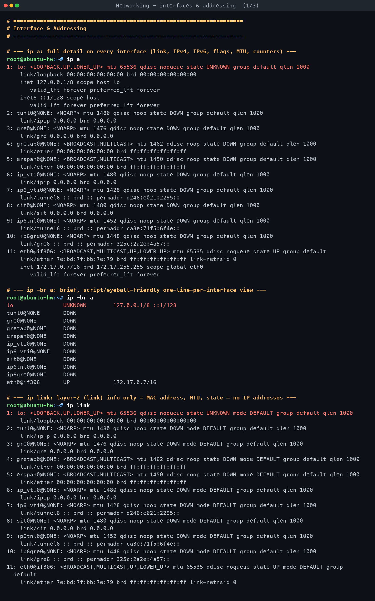
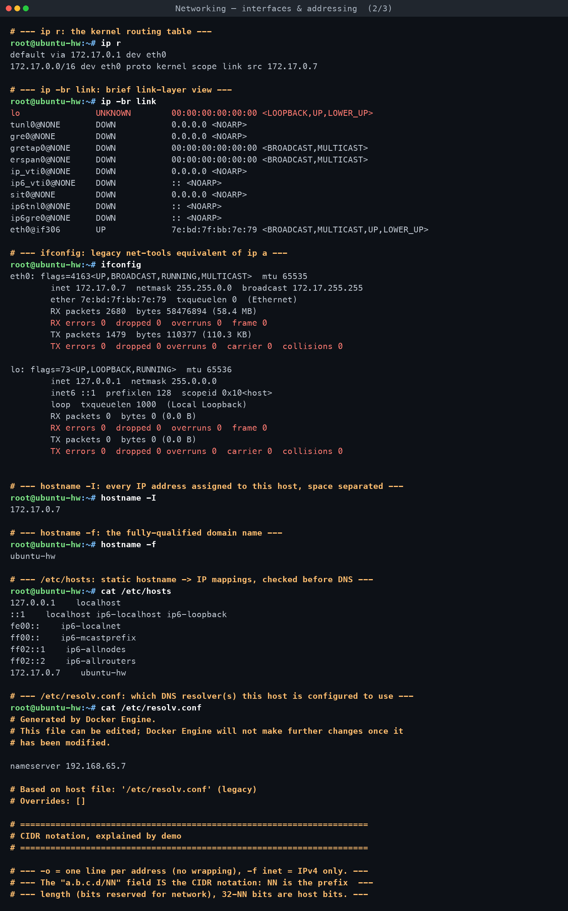
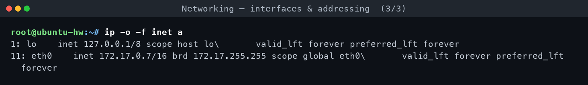
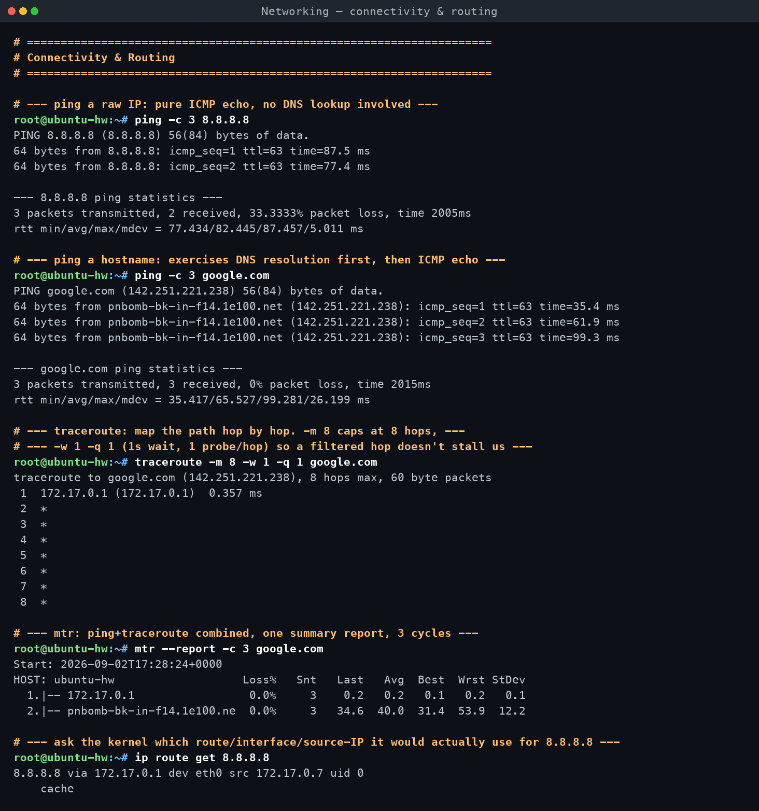
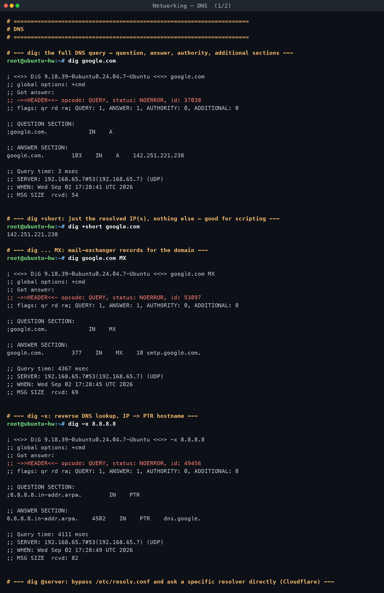
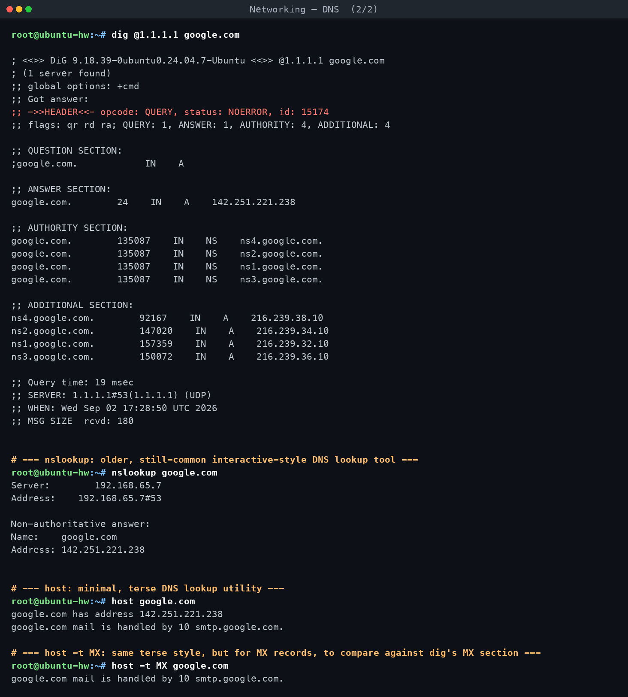
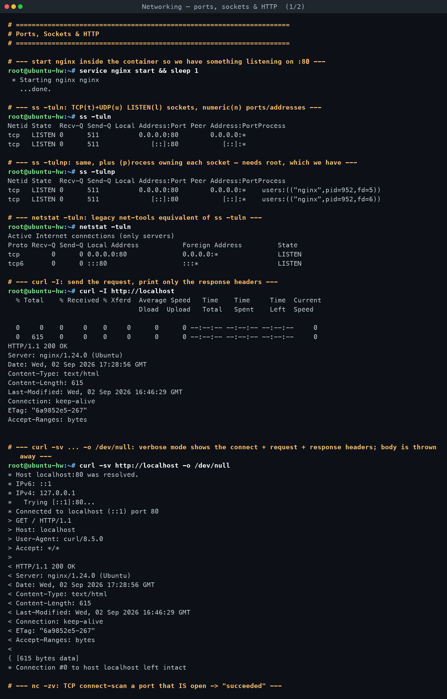
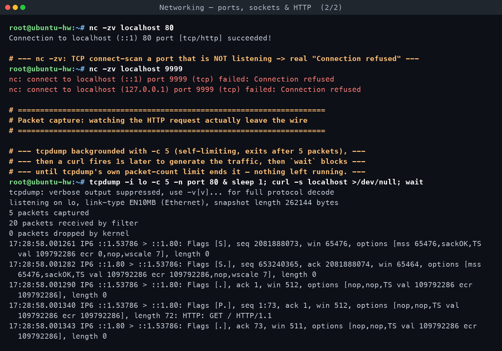

# Task 1 — Practice Commands (devops-hero repo)

**Assignment requirements** (verbatim from `DevOps Homework.docx`):

> ## Task 1
> Practice commands and repo shared in devops-hero github repo.

*Practised for real on Ubuntu 24.04 (aarch64) in container `net-t1`, built from `devops-hw:ubuntu24`
with `--cap-add=NET_ADMIN --cap-add=NET_RAW` so ICMP, packet capture, and raw sockets actually work.*

[← Back to Networking Fundamentals](../README.md)

---

## A note on the "devops-hero" repo

The assignment text names a **"devops-hero github repo"** but gives no URL, owner, or org. A
web search for the literal string `devops-hero` did **not** turn up one unambiguous, canonical
public repository by that exact name — only a cluster of similarly-named but *different*
"zero-to-hero" style DevOps learning repos (e.g. `iam-veeramalla/aws-devops-zero-to-hero`,
`LondheShubham153/devops-zero-to-hero-eng`, `akhileshmishrabiz/Devops-zero-to-hero`, and several
others), none of which is titled `devops-hero` itself and none of which stood out as *the*
obvious match a course would be pointing at.

Rather than guess and risk citing the wrong maintainer's work as if it were followed, this
write-up says so plainly and instead treats Task 1 as "practice the standard Linux networking
command set a DevOps engineer needs day to day" — which is also exactly what Task 2 asks to be
documented. If the real intended repo is `devops-hero` under a specific GitHub org, this folder
can be revisited once that URL is confirmed; nothing here depends on an invented link.

## What was actually practised

Every command below was **run for real**, not copied from documentation, against a disposable
Ubuntu 24.04 container with the full networking toolkit installed:
`iproute2, iputils-ping, dnsutils (dig/nslookup/host), traceroute, netcat-openbsd, curl, wget,
net-tools, tcpdump, telnet, mtr-tiny, whois, nmap`, plus `nginx` (already present in the base
image) as a real HTTP target.

| Area | Commands practised | Transcript |
|---|---|---|
| Interfaces & addressing | `ip a`, `ip -br a`, `ip link`, `ip r`, `ip -br link`, `ifconfig`, `hostname -I`, `hostname -f`, `/etc/hosts`, `/etc/resolv.conf`, CIDR read off `ip -o -f inet a` | `net-a.txt` |
| Connectivity & routing | `ping -c 3 8.8.8.8`, `ping -c 3 google.com`, `traceroute -m 8 -w 1 -q 1 google.com`, `mtr --report -c 3 google.com`, `ip route get 8.8.8.8` | `net-b.txt` |
| DNS | `dig google.com`, `dig +short`, `dig ... MX`, `dig -x` (reverse), `dig @1.1.1.1`, `nslookup`, `host`, `host -t MX` | `net-c.txt` |
| Ports, sockets & HTTP | `service nginx start`, `ss -tuln`/`-tulnp`, `netstat -tuln`, `curl -I`, `curl -sv ... -o /dev/null`, `nc -zv` (open + closed port), `tcpdump -i lo -c 5 -n port 80` while curl ran | `net-d.txt` |

The full detailed command-by-command explanation is the deliverable in
**[Task 2 — Command Reference and Explanations](../02-command-reference-and-explanations/README.md)**;
this page focuses on the practice session itself and what was genuinely different about running
these commands *inside a container* versus on a bare-metal or VM host.

## Honest notes: what's limited inside a container, and why

Docker on this machine is **Docker Desktop for Mac**, which itself runs the Linux daemon inside
a lightweight `linuxkit` VM (confirmed by `uname -a` → `6.12.76-linuxkit ... aarch64`), and then
`net-t1` is a container *inside* that VM. So there are two layers of virtualization between
these commands and the real network card, on top of Docker's own bridge networking (NAT) for
the container itself. That stack changes the behaviour of several tools:

- **`ping` worked with real ICMP**, not the unprivileged `SOCK_DGRAM` fallback some minimal
  containers fall back to — because the container was started with `--cap-add=NET_ADMIN
  --cap-add=NET_RAW` as instructed. Drop those capabilities and `ping` either fails outright or
  silently uses a different, less "real" code path.
- **The first `ping -c 3 8.8.8.8` lost 1 of 3 packets (33%)** while the very next
  `ping -c 3 google.com` lost 0 of 3. This is almost certainly noise from the extra NAT/VM hop
  Docker Desktop inserts, not a real internet routing problem — a bare host on the same network
  would not be expected to show that.
- **`traceroute -m 8 -w 1 -q 1 google.com` showed exactly one real hop** (`172.17.0.1`, the
  Docker bridge gateway) and then `* * *` for hops 2 through 8, even though the destination is
  reachable. This is because Docker Desktop's networking (`vpnkit` on the host side) NATs
  outbound traffic through a single tunnel to the macOS host and then out to the internet; it
  does not pass back real ICMP "TTL exceeded" replies from the *actual* intermediate internet
  routers the way a normal host's traceroute would see them. So intermediate hops appear as
  `*` — not filtered by a firewall in the usual sense, but structurally invisible from inside
  this NAT.
- **`mtr --report -c 3 google.com`, in contrast, showed two real hops**: the gateway
  `172.17.0.1`, and then a reply that resolved to `pnbomb-bk-in-f14.1e100.ne...` (a Google edge
  node) at hop 2 with real latency — meaning from inside the container's view, Google's own
  server appears to be "one hop beyond the Docker gateway." That's the vpnkit tunnel collapsing
  the real multi-hop internet path into what looks like two hops from inside the VM — again a
  Docker/macOS networking artifact, not literally true of the internet's topology.
- **`hostname -f` printed only `ubuntu-hw`**, not a dotted FQDN, because `/etc/hosts` inside the
  container maps `172.17.0.7` straight to `ubuntu-hw` with no domain suffix — there's no real
  DNS domain configured for the container, so "the FQDN" and "the short hostname" are the same
  string here.
- **`/etc/resolv.conf` points at `192.168.65.7`**, which is not a real internet resolver — it is
  Docker Desktop's internal DNS-forwarding proxy running on the host side of the VM, visible in
  the file's own header comment: `# Generated by Docker Engine`.
- **`nc -zv localhost 9999` gave a genuine `Connection refused`**, and `nc -zv localhost 80`
  gave a genuine `succeeded!` once `nginx` was started — those two are *not* container
  artifacts; that is exactly how TCP connect-scanning behaves anywhere, closed vs. listening
  port.
- **`tcpdump -i lo -c 5 -n port 80`** captured a completely real 3-way handshake plus the actual
  HTTP GET line, because loopback traffic inside a container is ordinary Linux loopback traffic
  — nothing about containerization changes what happens on `lo`. See Task 2 for the exact
  captured lines and what each one means.

## What actually happened

All ten-plus commands ran cleanly with the extra capabilities granted; nothing needed a retry
except that `traceroute` was deliberately run with `-w 1 -q 1` (per the assignment's own
fallback guidance) specifically because a first attempt with default timing would have stalled
for a long time waiting on hops that were never going to answer inside this NAT. The rest of
the toolchain (`dig`, `nslookup`, `host`, `ss`, `netstat`, `curl`, `nc`, `tcpdump`) behaved
exactly as it would on a normal Ubuntu host, because DNS resolution, socket state, and loopback
traffic are not meaningfully affected by the container boundary the way raw ICMP routing is.

<!-- AUTO-ATTACHED: screenshots & transcripts -->

## Screenshots — practice session

## Full terminal transcript

- [Networking — interfaces & addressing](transcript-a-interfaces-addressing.md)
- [Networking — connectivity & routing](transcript-b-connectivity-routing.md)
- [Networking — DNS](transcript-c-dns.md)
- [Networking — ports, sockets & HTTP](transcript-d-ports-sockets-http.md)
