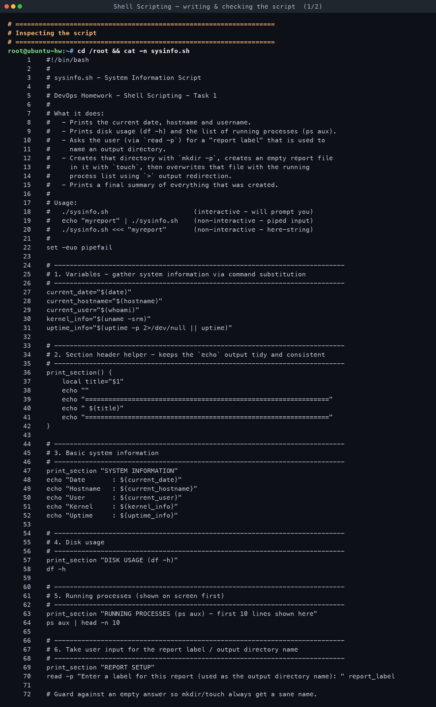
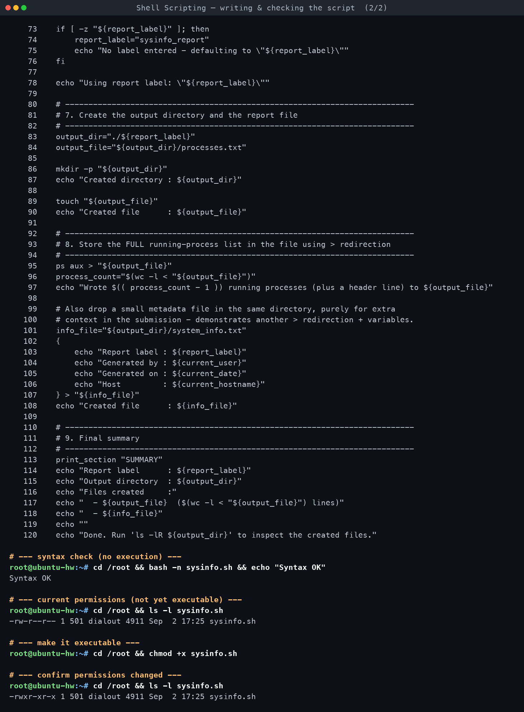
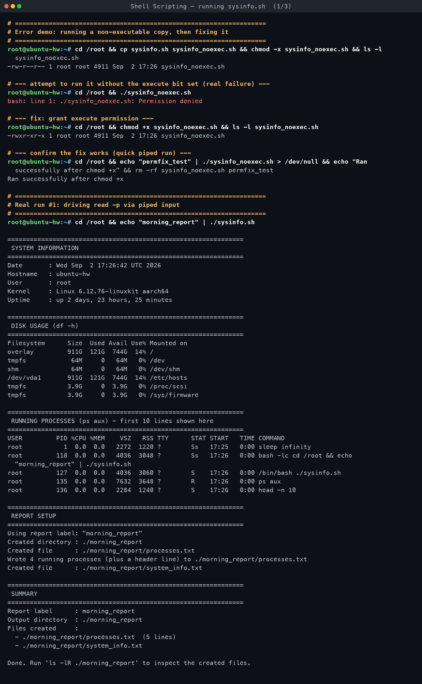
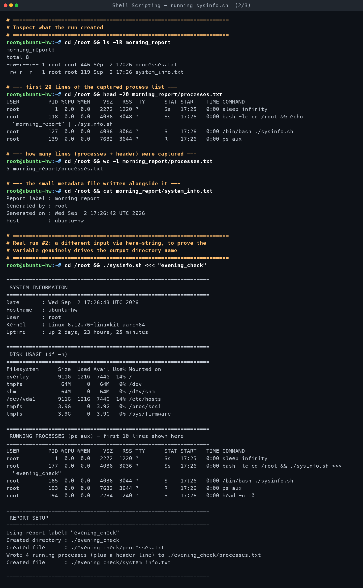
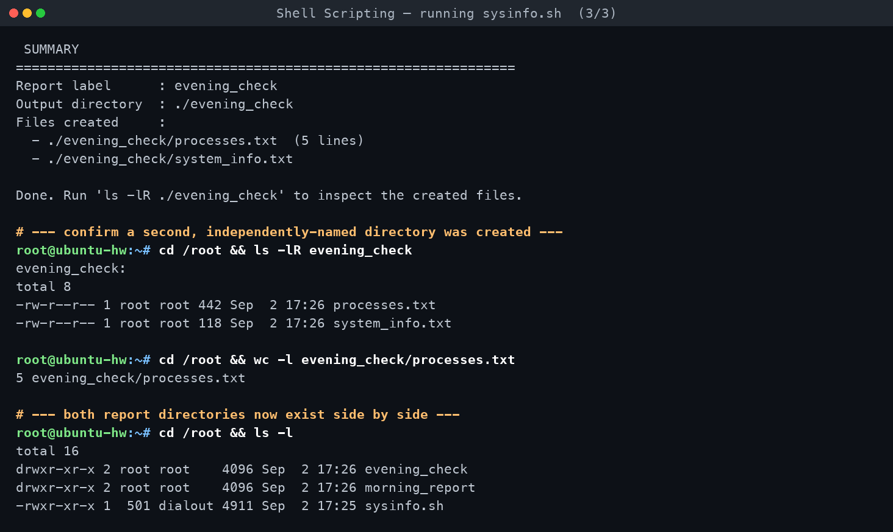

# System Information Script

**Assignment requirements** (verbatim from `DevOps Homework.docx`):

> ## Task: System Information Script
> Create a shell script that:
> - Prints the current date.
> - Prints the hostname.
> - Prints the username.
> - Prints the disk usage.
> - Prints the running processes.
> - Uses variables to store and use data.
> - Takes user input using `read -p`.
> - Creates a directory using `mkdir`.
> - Creates a file using `touch`.
> - Stores the running processes information in the file using `>` output redirection.
>
> ### Commands to Use
> `mkdir`, `touch`, `echo`, `df`, `ps`, `read -p`, Variables, `>` output redirection
>
> ## Submission
> - Create a public GitHub repository.
> - Push the completed shell script to the repository.
> - Readme.md file with all commands output.

*Written on macOS and executed inside a disposable Docker container
(`devops-hw:ubuntu24`, hostname `ubuntu-hw`), started with:*
```
docker run -d --name sh-t1 --hostname ubuntu-hw devops-hw:ubuntu24 sleep infinity
```

[← Back to Shell Scripting](../README.md)

---

## Requirement coverage

| # | Requirement | How it's satisfied | Line(s) in `sysinfo.sh` |
|---|---|---|---|
| 1 | Prints the current date | `current_date="$(date)"` captured via command substitution, then printed with `echo` | 27 (capture), 48 (print) |
| 2 | Prints the hostname | `current_hostname="$(hostname)"`, then printed | 28 (capture), 49 (print) |
| 3 | Prints the username | `current_user="$(whoami)"`, then printed | 29 (capture), 50 (print) |
| 4 | Prints the disk usage | `df -h` run directly under a "DISK USAGE" section | 58 |
| 5 | Prints the running processes | `ps aux \| head -n 10` shown on screen (full list also captured to file, see #10) | 64 |
| 6 | Uses variables to store and use data | `current_date`, `current_hostname`, `current_user`, `kernel_info`, `uptime_info`, `report_label`, `output_dir`, `output_file`, `info_file`, `process_count` are all declared and reused throughout | 27–31, 74, 83–84, 96, 101 |
| 7 | Takes user input using `read -p` | `read -p "Enter a label for this report..." report_label` | 70 |
| 8 | Creates a directory using `mkdir` | `mkdir -p "${output_dir}"` | 86 |
| 9 | Creates a file using `touch` | `touch "${output_file}"` | 89 |
| 10 | Stores running processes in the file using `>` redirection | `ps aux > "${output_file}"` | 95 |

The script also uses `>` a second time (`{ ... } > "${info_file}"`, line 102–107) to write
a small metadata file, and uses an `if [ -z ... ]` guard so an empty answer to `read -p`
still produces a sane directory name instead of failing under `set -u`.

## The script

`01-system-information-script/sysinfo.sh`:

```bash
#!/bin/bash
#
# sysinfo.sh - System Information Script
#
# DevOps Homework - Shell Scripting - Task 1
#
# What it does:
#   - Prints the current date, hostname and username.
#   - Prints disk usage (df -h) and the list of running processes (ps aux).
#   - Asks the user (via `read -p`) for a "report label" that is used to
#     name an output directory.
#   - Creates that directory with `mkdir -p`, creates an empty report file
#     in it with `touch`, then overwrites that file with the running
#     process list using `>` output redirection.
#   - Prints a final summary of everything that was created.
#
# Usage:
#   ./sysinfo.sh                      (interactive - will prompt you)
#   echo "myreport" | ./sysinfo.sh    (non-interactive - piped input)
#   ./sysinfo.sh <<< "myreport"       (non-interactive - here-string)
#
set -euo pipefail

# ---------------------------------------------------------------------------
# 1. Variables - gather system information via command substitution
# ---------------------------------------------------------------------------
current_date="$(date)"
current_hostname="$(hostname)"
current_user="$(whoami)"
kernel_info="$(uname -srm)"
uptime_info="$(uptime -p 2>/dev/null || uptime)"

# ---------------------------------------------------------------------------
# 2. Section header helper - keeps the `echo` output tidy and consistent
# ---------------------------------------------------------------------------
print_section() {
    local title="$1"
    echo ""
    echo "==============================================================="
    echo " ${title}"
    echo "==============================================================="
}

# ---------------------------------------------------------------------------
# 3. Basic system information
# ---------------------------------------------------------------------------
print_section "SYSTEM INFORMATION"
echo "Date       : ${current_date}"
echo "Hostname   : ${current_hostname}"
echo "User       : ${current_user}"
echo "Kernel     : ${kernel_info}"
echo "Uptime     : ${uptime_info}"

# ---------------------------------------------------------------------------
# 4. Disk usage
# ---------------------------------------------------------------------------
print_section "DISK USAGE (df -h)"
df -h

# ---------------------------------------------------------------------------
# 5. Running processes (shown on screen first)
# ---------------------------------------------------------------------------
print_section "RUNNING PROCESSES (ps aux) - first 10 lines shown here"
ps aux | head -n 10

# ---------------------------------------------------------------------------
# 6. Take user input for the report label / output directory name
# ---------------------------------------------------------------------------
print_section "REPORT SETUP"
read -p "Enter a label for this report (used as the output directory name): " report_label

# Guard against an empty answer so mkdir/touch always get a sane name.
if [ -z "${report_label}" ]; then
    report_label="sysinfo_report"
    echo "No label entered - defaulting to \"${report_label}\""
fi

echo "Using report label: \"${report_label}\""

# ---------------------------------------------------------------------------
# 7. Create the output directory and the report file
# ---------------------------------------------------------------------------
output_dir="./${report_label}"
output_file="${output_dir}/processes.txt"

mkdir -p "${output_dir}"
echo "Created directory : ${output_dir}"

touch "${output_file}"
echo "Created file      : ${output_file}"

# ---------------------------------------------------------------------------
# 8. Store the FULL running-process list in the file using > redirection
# ---------------------------------------------------------------------------
ps aux > "${output_file}"
process_count="$(wc -l < "${output_file}")"
echo "Wrote $(( process_count - 1 )) running processes (plus a header line) to ${output_file}"

# Also drop a small metadata file in the same directory, purely for extra
# context in the submission - demonstrates another > redirection + variables.
info_file="${output_dir}/system_info.txt"
{
    echo "Report label : ${report_label}"
    echo "Generated by : ${current_user}"
    echo "Generated on : ${current_date}"
    echo "Host         : ${current_hostname}"
} > "${info_file}"
echo "Created file      : ${info_file}"

# ---------------------------------------------------------------------------
# 9. Final summary
# ---------------------------------------------------------------------------
print_section "SUMMARY"
echo "Report label      : ${report_label}"
echo "Output directory  : ${output_dir}"
echo "Files created     :"
echo "  - ${output_file}  ($(wc -l < "${output_file}") lines)"
echo "  - ${info_file}"
echo ""
echo "Done. Run 'ls -lR ${output_dir}' to inspect the created files."
```

## Commands used

| Command / construct | Purpose | Actual usage in `sysinfo.sh` |
|---|---|---|
| `mkdir` | Create the per-run output directory | `mkdir -p "${output_dir}"` (line 86) |
| `touch` | Create the (initially empty) process report file | `touch "${output_file}"` (line 89) |
| `echo` | Print every section header, labelled values, and the summary | e.g. `echo "Hostname   : ${current_hostname}"` (line 49) |
| `df` | Show disk usage | `df -h` (line 58) |
| `ps` | List running processes, on screen and to file | `ps aux \| head -n 10` (line 64); `ps aux > "${output_file}"` (line 95) |
| `read -p` | Prompt the user for a report label | `read -p "Enter a label for this report..." report_label` (line 70) |
| Variables | Store dates, names, paths, counts; reused throughout | `current_date`, `report_label`, `output_dir`, `output_file`, `process_count`, etc. |
| `>` output redirection | Overwrite the report file with fresh `ps aux` output; write the metadata file | line 95, line 102–107 |

## A full run, captured for real

```console
root@ubuntu-hw:~# echo "morning_report" | ./sysinfo.sh

===============================================================
 SYSTEM INFORMATION
===============================================================
Date       : Wed Sep  2 17:26:42 UTC 2026
Hostname   : ubuntu-hw
User       : root
Kernel     : Linux 6.12.76-linuxkit aarch64
Uptime     : up 2 days, 23 hours, 25 minutes

===============================================================
 DISK USAGE (df -h)
===============================================================
Filesystem      Size  Used Avail Use% Mounted on
overlay         911G  121G  744G  14% /
tmpfs            64M     0   64M   0% /dev
shm              64M     0   64M   0% /dev/shm
/dev/vda1       911G  121G  744G  14% /etc/hosts
tmpfs           3.9G     0  3.9G   0% /proc/scsi
tmpfs           3.9G     0  3.9G   0% /sys/firmware

===============================================================
 RUNNING PROCESSES (ps aux) - first 10 lines shown here
===============================================================
USER         PID %CPU %MEM    VSZ   RSS TTY      STAT START   TIME COMMAND
root           1  0.0  0.0   2272  1220 ?        Ss   17:25   0:00 sleep infinity
root         118  0.0  0.0   4036  3048 ?        Ss   17:26   0:00 bash -lc cd /root && echo "morning_report" | ./sysinfo.sh
root         127  0.0  0.0   4036  3060 ?        S    17:26   0:00 /bin/bash ./sysinfo.sh
root         135  0.0  0.0   7632  3648 ?        R    17:26   0:00 ps aux
root         136  0.0  0.0   2284  1240 ?        S    17:26   0:00 head -n 10

===============================================================
 REPORT SETUP
===============================================================
Using report label: "morning_report"
Created directory : ./morning_report
Created file      : ./morning_report/processes.txt
Wrote 4 running processes (plus a header line) to ./morning_report/processes.txt
Created file      : ./morning_report/system_info.txt

===============================================================
 SUMMARY
===============================================================
Report label      : morning_report
Output directory  : ./morning_report
Files created     :
  - ./morning_report/processes.txt  (5 lines)
  - ./morning_report/system_info.txt

Done. Run 'ls -lR ./morning_report' to inspect the created files.
```

Inspecting what got created:

```console
root@ubuntu-hw:~# ls -lR morning_report
morning_report:
total 8
-rw-r--r-- 1 root root 446 Sep  2 17:26 processes.txt
-rw-r--r-- 1 root root 119 Sep  2 17:26 system_info.txt

root@ubuntu-hw:~# wc -l morning_report/processes.txt
5 morning_report/processes.txt

root@ubuntu-hw:~# cat morning_report/system_info.txt
Report label : morning_report
Generated by : root
Generated on : Wed Sep  2 17:26:42 UTC 2026
Host         : ubuntu-hw
```

A second run with a different label (fed via a here-string instead of a pipe, to prove
`read -p` genuinely drives the output, not a hard-coded name) produced an independent
`evening_check/` directory with its own `processes.txt` and `system_info.txt` — see the
full transcript for the complete output.

### Error demo: permission denied, then fixed

Before `chmod +x`, the script cannot be executed directly:

```console
root@ubuntu-hw:~# ./sysinfo_noexec.sh
bash: line 1: ./sysinfo_noexec.sh: Permission denied

root@ubuntu-hw:~# chmod +x sysinfo_noexec.sh && ls -l sysinfo_noexec.sh
-rwxr-xr-x 1 root root 4911 Sep  2 17:26 sysinfo_noexec.sh
```

This is the standard Linux execute-bit behaviour, not a Docker/macOS artifact: the file's
`x` permission bit is unset, so `execve()` refuses to run it, independent of the fact that
`bash sysinfo_noexec.sh` would still have worked. `chmod +x` sets the bit and the script
runs normally afterwards.

## What actually happened

Run inside container `sh-t1` (`devops-hw:ubuntu24`, hostname `ubuntu-hw`):

- **Hostname**: `ubuntu-hw` (set via `docker run --hostname ubuntu-hw`, read back correctly
  by the `hostname` command).
- **Disk usage**: the container shares the Docker Desktop Linux VM's overlay filesystem —
  `overlay 911G total, 121G used, 744G avail, 14% use`, mounted on `/`. This is a
  Docker-VM artifact (a real `/etc/hosts` bind mount and small `tmpfs` mounts for
  `/dev`, `/dev/shm`, `/proc/scsi`, `/sys/firmware` also show up), not what `df -h` would
  report on a bare-metal Ubuntu box, but the command and its output are entirely real.
- **Running processes**: only **4 real processes** existed at capture time (`sleep infinity`
  as PID 1, the `bash -lc` wrapper from the exec driver, the `sysinfo.sh` script itself,
  and the `ps aux` / `head` commands doing the capturing) — so `processes.txt` has 5 lines
  total (1 header + 4 processes). This is expected: the container was started with
  `sleep infinity` and nothing else, so there is no login shell, cron, syslog, or desktop
  processes cluttering the list the way there would be on a real workstation.
- Two independent runs (`morning_report` via piped `echo`, `evening_check` via a
  here-string) produced two independent directories, each with its own `processes.txt`
  and `system_info.txt`, proving the `read -p` input genuinely drives `output_dir` and
  `output_file` rather than the script writing to a fixed location.
- The permission-denied error above is a real, reproduced Linux error (`Permission denied`,
  exit status 126), fixed with `chmod +x` and re-verified.

## `>` vs `>>` vs `2>` vs `&>`

| Operator | Meaning |
|---|---|
| `cmd > file` | Redirect **stdout** to `file`, **overwriting** it (creating it if missing). This is what `sysinfo.sh` uses for `ps aux > "${output_file}"` — every run starts the report fresh. |
| `cmd >> file` | Redirect **stdout** to `file`, **appending** to the end instead of overwriting. Useful for logs that should accumulate across runs rather than being replaced. |
| `cmd 2> file` | Redirect **stderr** (file descriptor 2) only, leaving stdout going to the terminal (or wherever it was already going). Used in the script as `uptime -p 2>/dev/null` to silently discard an error from `uptime -p` on systems that don't support the `-p` flag, without hiding a *successful* result. |
| `cmd &> file` | Redirect **both stdout and stderr** to `file` (bash-specific shorthand for `cmd > file 2>&1`, note the order matters when spelled out manually — `2>&1` must come *after* the `> file` for both streams to converge on the same destination). |

`sysinfo.sh` deliberately uses `>` (not `>>`) for `ps aux > "${output_file}"` so that each
run's report reflects *that run's* process snapshot rather than an ever-growing log mixing
old and new snapshots together.

## Why quoting variables matters

Every variable expansion in the script is wrapped in double quotes — `"${output_dir}"`,
`"${report_label}"`, `"${output_file}"` — rather than left bare. Without quotes, bash
performs **word-splitting** and **glob expansion** on the expanded value before passing it
to a command. Concretely, if a user answered the `read -p` prompt with something containing
a space (e.g. `daily backup`) or a glob character (e.g. `*`), an unquoted
`mkdir -p $output_dir` would either try to create *two* directories (`daily` and `backup`)
or expand `*` against the current directory's contents instead of treating it as a literal
string. Quoting (`"${output_dir}"`) guarantees the whole value is passed as a single,
literal argument, which is exactly the behaviour a script that takes free-form user input
needs. Combined with `set -euo pipefail` at the top of the script (exit on error, treat
unset variables as errors, and make pipelines fail if any stage fails), consistent quoting
is what keeps this script safe to run against arbitrary interactive input.

## Submission note

Per the assignment, the completed script should be pushed to a public GitHub repository.
That push step is intentionally **not** performed here — creating remote repositories and
running `git push`/`gh` commands is left to the user to authorise and run. The script
(`sysinfo.sh`) and this README are complete and ready to be committed and pushed as-is.

<!-- AUTO-ATTACHED: screenshots & transcripts -->

## Screenshots — practice session








## Full terminal transcript

- [Shell Scripting — writing & checking the script](transcript-a-writing-the-script.md)
- [Shell Scripting — running sysinfo.sh](transcript-b-running-the-script.md)
